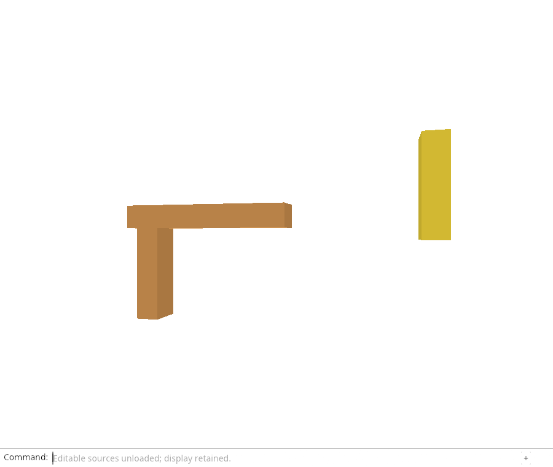
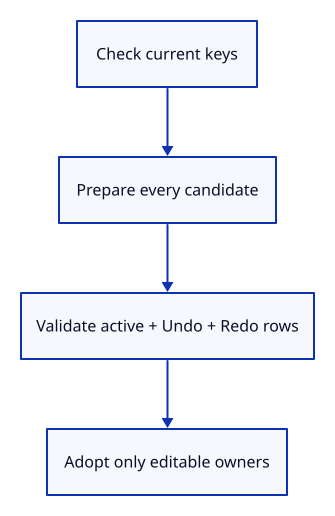

# 32gb · Adopt restored source owners as one residency change

**Typing: 16–32 minutes.** [Estimate](typing-load.md).

Restore unloaded sources as one transaction. Validate every reply first; one invalid reply must leave all sources unchanged.

## Type

Continue from [Prepare original kernel data without rebuilding its display](32ga-prepare.md). [Save or recover your work](recovery.md).

### 1. `src/scene.rs`

Restore editable owners without replacing display, metadata, identity or placement.

<details>
<summary>Locate the existing block</summary>

```rust
    pub fn insert(&mut self, prepared: PreparedMesh) -> Result<ObjectId, &'static str> {
```

</details>

Replace that block with:

```rust
--8<-- "journey/code/32gb-adopt-01.rs"
```

### 2. `src/editor.rs`

Check current release ownership and all source rows before any candidate is adopted.

<details>
<summary>Locate the existing block</summary>

```rust
    fn unload_sources(&mut self) -> Result<(), &'static str> {
```

</details>

Replace that block with:

```rust
--8<-- "journey/code/32gb-adopt-02.rs"
```

## Run and check

In your project:

```sh
cd workspace/journey
REGEN_PROTO=0 cargo build --lib --locked --target wasm32-unknown-unknown -j4
REGEN_PROTO=0 CARGO_BUILD_JOBS=4 trunk serve --port 8780
```

Open `http://127.0.0.1:8780/`. Keep an existing Trunk server running; saving rebuilds it.

Run the adoption checks below. A bad second candidate must restore neither source. Valid candidates restore editable owners without changing display, placement or history.

**Verified checkpoint in Chrome.**



[Verification scope](release.md).

Run the state checks on your computer from your project folder:

```sh
REGEN_PROTO=0 cargo test --lib --locked --target host-tuple -j4
```

<details>
<summary>Code explanation and diagram</summary>

hydrate accepts key/byte pairs from a completed request. First check that each distinct key still matches an active cold row; a stale or duplicate key cannot start preparation. Next build every candidate and validate all matching active, Undo and Redo rows. Only after every check succeeds does `Scene` adopt the prepared source owners.

Adoption changes only `EditSource`: each matching row receives the restored mesh and Source sharing one candidate `Session` and the original Origin. Keep local ID, saved GUID, metadata Rc, display Rc and model matrix exactly as they were.

This is a residency pass, not a document edit. It must not clear history, append an Undo entry or alter camera/selection. The next endpoint adds explicit ownership, precision and rejection checks. Browser fetching and command replay are not wired yet.

`collect::<Result<_, _>>()` turns many candidate results into one result: an error stops collection and drops candidates already prepared. The question mark returns that error before adoption starts. `flat_map` visits rows from each active/history `Scene` without copying them. The final mutable pass replaces only editable ownership; it is not a History edit.

Current keys → prepare all candidates → validate all matching roots → adopt editable owners.



What prevents a valid first candidate from committing when a later source fails?

Prepare every candidate and validate every affected row before the adoption loop. If any version, source GUID or metadata check fails, the function returns with all rows still cold and no new history entry.

Study estimate, including typing and experiments: 1–2 hours.

</details>

<details>
<summary>Optional experiment</summary>

Move the adoption loop ahead of candidate validation in a scratch copy. Explain what a failure in the second origin would leave behind.

</details>

<details>
<summary>Check and save your work</summary>

Restore experimental edits, then run from `session_viewer`:

```sh
npm --prefix ../session_tests run course -- check 32gb-adopt
npm --prefix ../session_tests run course -- save 32gb-adopt
```

Source comparison leaves your project untouched. [Save and recovery instructions](recovery.md).

</details>

<details>
<summary>Viewer coverage and verification</summary>

The production operation validates released identity before hydration. This API additionally groups the requested immutable-source candidates so one command cannot partially adopt its source batch.

The browser checks the existing command-only unload behavior and retained drawing. Source hydration at this endpoint is verified by the native state/GPU checks; browser fetch and automatic command replay are still pending.

[Full validation scope](release.md).

To reproduce the scripted acceptance of the reference checkpoint, run from `session_viewer` with the [course bundle server](release.md#reproduce) running on port 8781:

```sh
npm --prefix ../session_tests run course -- capture 32gb-adopt
```

This uses the verified reference bundle; it does not check or change your typed project.

</details>
