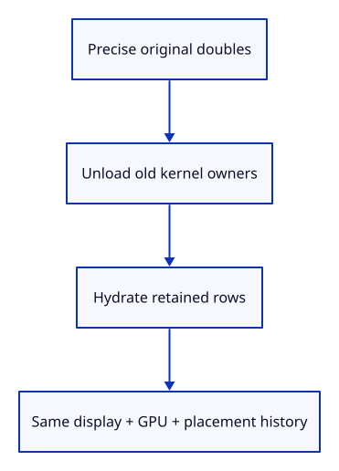
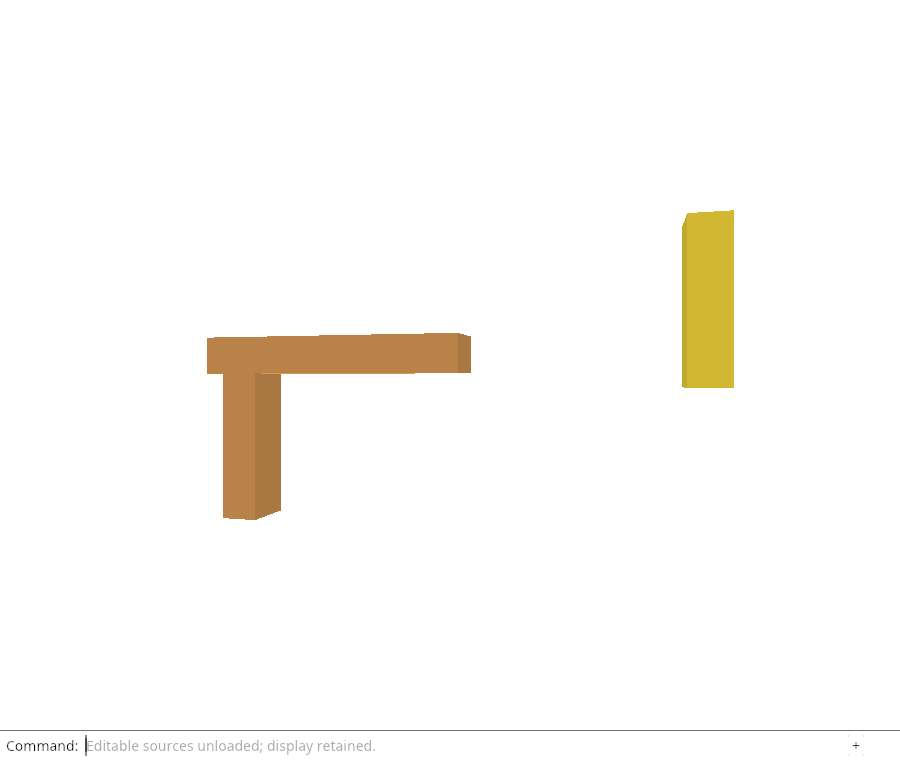

# 32gc · Prove source restoration preserves display and history

**Combined study estimate: 1–2 hours.** Includes reading, typing, reasoning and experiments.

**Typing estimate: 22–43 minutes.** 33 added or changed lines; unchanged context is excluded. [How this is estimated](typing-load.md).

**Today:** Restore exact source coordinates and editing without reallocating retained display owners.

**Follow:** Move → Unload Sources → checked hydrate → exact Save → retained Undo/Redo and GPU owners.

Add a fixture with a deliberately precise double coordinate and original flags. Import through a located source, Move, unload, then hydrate the captured key with the original bytes. The old kernel value stays expired; restored source geometry has the exact original coordinate.

The row’s display and metadata Rcs are retained, as are its IDs, placement, camera and history roots. Snapshot can again serialize the exact editable source. Undo/Redo still return the earlier and moved placements with available restored kernel owners.

The native GPU fixture adds the same boundary: source hydration must preserve the existing geometry/settings allocations and drawing. The browser still demonstrates unloading at this endpoint; actual fetch and replay come after the native rejection checks.

The protobuf field uses `Some(true)` because its representation distinguishes an explicitly stored flag from an omitted one. This test checks flag preservation, not the later selection/locking policy. `Rc::downgrade` observes a value without keeping it alive; upgrade returning None proves the old kernel allocation is gone. `Rc::ptr_eq` then distinguishes a retained display from a newly copied display with equal coordinates.



## Type the change

Continue from [Adopt restored source owners as one residency change](32gb-adopt.md). Save your own work first: `npm --prefix ../session_tests run course -- save before-32gc-roundtrip` (from `session_viewer`).

### 1. `src/lib.rs`

Keep source restoration proofs in typed native state checks.

Find this exact block:

```rust
mod unload_tests;
```

Replace that block with:

```rust
--8<-- "journey/code/32gc-roundtrip-01.rs"
```

### 2. `src/rehydrate_tests.rs`

Check exact restored coordinates and retained display/metadata/placement history.

Create the file and type:

```rust
--8<-- "journey/code/32gc-roundtrip-02.rs"
```

## Run and look

From `session_viewer`, enter your project folder:

```sh
cd workspace/journey
REGEN_PROTO=0 cargo build --lib --locked --target wasm32-unknown-unknown -j4
REGEN_PROTO=0 CARGO_BUILD_JOBS=4 trunk serve --port 8780
```

Open `http://127.0.0.1:8780/`. If Trunk is already running in this project, leave it running; it rebuilds when you save.

Run the cold-source round-trip checks below. Restoring and saving must retain the original double coordinates through Undo and Redo.

**Verified checkpoint in Chrome.**



[What this screenshot checks](release.md).

Run the state checks from your project folder:

```sh
REGEN_PROTO=0 cargo test --lib --locked -j4
```

<details>
<summary>Optional experiment</summary>

Replace the restored kernel coordinate with a value reconstructed from the retained display and predict which assertion fails.

</details>

## Explain the change

How can the test distinguish rehydration from rebuilding the whole scene?

<details>
<summary>Compare your explanation</summary>

Record row IDs, saved GUIDs, metadata/display Rc identities, model matrices, camera and history-root count. After hydration these must be unchanged, while kernel geometry becomes available again from the restored original bytes.

</details>

## Keep your working result

Return to `session_viewer` in a second terminal. Restore experimental edits before comparing:

```sh
npm --prefix ../session_tests run course -- check 32gc-roundtrip
npm --prefix ../session_tests run course -- save 32gc-roundtrip
```

Check compares your typed source; run the focused check above for behavior. [Recover your work](recovery.md).

<details>
<summary>Where this fits in the finished viewer</summary>

Rehydration is separate from scene rebuild and document history. The forthcoming browser callback can adopt this checked result without silently changing drawing or targeting another selection.

</details>

<details>
<summary>Verification notes and browser acceptance</summary>

The browser checks the existing command-only unload behavior and retained drawing. Source hydration at this endpoint is verified by the native state/GPU checks; browser fetch and automatic command replay are still pending.

[Full validation scope](release.md).

To reproduce the scripted acceptance of the reference checkpoint, run from `session_viewer` with the [course bundle server](release.md#reproduce) running on port 8781:

```sh
npm --prefix ../session_tests run course -- capture 32gc-roundtrip
```

This uses the verified reference bundle; it does not check or change your typed project.

</details>
