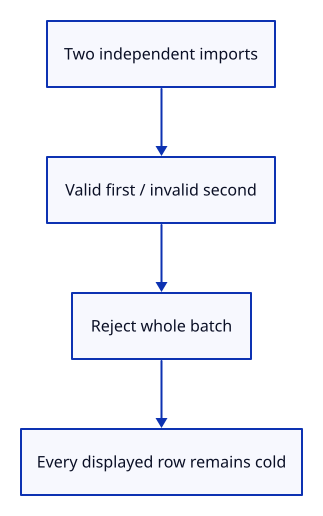
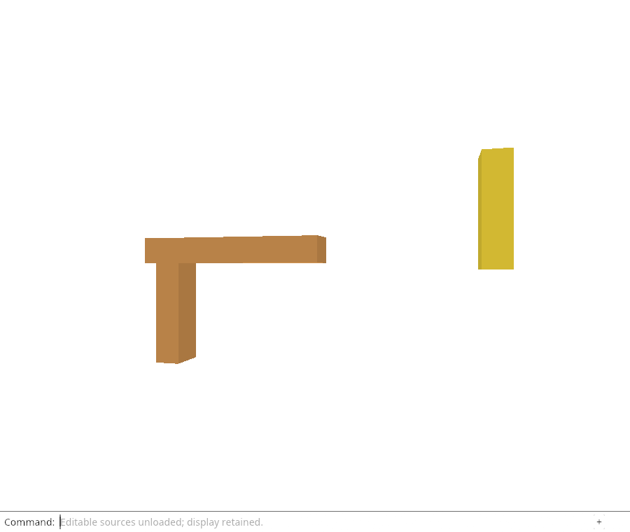

# 32gd · Reject stale or inconsistent source batches atomically

**Combined study estimate: 1–2 hours.** Includes reading, typing, reasoning and experiments.

**Typing estimate: 25–49 minutes.** 38 added or changed lines; unchanged context is excluded. [How this is estimated](typing-load.md).

**Today:** Keep rows cold on changed versions, missing source identity and obsolete release keys.

**Follow:** Prepare two origins → reject changed second source → no adoption → successful retry.

A successful round trip is not enough. Use duplicate imports with independent origins and validate all candidates before adoption. Change the second source version and confirm neither origin becomes loaded. A wrong original source GUID in a retained row must also reject the candidate.

Close and reimport the same bytes, then deliver an old key with malformed bytes: the stale result must be ignored without even trying to decode it. Restore one origin, release again and verify the old epoch no longer matches; a duplicate completion of an already adopted key is also ignored.

`Rc::make_mut` gives this row its own metadata value when another history row shares the original. That lets the check simulate an inconsistent retained row without changing the imported file. The changed byte version and the changed row metadata exercise separate rejection boundaries.



## Type the change

Continue from [Prove source restoration preserves display and history](32gc-roundtrip.md). Save your own work first: `npm --prefix ../session_tests run course -- save before-32gd-rejections` (from `session_viewer`).

### 1. `src/rehydrate_tests.rs`

Reject the entire candidate batch before adopting any source and preserve displayed owners.

Find this exact block:

```rust
use crate::editor::{Action, Editor};
```

Replace that block with:

```rust
--8<-- "journey/code/32gd-rejections-01.rs"
```

## Run and look

From `session_viewer`, enter your project folder:

```sh
cd workspace/journey
REGEN_PROTO=0 cargo build --lib --locked --target wasm32-unknown-unknown -j4
REGEN_PROTO=0 CARGO_BUILD_JOBS=4 trunk serve --port 8780
```

Open `http://127.0.0.1:8780/`. If Trunk is already running in this project, leave it running; it rebuilds when you save.

Run the rejection checks below. A wrong file version, source identity or release key must leave all editable owners unchanged.

**Verified checkpoint in Chrome.**



[What this screenshot checks](release.md).

Run the state checks from your project folder:

```sh
REGEN_PROTO=0 cargo test --lib --locked -j4
```

<details>
<summary>Optional experiment</summary>

Change the second candidate in a two-origin batch to malformed bytes. Predict why validating all candidates first keeps the first origin cold.

</details>

## Explain the change

Should a late result after Close be decoded before deciding that it is obsolete?

<details>
<summary>Compare your explanation</summary>

No. First confirm the captured key still matches an active cold row. An obsolete result returns false before source construction or mutation, whether its payload is valid or malformed.

</details>

## Keep your working result

Return to `session_viewer` in a second terminal. Restore experimental edits before comparing:

```sh
npm --prefix ../session_tests run course -- check 32gd-rejections
npm --prefix ../session_tests run course -- save 32gd-rejections
```

Check compares your typed source; run the focused check above for behavior. [Recover your work](recovery.md).

<details>
<summary>Where this fits in the finished viewer</summary>

Late source delivery must never revive a closed or replaced import. Immutable file-version checks and origin/epoch checks address different causes of stale data.

</details>

<details>
<summary>Verification notes and browser acceptance</summary>

These are native acceptance checks for the atomic API. Fetch errors, aborts and queued edits belong to the next browser request boundary.

The browser checks the existing command-only unload behavior and retained drawing. Source hydration at this endpoint is verified by the native state/GPU checks; browser fetch and automatic command replay are still pending.

[Full validation scope](release.md).

To reproduce the scripted acceptance of the reference checkpoint, run from `session_viewer` with the [course bundle server](release.md#reproduce) running on port 8781:

```sh
npm --prefix ../session_tests run course -- capture 32gd-rejections
```

This uses the verified reference bundle; it does not check or change your typed project.

</details>
