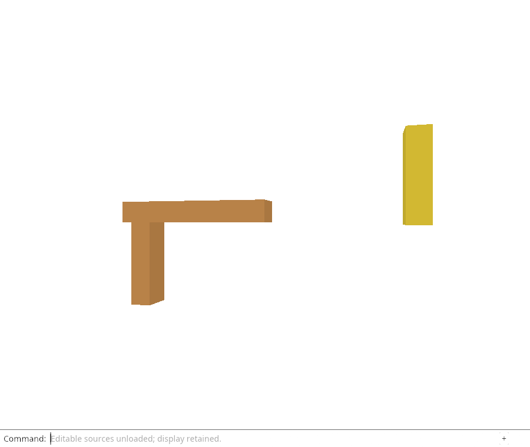
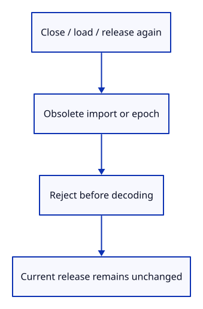

# 32ge · Ignore old reload results before decoding them

**Typing: 16–31 minutes.** [Estimate](typing-load.md).

Close and reimport the same file with the same original GUIDs. The import Origin is a new allocation, so the previous key must be ignored. Then hydrate the current release, deliver it twice, release again and deliver the previous epoch. Every obsolete completion returns false.

## Type

Continue from [Reject stale or inconsistent source batches atomically](32gd-rejections.md). [Save or recover your work](recovery.md).

### 1. `src/rehydrate_tests.rs`

Show that obsolete identities are rejected before version checks, decoding or mutation.

<details>
<summary>Locate the existing block</summary>

```rust
use crate::editor::{Action, Editor};
```

</details>

Replace that block with:

```rust
--8<-- "journey/code/32ge-stale-01.rs"
```

## Run and check

In your project:

```sh
cd workspace/journey
REGEN_PROTO=0 cargo build --lib --locked --target wasm32-unknown-unknown -j4
REGEN_PROTO=0 CARGO_BUILD_JOBS=4 trunk serve --port 8780
```

Open `http://127.0.0.1:8780/`. Keep an existing Trunk server running; saving rebuilds it.

Run the stale-key checks below. Closed imports, loaded rows, duplicate replies and previous release epochs must reject an obsolete restoration.

**Verified checkpoint in Chrome.**



[Verification scope](release.md).

Run the state checks on your computer from your project folder:

```sh
REGEN_PROTO=0 cargo test --lib --locked --target host-tuple -j4
```

<details>
<summary>Code explanation and diagram</summary>

A request must contain at most one candidate per origin. Duplicate keys are rejected before preparing either candidate. An empty batch also has no effect. Keep the current rows and their display identities throughout.

These checks establish the native adoption contract. Browser request cancellation and automatic Move/Delete/Save replay are still pending; the browser at this endpoint continues to demonstrate Unload Sources.

`Ok(false)` means this result no longer belongs to a current request; it is not a document error. `Err(message)` means a current candidate failed validation. Keeping those outcomes separate lets a later browser callback silently discard obsolete completions while reporting failures for the current reload. A captured key owns its Origin, so the next request-lifetime lesson must also drop that owner when cancelling work.

Old import/release key → active-key check → false before payload decoding.



Why deliver deliberately invalid bytes with an obsolete reload key?

A false result instead of a decode error proves the identity check happens first. Invalid stale payloads cannot revive a closed import or disturb the current source release.

Study estimate, including typing and experiments: 1–2 hours.

</details>

<details>
<summary>Optional experiment</summary>

Use the current key with invalid bytes instead. Predict why the error now concerns the source version rather than an obsolete request.

</details>

<details>
<summary>Check and save your work</summary>

Restore experimental edits, then run from `session_viewer`:

```sh
npm --prefix ../session_tests run course -- check 32ge-stale
npm --prefix ../session_tests run course -- save 32ge-stale
```

Source comparison leaves your project untouched. [Save and recovery instructions](recovery.md).

</details>

<details>
<summary>Viewer coverage and verification</summary>

Request ownership, import identity and release epochs must all survive asynchronous timing. The next lessons add that browser boundary to this checked state API.

The browser checks the existing command-only unload behavior and retained drawing. Source hydration at this endpoint is verified by the native state/GPU checks; browser fetch and automatic command replay are still pending.

[Full validation scope](release.md).

To reproduce the scripted acceptance of the reference checkpoint, run from `session_viewer` with the [course bundle server](release.md#reproduce) running on port 8781:

```sh
npm --prefix ../session_tests run course -- capture 32ge-stale
```

This uses the verified reference bundle; it does not check or change your typed project.

</details>
