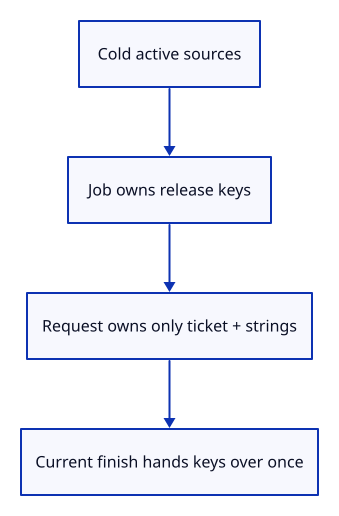

# 32gf · Give each source request its own owner

**Combined study estimate: 1–2 hours.** Includes reading, typing, reasoning and experiments.

**Typing estimate: 15–29 minutes.** 45 added or changed lines; unchanged context is excluded. [How this is estimated](typing-load.md).

**Today:** Give each source request its own owner.

**In the whole viewer:** Connect the browser, drawing and input, then extend the same project. [See the destination](../journey.md#the-destination).

**Follow:** Active release keys → ReloadJob → ticket and URL strings → one accepted completion.

**Before you finish, explain:** Why does the asynchronous request receive URL strings instead of cloned Origins?

Add a browser-independent `ReloadJob`. It owns only one pending set of release keys, issues checked tickets and gives the caller a `Request` containing a ticket and URL strings. A new request cancels older keys before validating its own candidates. Empty requests, duplicate origins and missing locations return errors.

`finish` first checks the ticket, then takes the matching keys once. `Option<Vec<ReloadKey>>` distinguishes accepted keys from obsolete work. `take` replaces the pending option with `None`; the removed owners drop when the caller finishes with them. Cancellation takes the keys without handing them to abandoned work.

The request ticket identifies this operation; each key still identifies the imported source and its release epoch. Both checks are needed. This native owner is not yet connected to fetch or a new browser command.



## Type the change

Continue [Ignore old reload results before decoding them](32ge-stale.md). From `session_viewer`, save your files with `npm --prefix ../session_tests run course -- save before-32gf-request`. A save keeps your own work; it does not fill in the next lesson.

### 1. `src/lib.rs`

Expose the native request owner without adding browser APIs to it.

Find this exact block:

```rust
pub mod rehydrate;
```

Replace that block with:

```rust
--8<-- "journey/code/32gf-request-01.rs"
```

### 2. `src/reload_job.rs`

Issue checked tickets and retain source keys only in current pending work.

Create the file and type:

```rust
--8<-- "journey/code/32gf-request-02.rs"
```

## Run and look

From `session_viewer`, enter your project folder:

```sh
cd workspace/journey
REGEN_PROTO=0 cargo build --lib --locked --target wasm32-unknown-unknown -j4
REGEN_PROTO=0 CARGO_BUILD_JOBS=4 trunk serve --port 8780
```

Open `http://127.0.0.1:8780/`. If Trunk is already running in this project, leave it running; it rebuilds when you save.

When Trunk reloads after a code change, the viewer starts with its generated demo again. From `workspace/journey`, make the sample using the example you already typed:

```sh
REGEN_PROTO=0 cargo run --example sample --locked -j4
```

Type `Open Replace`, choose `sample.pb`, then type `Select Next` twice, `Move 0.35,0,0.25`, `View Isometric` and `Fit`. You now have a moved object from a retained, reloadable file.

Build the request owner. The browser retains its previous Unload Sources endpoint; the next lesson adds stale-result and owner-expiration checks.

**Actual Chrome screenshot.**

The browser checks existing command-only unloading and retained drawing. The new infrastructure is compiled here; the Reload Sources command is connected in the following command lesson.


*Captured from this checkpoint’s browser bundle after its browser checks passed. [Check scope and environment](release.md).*

Run the state checks from your project folder:

```sh
REGEN_PROTO=0 cargo test --lib --locked -j4
```

## Try one small experiment

Keep a returned Request alive after cancelling the job. Explain why its strings cannot keep the Origin or ReloadUrl alive.

## Explain it in your own words

Trace the values through the files without reading the answer first. If you lose the connection, stop at the last value you can follow.

<details>
<summary>Compare your explanation</summary>

A cloned Origin would retain its URL owner after cancellation or Close. Keep the keys in the pending job, clear them on cancellation, and let asynchronous work carry plain URL strings and a ticket. A late result then has no source ownership to revive.

</details>

## Keep your working result

Return to `session_viewer` in a second terminal. Restore experimental edits before comparing:

```sh
npm --prefix ../session_tests run course -- check 32gf-request
npm --prefix ../session_tests run course -- save 32gf-request
```

The comparison spots typing differences; it does not prove behaviour. Keep three notes: what I changed; the values I followed; the question I still have. [Recover a checkpoint](recovery.md) if an experiment gets tangled.

## Where this grows

Production reloads carry release tokens across asynchronous work. This request owner gives the browser a distinct current-operation boundary and keeps ownership separate from immutable source identity.

[Validation status and course release](release.md).
