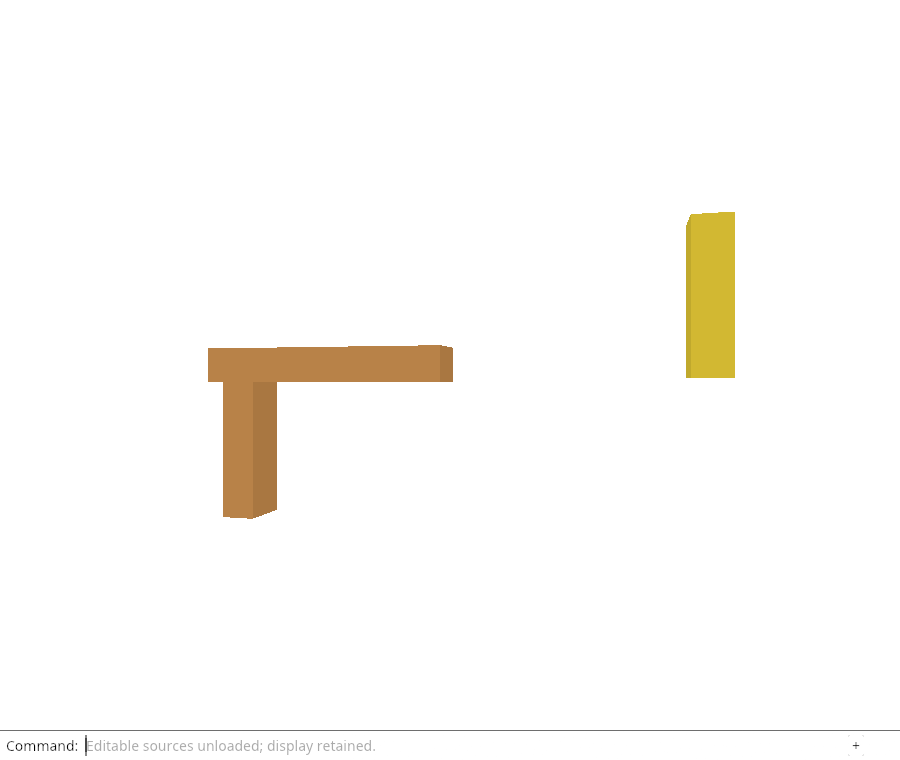
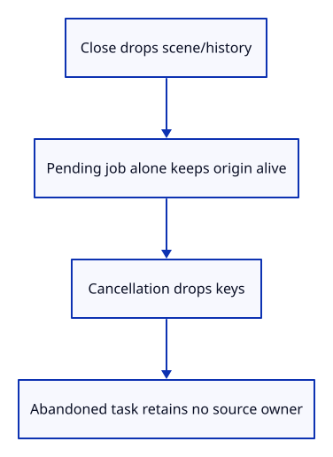

# 32gfa · Prove cancelled work releases its source owners

**Typing: 26–51 minutes.** [Estimate](typing-load.md).

Add three native checks. The first starts requests out of order and proves that an older ticket cannot consume current keys; a matching ticket consumes them once. Cancellation, empty requests and duplicate origins leave no pending work.

## Type

Continue from [Give each source request its own owner](32gf-request.md). [Save or recover your work](recovery.md).

### 1. `src/reload_job.rs`

Check ordering, exhaustion and actual owner expiration while abandoned work remains alive.

<details>
<summary>Locate the existing block</summary>

```rust
    pub fn cancel(&mut self) -> bool { self.pending.take().is_some() }
}
```

</details>

Replace that block with:

```rust
--8<-- "journey/code/32gfa-ownership-01.rs"
```

## Run and check

In your project:

```sh
cd workspace/journey
REGEN_PROTO=0 cargo build --lib --locked --target wasm32-unknown-unknown -j4
REGEN_PROTO=0 CARGO_BUILD_JOBS=4 trunk serve --port 8780
```

Open `http://127.0.0.1:8780/`. Keep an existing Trunk server running; saving rebuilds it.

Run the request-owner checks below. Cancelling a batch releases its request metadata; a late completion must not revive that owner.

**Verified checkpoint in Chrome.**



[Verification scope](release.md).

Run the state checks on your computer from your project folder:

```sh
REGEN_PROTO=0 cargo test --lib --locked --target host-tuple -j4
```

<details>
<summary>Code explanation and diagram</summary>

The ownership check closes the editor while a pending job still owns the source. Then it cancels the job and keeps a simulated abandoned asynchronous owner alive. `Weak::upgrade` must return `None` for the Origin and URL while the request strings remain readable. This directly tests the reason for separating URL strings from source owners.

Finally force ticket exhaustion. A checked increment must fail, never wrap, and leave older keys cancelled. These tests do not claim the browser has aborted a network read yet; that controller belongs to the later browser flight.

Pending job holds keys → Close drops rows → cancel drops keys → abandoned request is inert.



Can a held reference to the job keep the source alive after cancellation?

It can keep the empty job alive, but not its removed keys. Weak observers of the Origin and URL must expire even while an abandoned caller still holds the job and its request strings.

Study estimate, including typing and experiments: 1–2 hours.

</details>

<details>
<summary>Optional experiment</summary>

Change Request to store an `Rc<Origin>` in a scratch copy and predict which Weak assertion would fail after cancellation.

</details>

<details>
<summary>Check and save your work</summary>

Restore experimental edits, then run from `session_viewer`:

```sh
npm --prefix ../session_tests run course -- check 32gfa-ownership
npm --prefix ../session_tests run course -- save 32gfa-ownership
```

Source comparison leaves your project untouched. [Save and recovery instructions](recovery.md).

</details>

<details>
<summary>Viewer coverage and verification</summary>

Ownership proofs matter even when the browser ignores an abort temporarily. Cancelled asynchronous work must have neither authority to commit nor a retained kernel/URL owner.

The browser checks existing command-only unloading and retained drawing. The new infrastructure is compiled here; the Reload Sources command is connected in the following command lesson.

[Full validation scope](release.md).

To reproduce the scripted acceptance of the reference checkpoint, run from `session_viewer` with the [course bundle server](release.md#reproduce) running on port 8781:

```sh
npm --prefix ../session_tests run course -- capture 32gfa-ownership
```

This uses the verified reference bundle; it does not check or change your typed project.

</details>
