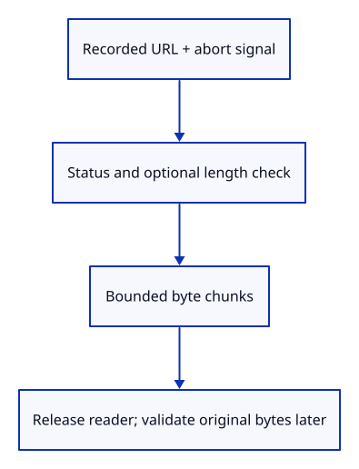
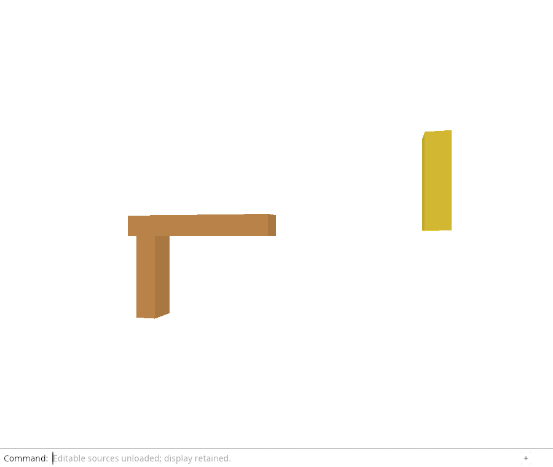

# 32gg · Read a source response within its byte limit

**Combined study estimate: 1–2 hours.** Includes reading, typing, reasoning and experiments.

**Typing estimate: 24–47 minutes.** 40 added or changed lines; unchanged context is excluded. [How this is estimated](typing-load.md).

**Today:** Read a source response within its byte limit.

**Follow:** Recorded URL → fetch with AbortSignal → HTTP/length checks → bounded stream chunks.

Enable the browser fetch, response, stream-reader and abort types. `source_fetch::fetch` uses a borrowed URL and AbortSignal, checks the HTTP status and optional length, then reads the response body as a stream. The current tutorial limit remains 4 MiB per source; it is not a measurement of browser staging or total process memory.

`JsFuture::from` lets Rust await a browser promise. `dyn_into` checks that the returned JavaScript value has the expected browser type. Each reader reply contains `done` and a byte-array `value`; `Reflect::get` reads those fields. Check remaining capacity before converting and appending a chunk.

On read failure, cancel the reader and release its lock. On success, release the lock and return original bytes. Version/schema checks still belong to source preparation, before adoption. This helper is compiled here; the browser command will exercise it after the flight and delivery boundaries exist.



## Type the change

Continue from [Prove cancelled work releases its source owners](32gfa-ownership.md). Save your own work first: `npm --prefix ../session_tests run course -- save before-32gg-fetch` (from `session_viewer`).

### 1. `Cargo.toml`

Enable only the browser types used by streaming and cancellation.

<details>
<summary>Locate the existing block</summary>

```toml
"Url", "HtmlAnchorElement"]
```

</details>

Replace that block with:

```toml
--8<-- "journey/code/32gg-fetch-01.toml"
```

### 2. `src/lib.rs`

Keep browser promises and streams out of the native editor.

<details>
<summary>Locate the existing block</summary>

```rust
#[cfg(target_arch = "wasm32")]
mod browser;
```

</details>

Replace that block with:

```rust
--8<-- "journey/code/32gg-fetch-02.rs"
```

### 3. `src/source_fetch.rs`

Read original byte chunks without exceeding the per-source limit.

Create the file and type:

```rust
--8<-- "journey/code/32gg-fetch-03.rs"
```

## Run and look

From `session_viewer`, enter your project folder:

```sh
cd workspace/journey
REGEN_PROTO=0 cargo build --lib --locked --target wasm32-unknown-unknown -j4
REGEN_PROTO=0 CARGO_BUILD_JOBS=4 trunk serve --port 8780
```

Open `http://127.0.0.1:8780/`. If Trunk is already running in this project, leave it running; it rebuilds when you save.

Run the bounded-fetch checks below. Oversized or incomplete bodies must fail before source adoption. The fetch is not a viewer command yet.

**Verified checkpoint in Chrome.**



[What this screenshot checks](release.md).

Run the state checks from your project folder:

```sh
REGEN_PROTO=0 cargo test --lib --locked -j4
```

<details>
<summary>Optional experiment</summary>

Remove the incremental limit in a scratch copy. Explain what a response without a length header could allocate before the final check.

</details>

## Explain the change

Why is checking only Content-Length insufficient?

<details>
<summary>Compare your explanation</summary>

The header can be missing or wrong. Check it before reading when present, then enforce the same limit on every received chunk. Never append a chunk that would exceed the per-source byte budget.

</details>

## Keep your working result

Return to `session_viewer` in a second terminal. Restore experimental edits before comparing:

```sh
npm --prefix ../session_tests run course -- check 32gg-fetch
npm --prefix ../session_tests run course -- save 32gg-fetch
```

Check compares your typed source; run the focused check above for behavior. [Recover your work](recovery.md).

<details>
<summary>Where this fits in the finished viewer</summary>

Later publication lessons extend fetching to large published sources and their version policy. This immutable File/Blob path preserves exact source bytes and a bounded read for the current mesh subset.

</details>

<details>
<summary>Verification notes and browser acceptance</summary>

The browser checks existing command-only unloading and retained drawing. The new infrastructure is compiled here; the Reload Sources command is connected in the following command lesson.

[Full validation scope](release.md).

To reproduce the scripted acceptance of the reference checkpoint, run from `session_viewer` with the [course bundle server](release.md#reproduce) running on port 8781:

```sh
npm --prefix ../session_tests run course -- capture 32gg-fetch
```

This uses the verified reference bundle; it does not check or change your typed project.

</details>
