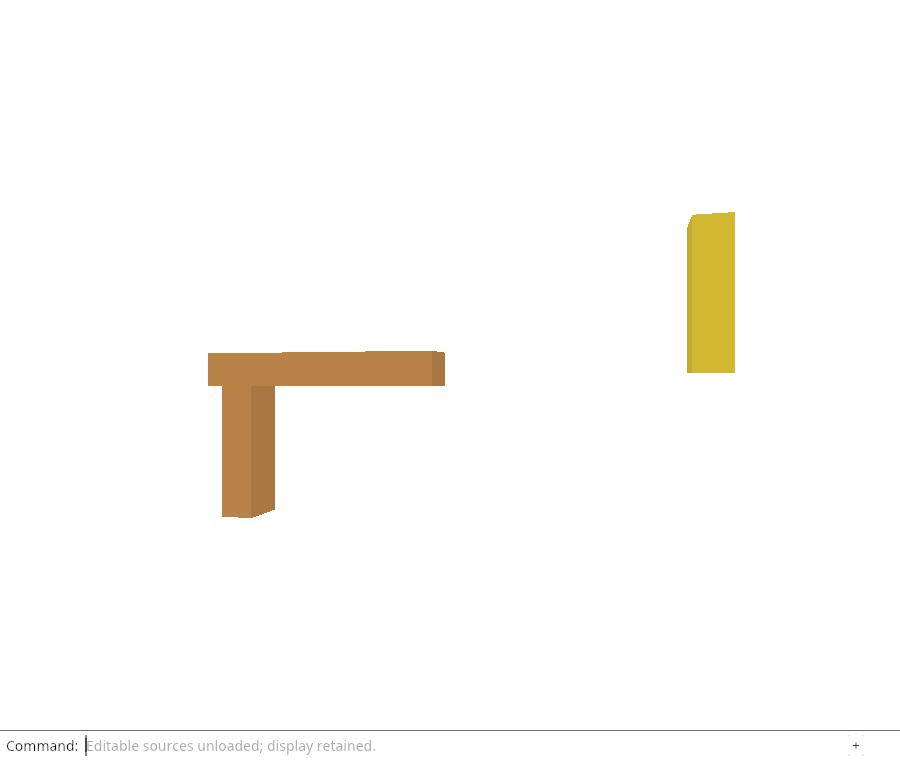
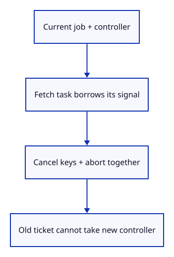

# 32gga · Pair reload ownership with a browser abort controller

**Typing: 12–24 minutes.** [Estimate](typing-load.md).

Define `Flight` with the native job and one AbortController. `begin` cancels the previous flight, creates the browser controller and gives the fetch task its signal together with URL strings. The controller stays in the current owner.

`cancel` removes keys and takes the controller before calling abort. `finish` checks the ticket through the job first. A matching failure aborts any remaining response work; a successful complete batch simply drops its controller. An older completion cannot reach either path.

## Type

Continue from [Read a source response within its byte limit](32gg-fetch.md). [Save or recover your work](recovery.md).

### 1. `src/lib.rs`

Keep the browser flight beside the fetch adapter.

<details>
<summary>Locate the existing block</summary>

```rust
#[cfg(target_arch = "wasm32")]
mod source_fetch;
```

</details>

Replace that block with:

```rust
--8<-- "journey/code/32gga-flight-01.rs"
```

### 2. `src/browser_reload.rs`

Cancel keys and I/O together without letting old results touch a new flight.

Create the file and type:

```rust
--8<-- "journey/code/32gga-flight-02.rs"
```

## Run and check

In your project:

```sh
cd workspace/journey
REGEN_PROTO=0 cargo build --lib --locked --target wasm32-unknown-unknown -j4
REGEN_PROTO=0 CARGO_BUILD_JOBS=4 trunk serve --port 8780
```

Open `http://127.0.0.1:8780/`. Keep an existing Trunk server running; saving rebuilds it.

Run the checks below and build the browser bundle. The flight now pairs its ticket with an AbortController; cancelling it removes authority and aborts its fetch.

**Verified checkpoint in Chrome.**



[Verification scope](release.md).

Run the state checks on your computer from your project folder:

```sh
REGEN_PROTO=0 cargo test --lib --locked --target host-tuple -j4
```

<details>
<summary>Code explanation and diagram</summary>

`Shared` is an `Rc<RefCell<Flight>>` because one browser event callback and its asynchronous task need the same owner. Borrow only for short synchronous operations. Never keep a RefCell borrow across await: another event must be able to cancel while a fetch is waiting.

ReloadJob + AbortController → captured signal → cancel or current finish.



Why must an old failed request not abort the newer controller?

Only a matching current ticket may finish and take the current controller. A late result first fails the job ticket check and cannot touch newer work.

Study estimate, including typing and experiments: 1–2 hours.

</details>

<details>
<summary>Optional experiment</summary>

Move controller.take before the job ticket check in a scratch copy. Trace how a late failure could remove the newer request controller.

</details>

<details>
<summary>Check and save your work</summary>

Restore experimental edits, then run from `session_viewer`:

```sh
npm --prefix ../session_tests run course -- check 32gga-flight
npm --prefix ../session_tests run course -- save 32gga-flight
```

Source comparison leaves your project untouched. [Save and recovery instructions](recovery.md).

</details>

<details>
<summary>Viewer coverage and verification</summary>

Abort is an I/O request, not permission to commit. The native ticket and release-key checks remain necessary even when network cancellation behaves correctly.

The browser checks existing command-only unloading and retained drawing. The new infrastructure is compiled here; the Reload Sources command is connected in the following command lesson.

[Full validation scope](release.md).

To reproduce the scripted acceptance of the reference checkpoint, run from `session_viewer` with the [course bundle server](release.md#reproduce) running on port 8781:

```sh
npm --prefix ../session_tests run course -- capture 32gga-flight
```

This uses the verified reference bundle; it does not check or change your typed project.

</details>
