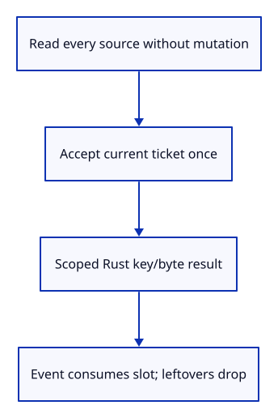
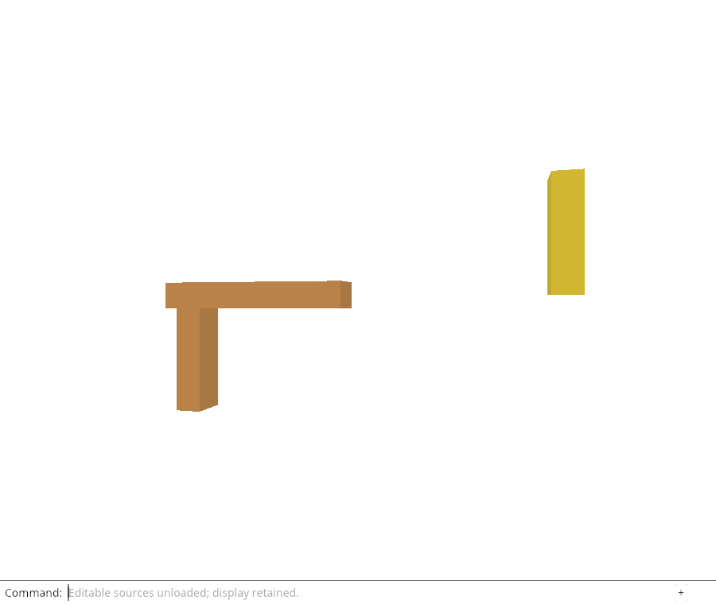

# 32ggb · Deliver only the current completed reload batch

**Combined study estimate: 1–2 hours.** Includes reading, typing, reasoning and experiments.

**Typing estimate: 14–28 minutes.** 30 added or changed lines; unchanged context is excluded. [How this is estimated](typing-load.md).

**Today:** Deliver only the current completed reload batch.

**Follow:** Flight begin → await URL reads → finish ticket once → scoped Rust reply → viewer event.

Add a `Delivery` slot and spawn one local asynchronous task. Fetch each requested URL with the captured signal. A failure stops the batch; successful bytes are kept in request order. No Scene changes while any read is pending.

After awaiting, ask the shared owner to finish this ticket. A cancelled or replaced request returns immediately, before reporting an error or dispatching a viewer event. For the current request, zip the accepted keys with its bytes and place that Result in the Rust slot for synchronous dispatch. Clear any unclaimed result after dispatch.

The asynchronous task holds the shared flight, plain strings, signal and delivery slot. Cancellation empties the flight keys, so a delayed task does not keep the old Origin alive. Event callbacks will take the accepted slot and call the atomic hydration API; the command is connected next.



## Type the change

Continue from [Pair reload ownership with a browser abort controller](32gga-flight.md). Save your own work first: `npm --prefix ../session_tests run course -- save before-32ggb-delivery` (from `session_viewer`).

### 1. `src/browser_reload.rs`

Spawn bounded source reads and deliver only one current owned completion.

Find this exact block:

```rust
pub type Shared = Rc<RefCell<Flight>>;
```

Replace that block with:

```rust
--8<-- "journey/code/32ggb-delivery-01.rs"
```

## Run and look

From `session_viewer`, enter your project folder:

```sh
cd workspace/journey
REGEN_PROTO=0 cargo build --lib --locked --target wasm32-unknown-unknown -j4
REGEN_PROTO=0 CARGO_BUILD_JOBS=4 trunk serve --port 8780
```

Open `http://127.0.0.1:8780/`. If Trunk is already running in this project, leave it running; it rebuilds when you save.

Run the delivery checks below. Only the current completed batch can fill the reply slot. Stale or duplicate replies must leave that slot unchanged.

**Verified checkpoint in Chrome.**



[What this screenshot checks](release.md).

Run the state checks from your project folder:

```sh
REGEN_PROTO=0 cargo test --lib --locked -j4
```

<details>
<summary>Optional experiment</summary>

Dispatch viewer-reload from the browser console without an accepted slot. Predict why it cannot restore any source.

</details>

## Explain the change

Why is the restored source data kept in a Rust delivery slot rather than event.detail?

<details>
<summary>Compare your explanation</summary>

The slot carries the accepted release keys with their bytes. The event only wakes the viewer; an external event without accepted Rust data cannot fabricate a source completion.

</details>

## Keep your working result

Return to `session_viewer` in a second terminal. Restore experimental edits before comparing:

```sh
npm --prefix ../session_tests run course -- check 32ggb-delivery
npm --prefix ../session_tests run course -- save 32ggb-delivery
```

Check compares your typed source; run the focused check above for behavior. [Recover your work](recovery.md).

<details>
<summary>Where this fits in the finished viewer</summary>

The accepted File bridge and the source-reload bridge use the same principle: retain native ownership through one accepted handoff and do not let generic browser events become source authority.

</details>

<details>
<summary>Verification notes and browser acceptance</summary>

The browser checks existing command-only unloading and retained drawing. The new infrastructure is compiled here; the Reload Sources command is connected in the following command lesson.

[Full validation scope](release.md).

To reproduce the scripted acceptance of the reference checkpoint, run from `session_viewer` with the [course bundle server](release.md#reproduce) running on port 8781:

```sh
npm --prefix ../session_tests run course -- capture 32ggb-delivery
```

This uses the verified reference bundle; it does not check or change your typed project.

</details>
