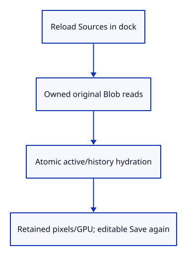
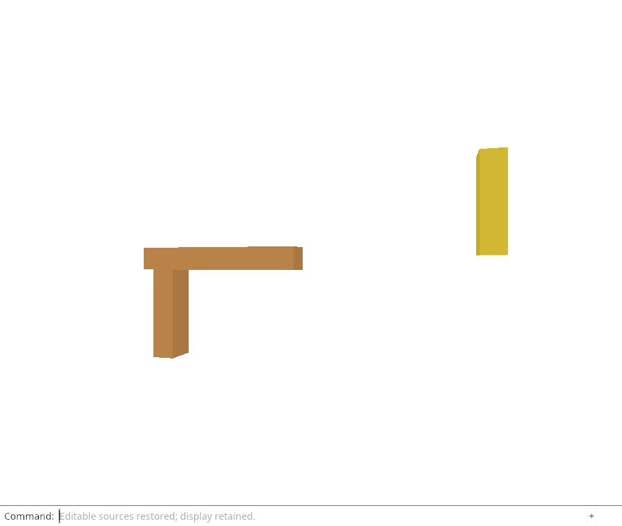

# 32gh · Restore editable sources through the command line

**Combined study estimate: 1–2 hours.** Includes reading, typing, reasoning and experiments.

**Typing estimate: 18–35 minutes.** 30 added or changed lines; unchanged context is excluded. [How this is estimated](typing-load.md).

**Today:** Restore editable sources through the command line.

**Follow:** Reload Sources → active keys → owned fetch → atomic hydrate → same GPU display.

Add `Reload Sources` and `Cancel Reload` to the same production-styled dock. Reload collects active release keys and starts the browser flight. Immediate setup errors belong to the typed command; later success or failure gets its own `Reload Sources` history reply.

A `viewer-reload` event takes only the accepted Rust delivery slot. Atomic hydrate validates keys, immutable bytes and every affected history row before restoring source owners. Synchronize the renderer afterward: retained display Rcs and object settings must produce zero new GPU allocations or writes.



## Type the change

Continue from [Deliver only the current completed reload batch](32ggb-delivery.md). Save your own work first: `npm --prefix ../session_tests run course -- save before-32gh-command` (from `session_viewer`).

### 1. `src/browser.rs`

Make source residency requests typed commands without feature buttons.

Find this exact block:

```rust
            "Unload Sources",
```

Replace that block with:

```rust
--8<-- "journey/code/32gh-command-01.rs"
```

### 2. `src/browser.rs`

Own one current reload flight and one scoped accepted reply.

Find this exact block:

```rust
    let delivery: crate::file_input::Delivery = std::rc::Rc::new(std::cell::RefCell::new(None));
```

Replace that block with:

```rust
--8<-- "journey/code/32gh-command-02.rs"
```

### 3. `src/browser.rs`

Adopt only an accepted current result and give asynchronous replies their own history entry.

Find this exact block:

```rust
        } else if event.type_() == "viewer-file" {
            match crate::file_input::action(&event, &delivery) {
```

Replace that block with:

```rust
--8<-- "journey/code/32gh-command-03.rs"
```

### 4. `src/browser.rs`

Start or cancel an owned request from the actual command field.

Find this exact block:

```rust
            if line == "unload sources" {
```

Replace that block with:

```rust
--8<-- "journey/code/32gh-command-04.rs"
```

### 5. `src/browser.rs`

Wake the viewer for a scoped accepted result.

Find this exact block:

```rust
    window.add_event_listener_with_callback("viewer-file-error", update.as_ref().unchecked_ref())?;
```

Replace that block with:

```rust
--8<-- "journey/code/32gh-command-05.rs"
```

## Run and look

From `session_viewer`, enter your project folder:

```sh
cd workspace/journey
REGEN_PROTO=0 cargo build --lib --locked --target wasm32-unknown-unknown -j4
REGEN_PROTO=0 CARGO_BUILD_JOBS=4 trunk serve --port 8780
```

Open `http://127.0.0.1:8780/`. If Trunk is already running in this project, leave it running; it rebuilds when you save.

Open `sample.pb`, then type `Unload Sources` and `Reload Sources`. Wait for “Editable sources restored; display retained.” The picture stays the same and Move works again.

**Verified checkpoint in Chrome.**



[What this screenshot checks](release.md).

Run the state checks from your project folder:

```sh
REGEN_PROTO=0 cargo test --lib --locked -j4
```

<details>
<summary>Optional experiment</summary>

Keep a command such as View Isometric between the reload request and its reply. Explain why panel.answer must append its own result instead of replacing that newer command.

</details>

## Explain the change

Does source restoration need a new Undo entry?

<details>
<summary>Compare your explanation</summary>

No. Restoring editable ownership changes residency, not the document. Keep the existing drawing, placement and history; only the later requested edit should create a document transaction.

</details>

## Keep your working result

Return to `session_viewer` in a second terminal. Restore experimental edits before comparing:

```sh
npm --prefix ../session_tests run course -- check 32gh-command
npm --prefix ../session_tests run course -- save 32gh-command
```

Check compares your typed source; run the focused check above for behavior. [Recover your work](recovery.md).

<details>
<summary>Where this fits in the finished viewer</summary>

The full viewer hydrates released sources before editing. This endpoint makes the browser restore operation real; captured-target automatic command replay follows separately.

</details>

<details>
<summary>Verification notes and browser acceptance</summary>

Chrome runs a real Blob fetch, checks unchanged pixels/IDs/metadata/GPU counters, saves the restored document and uses Undo/Redo. It also sends an external reload event with no slot and checks a second reload when nothing is cold. Automatic Move/Delete/Save-triggered reload remains the next feature; users explicitly reload first here.

[Full validation scope](release.md).

To reproduce the scripted acceptance of the reference checkpoint, run from `session_viewer` with the [course bundle server](release.md#reproduce) running on port 8781:

```sh
npm --prefix ../session_tests run course -- capture 32gh-command
```

This uses the verified reference bundle; it does not check or change your typed project.

</details>
