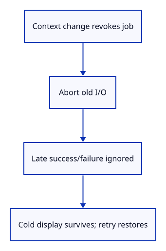
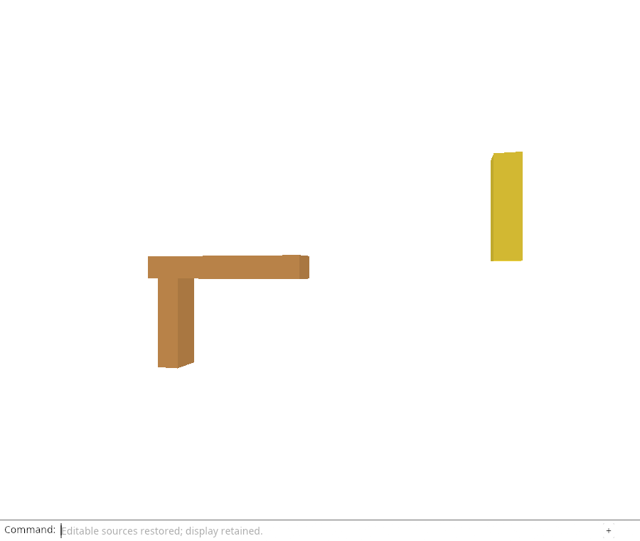

# 32gha · Cancel reloads when their document context changes

**Combined study estimate: 1–2 hours.** Includes reading, typing, reasoning and experiments.

**Typing estimate: 16–31 minutes.** 28 added or changed lines; unchanged context is excluded. [How this is estimated](typing-load.md).

**Today:** Cancel reloads when their document context changes.

**In the whole viewer:** Connect the browser, drawing and input, then extend the same project. [See the destination](../journey.md#the-destination).

**Follow:** Close / replacement / Undo / release → cancel flight → late result is inert.

**Before you finish, explain:** Why cancel Open Replace at picker opening rather than after its file finishes reading?

Cancel the reload before Close, another Unload Sources, Undo/Redo or replacement adoption. Open Replace also cancels at picker opening, matching the existing file-read boundary. Camera and selection remain available while a source request waits.

Chrome holds real fetch results while typing camera commands, Cancel Reload, Undo, Close and Open Replace. It releases both late successes and failures after invalidation and verifies no adopted source or new history reply. Closing drops the current source URL even if a delayed task still exists.

The same browser checker injects HTTP failures, oversized/stream-error bodies and changed versions, then performs a successful retry. These failures keep the display cold and pixel-identical. A real Blob retry restores source ownership without allocating geometry. Automatic requested-edit replay remains pending.



Type a small native `reload_check` example to compare the original file with the actual browser download. It compares original double vertices and topology by saved GUID, checks names/flags and requires separately stored placements. Run `REGEN_PROTO=0 cargo run --example reload_check -- sample.pb ~/Downloads/viewer.session` from your project. The Chrome checker invokes this same example on its actual saved file; it does not substitute a generated fixture.

## Type the change

Continue [Restore editable sources through the command line](32gh-command.md). From `session_viewer`, save your files with `npm --prefix ../session_tests run course -- save before-32gha-cancel`. A save keeps your own work; it does not fill in the next lesson.

### 1. `src/browser.rs`

Invalidate the old reload as soon as replacement intent begins.

Find this exact block:

```rust
                read_mode.set(if line == "open replace" { crate::file_input::Mode::Replace }
```

Replace that block with:

```rust
--8<-- "journey/code/32gha-cancel-01.rs"
```

### 2. `src/browser.rs`

Remove reload keys and abort I/O before changing the current document context.

Find this exact block:

```rust
        if let Some(action) = action {
```

Replace that block with:

```rust
--8<-- "journey/code/32gha-cancel-02.rs"
```

### 3. `examples/reload_check.rs`

Compare original geometry and flags with the real browser download using the typed protobuf reader.

Create the file and type:

```rust
--8<-- "journey/code/32gha-cancel-03.rs"
```

## Run and look

From `session_viewer`, enter your project folder:

```sh
cd workspace/journey
REGEN_PROTO=0 cargo build --lib --locked --target wasm32-unknown-unknown -j4
REGEN_PROTO=0 CARGO_BUILD_JOBS=4 trunk serve --port 8780
```

Open `http://127.0.0.1:8780/`. If Trunk is already running in this project, leave it running; it rebuilds when you save.

When Trunk reloads after a code change, the viewer starts with its generated demo again. From `workspace/journey`, make the sample using the example you already typed:

```sh
REGEN_PROTO=0 cargo run --example sample --locked -j4
```

Type `Open Replace`, choose `sample.pb`, then type `Select Next` twice, `Move 0.35,0,0.25`, `View Isometric` and `Fit`. You now have a moved object from a retained, reloadable file.

Hold a source request, cancel or change its context, then release it. The old result must not change current pixels, residency or command history. Retry Reload Sources successfully.

**Actual Chrome screenshot.**



*Captured from this checkpoint’s browser bundle after its browser checks passed. [Check scope and environment](release.md).*

Run the state checks from your project folder:

```sh
REGEN_PROTO=0 cargo test --lib --locked -j4
```

## Try one small experiment

Cancel only after replacement adoption in a scratch copy. Explain the interval in which an older reload could still finish while the replacement picker or read is pending.

## Explain it in your own words

Trace the values through the files without reading the answer first. If you lose the connection, stop at the last value you can follow.

<details>
<summary>Compare your explanation</summary>

The user has already chosen to replace the document context. Cancel the older reload before waiting for another picker or file read, so its delayed result cannot adopt into that context.

</details>

## Keep your working result

Return to `session_viewer` in a second terminal. Restore experimental edits before comparing:

```sh
npm --prefix ../session_tests run course -- check 32gha-cancel
npm --prefix ../session_tests run course -- save 32gha-cancel
```

The comparison spots typing differences; it does not prove behaviour. Keep three notes: what I changed; the values I followed; the question I still have. [Recover a checkpoint](recovery.md) if an experiment gets tangled.

## Where this grows

Context cancellation and source release-key checks complement one another. Neither a network abort nor a valid original file is enough to authorize an obsolete completion.

[Validation status and course release](release.md).
