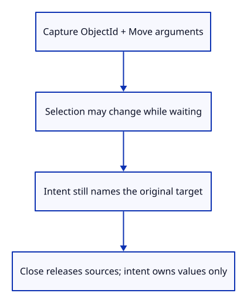
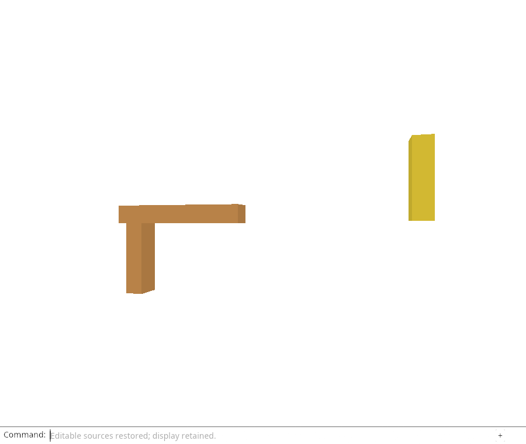

# 32gi · Capture the requested edit before waiting

**Combined study estimate: 1–2 hours.** Includes reading, typing, reasoning and experiments.

**Typing estimate: 30–60 minutes.** 72 added or changed lines; unchanged context is excluded. [How this is estimated](typing-load.md).

**Today:** Retain the original object and arguments before any source request starts.

**In the whole viewer:** Connect the browser, drawing and input, then extend the same project. [See the destination](../journey.md#the-destination).

**Follow:** Command + original selection → value-only Intent → unchanged target while waiting.

**Before you finish, explain:** Why store ObjectId and Move offset rather than selection or a precomputed model?

A delayed edit needs a small record of the user’s request. Intent contains only a stable ObjectId and copied Move arguments, or Save. It owns no geometry, origin or URL. Changing selection cannot redirect that value.

Unselected Delete, zero-offset Move and ordinary view commands do not create an edit intent; invalid Move values are refused. Save is represented explicitly because it will need every active cold origin instead of one selected target. Source selection and replay are added in the following checkpoints.

This checkpoint introduces and tests the request record. It does not yet intercept browser edits or replay them. Chrome checks the existing explicit reload path and its retained drawing; native tests prove captured target identity and that Close releases sources despite a retained intent.



## Type the change

Continue [Cancel reloads when their document context changes](32gha-cancel.md). From `session_viewer`, save your files with `npm --prefix ../session_tests run course -- save before-32gi-capture`. A save keeps your own work; it does not fill in the next lesson.

### 1. `src/lib.rs`

Register the value-only requested-edit module.

Find this exact block:

```rust
pub mod reload_job;
```

Replace that block with:

```rust
--8<-- "journey/code/32gi-capture-01.rs"
```

### 2. `src/edit_intent.rs`

Capture the requested target and arguments without retaining any source owners.

Create the file and type:

```rust
--8<-- "journey/code/32gi-capture-02.rs"
```

## Run and look

From `session_viewer`, enter your project folder:

```sh
cd workspace/journey
REGEN_PROTO=0 cargo build --lib --locked --target wasm32-unknown-unknown -j4
REGEN_PROTO=0 CARGO_BUILD_JOBS=4 trunk serve --port 8780
```

Open `http://127.0.0.1:8780/`. If Trunk is already running in this project, leave it running; it rebuilds when you save.

From your project, run `REGEN_PROTO=0 cargo run --example sample --locked -j4`. Type Open Replace, choose sample.pb, Select Next twice, Move 0.35,0,0.25, View Isometric, Orbit Right, Orbit Up, Move 1.92,0,0.93, Move 0.25,0,-0.15 and Fit. Unload Sources and Reload Sources must retain this drawing. Automatic Move/Delete/Save reload is still pending.

**Actual Chrome screenshot.**

The existing explicit source reload preserves this checkpoint’s placed drawing. Captured-intent identity and release ownership are checked natively; automatic browser replay is introduced next.



*Captured from this checkpoint’s browser bundle after its browser checks passed. [Check scope and environment](release.md).*

Run the state checks from your project folder:

```sh
REGEN_PROTO=0 cargo test --lib --locked -j4
```

## Try one small experiment

Capture Move for one object, change selection, then inspect the captured ObjectId in the native test. Explain which origin the request must load.

## Explain it in your own words

Trace the values through the files without reading the answer first. If you lose the connection, stop at the last value you can follow.

<details>
<summary>Compare your explanation</summary>

Selection can change while I/O waits. The original ObjectId names the requested target; the offset expresses the requested change. A later replay must read that target’s current placement rather than replace it with a stale matrix.

</details>

## Keep your working result

Return to `session_viewer` in a second terminal. Restore experimental edits before comparing:

```sh
npm --prefix ../session_tests run course -- check 32gi-capture
npm --prefix ../session_tests run course -- save 32gi-capture
```

The comparison spots typing differences; it does not prove behaviour. Keep three notes: what I changed; the values I followed; the question I still have. [Recover a checkpoint](recovery.md) if an experiment gets tangled.

## Where this grows

Separate requested intent from current interaction state. Source tickets authorize the completion; the captured target determines which edit may be replayed.

[Validation status and course release](release.md).
