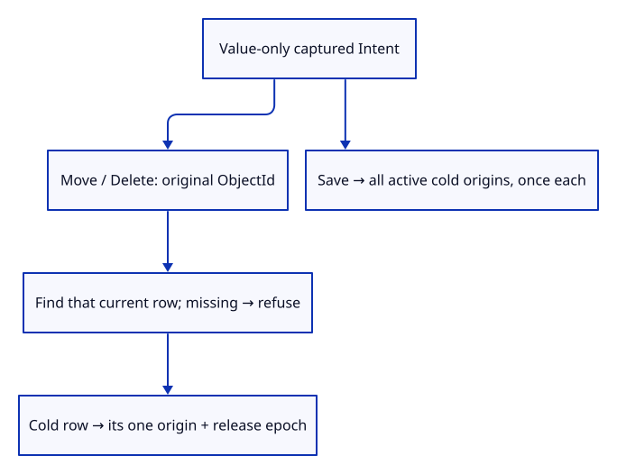
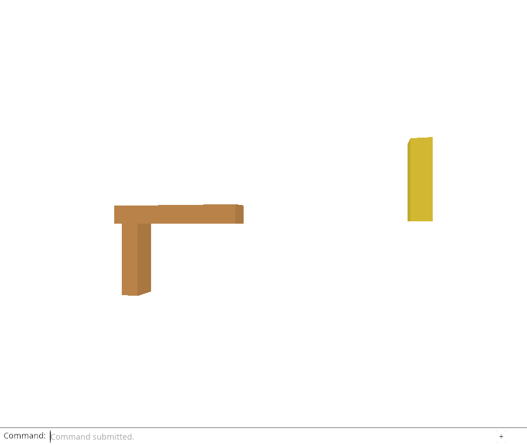

# 32gia · Load only the sources the requested edit needs

**Combined study estimate: 1–2 hours.** Includes reading, typing, reasoning and experiments.

**Typing estimate: 30–60 minutes.** 68 added or changed lines; unchanged context is excluded. [How this is estimated](typing-load.md).

**Today:** Select source requests from the original edit target, with Save covering the active document.

**Follow:** Intent → original current row → cold origin + epoch; Save → unique active cold origins.

Move and Delete follow the captured ObjectId, even if selection now belongs to a different import. A loaded target needs no source request. A missing target fails before any fetch begins. For a cold row, ReloadKey::of returns its exact origin and release epoch.

Save reuses Editor::reload_keys: it gathers each active cold origin once, even when several rows share it. It excludes loaded rows and sources held only by Undo/Redo history. Three native tests distinguish two imports, later selection, deduplication, history-only sources and missing or loaded targets.

The method borrows Editor only while collecting keys. The returned keys temporarily retain the origins needed by a future ReloadJob; the Intent itself still holds values only. Browser interception and replay are not connected yet.



## Type the change

Continue from [Capture the requested edit before waiting](32gi-capture.md). Save your own work first: `npm --prefix ../session_tests run course -- save before-32gia-scope` (from `session_viewer`).

### 1. `src/edit_intent.rs`

Bring the editor and existing release-key type into this module.

<details>
<summary>Locate the existing block</summary>

```rust
use crate::{editor::Action, scene::ObjectId};
```

</details>

Replace that block with:

```rust
--8<-- "journey/code/32gia-scope-01.rs"
```

### 2. `src/edit_intent.rs`

Resolve dependencies from the captured target or active Save scene.

<details>
<summary>Locate the existing block</summary>

```rust
impl Intent {
```

</details>

Replace that block with:

```rust
--8<-- "journey/code/32gia-scope-02.rs"
```

### 3. `src/lib.rs`

Register the independent source-scope tests.

<details>
<summary>Locate the existing block</summary>

```rust
pub mod edit_intent;
```

</details>

Replace that block with:

```rust
--8<-- "journey/code/32gia-scope-03.rs"
```

### 4. `src/edit_scope_tests.rs`

Distinguish target imports from later selection, active Save sources from history, and missing targets from loaded ones.

Create the file and type:

```rust
--8<-- "journey/code/32gia-scope-04.rs"
```

## Run and look

From `session_viewer`, enter your project folder:

```sh
cd workspace/journey
REGEN_PROTO=0 cargo build --lib --locked --target wasm32-unknown-unknown -j4
REGEN_PROTO=0 CARGO_BUILD_JOBS=4 trunk serve --port 8780
```

Open `http://127.0.0.1:8780/`. If Trunk is already running in this project, leave it running; it rebuilds when you save.

Run the scope checks below. Move/Delete request only their captured target; Save requests active cold sources, excluding history-only rows.

**Verified checkpoint in Chrome.**



[What this screenshot checks](release.md).

Run the state checks from your project folder:

```sh
REGEN_PROTO=0 cargo test --lib --locked -j4
```

<details>
<summary>Optional experiment</summary>

In the first scope test, point selection at a row from the second import. Explain why Move and Delete still request the first import, while Save requests both.

</details>

## Explain the change

Why should Save ignore a released source that exists only in Undo history?

<details>
<summary>Compare your explanation</summary>

Save serializes the active scene. History-only rows are not in that file, so fetching their source delays Save without supplying any required data. Undo can request that source later when its rows become active.

</details>

## Keep your working result

Return to `session_viewer` in a second terminal. Restore experimental edits before comparing:

```sh
npm --prefix ../session_tests run course -- check 32gia-scope
npm --prefix ../session_tests run course -- save 32gia-scope
```

Check compares your typed source; run the focused check above for behavior. [Recover your work](recovery.md).

<details>
<summary>Where this fits in the finished viewer</summary>

The operation determines its source dependencies. Current selection, history size and the number of displayed rows do not determine a request’s authority.

</details>

<details>
<summary>Verification notes and browser acceptance</summary>

Chrome checks the inherited explicit source reload and this placed drawing. Original-target source selection, active-document Save scope and refusal cases are proved natively; automatic browser replay is still pending.

[Full validation scope](release.md).

To reproduce the scripted acceptance of the reference checkpoint, run from `session_viewer` with the [course bundle server](release.md#reproduce) running on port 8781:

```sh
npm --prefix ../session_tests run course -- capture 32gia-scope
```

This uses the verified reference bundle; it does not check or change your typed project.

</details>
