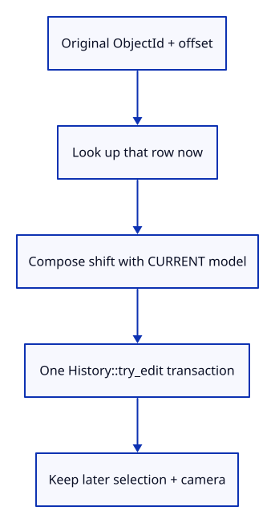
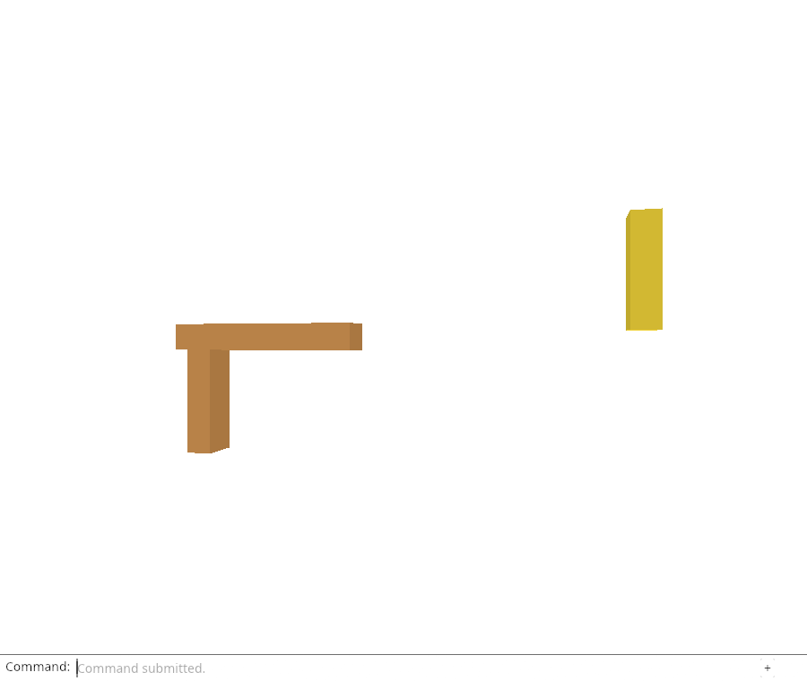

# 32gib · Move the original target from its current placement

**Combined study estimate: 1–2 hours.** Includes reading, typing, reasoning and experiments.

**Typing estimate: 27–53 minutes.** 45 added or changed lines; unchanged context is excluded. [How this is estimated](typing-load.md).

**Today:** Apply a captured Move to its original target, composing with the placement that exists at replay time.

**Follow:** Captured ObjectId + offset → current row.model → world shift × model → one history edit.

Extract Editor::move_object with an explicit ObjectId. It validates arguments, finds that current row, composes the world shift with its current model and makes one History::try_edit transaction. It leaves selection and camera untouched. Normal Action::Translate calls the same method after resolving current selection.

This is the native Move replay operation. One-shot asynchronous authority is added in the ticket/intent lesson, and automatic browser interception follows it. Delete and Save are taught separately to keep each change small.



## Type the change

Continue from [Load only the sources the requested edit needs](32gia-scope.md). Save your own work first: `npm --prefix ../session_tests run course -- save before-32gib-move` (from `session_viewer`).

### 1. `src/editor.rs`

Resolve an explicit target from current state and commit its world-space delta once.

<details>
<summary>Locate the existing block</summary>

```rust
    pub fn apply(&mut self, action: Action) -> Result<Change, &'static str> {
```

</details>

Replace that block with:

```rust
--8<-- "journey/code/32gib-move-01.rs"
```

### 2. `src/editor.rs`

Keep ordinary Move on the same implementation used by captured edits.

<details>
<summary>Locate the existing block</summary>

```rust
            Action::Translate(offset) => {
                let id = self.selected.ok_or("Select an object before Move")?;
                if offset.iter().all(|&v| v == 0.0) { return Ok(Change::View); }
                let object = self.scene.objects().iter().find(|o| o.id == id).ok_or("Object not found")?;
                let shift = session_rust::Xform::translation(offset[0], offset[1], offset[2]);
                let model = &shift * &object.model;
                self.history.try_edit(&mut self.scene, |scene| scene.place(id, model))?;
            }
```

</details>

Replace that block with:

```rust
--8<-- "journey/code/32gib-move-02.rs"
```

### 3. `src/lib.rs`

Register the original-target Move checks.

<details>
<summary>Locate the existing block</summary>

```rust
mod edit_scope_tests;
```

</details>

Replace that block with:

```rust
--8<-- "journey/code/32gib-move-03.rs"
```

### 4. `src/edit_move_tests.rs`

Prove current placement, later selection, camera and one history transaction survive replay.

Create the file and type:

```rust
--8<-- "journey/code/32gib-move-04.rs"
```

## Run and look

From `session_viewer`, enter your project folder:

```sh
cd workspace/journey
REGEN_PROTO=0 cargo build --lib --locked --target wasm32-unknown-unknown -j4
REGEN_PROTO=0 CARGO_BUILD_JOBS=4 trunk serve --port 8780
```

Open `http://127.0.0.1:8780/`. If Trunk is already running in this project, leave it running; it rebuilds when you save.

Run the captured-Move checks below. Change selection while waiting: replay must still move the original target and compose with its current placement.

**Verified checkpoint in Chrome.**



[What this screenshot checks](release.md).

Run the state checks from your project folder:

```sh
REGEN_PROTO=0 cargo test --lib --locked -j4
```

<details>
<summary>Optional experiment</summary>

In the native test, replace the newer model with the model that existed at capture time. Explain which placement that stale replacement would lose.

</details>

## Explain the change

Why must a delayed Move compose with the current placement rather than a matrix saved when the request began?

<details>
<summary>Compare your explanation</summary>

The request describes an offset, not a replacement matrix. Reading the current model preserves any placement that now exists. The captured ObjectId chooses the target while current selection remains available for other interaction.

</details>

## Keep your working result

Return to `session_viewer` in a second terminal. Restore experimental edits before comparing:

```sh
npm --prefix ../session_tests run course -- check 32gib-move
npm --prefix ../session_tests run course -- save 32gib-move
```

Check compares your typed source; run the focused check above for behavior. [Recover your work](recovery.md).

<details>
<summary>Where this fits in the finished viewer</summary>

Captured intent names the target and requested delta. Replay reads current state; a separate ticket owner limits which completion may execute it.

</details>

<details>
<summary>Verification notes and browser acceptance</summary>

The native test captures a Move, changes the target’s placement and selects another object before executing the captured values. The result is based on the newer placement; selection and camera stay unchanged. One Undo restores the immediate prior model, another Undo does nothing, and Redo restores the result. No-op or refused moves preserve an existing Redo. Existing source tests still reject moving a cold row until hydration.

Chrome checks normal Move/Undo/Redo through the extracted explicit-target method. Delayed target identity, current-placement composition and later selection are proved natively; automatic browser replay is still pending.

[Full validation scope](release.md).

To reproduce the scripted acceptance of the reference checkpoint, run from `session_viewer` with the [course bundle server](release.md#reproduce) running on port 8781:

```sh
npm --prefix ../session_tests run course -- capture 32gib-move
```

This uses the verified reference bundle; it does not check or change your typed project.

</details>
