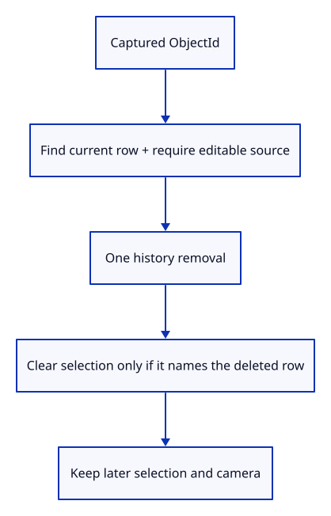
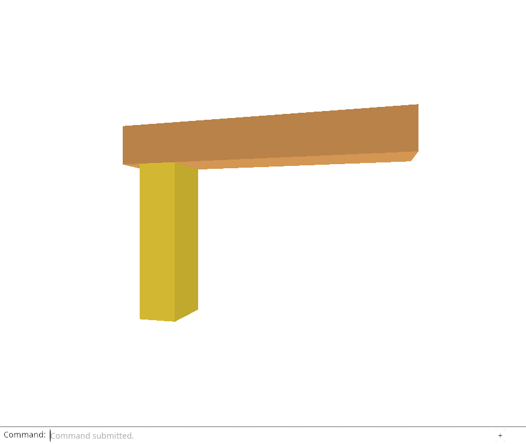

# 32giba · Delete the original target while keeping later selection

**Combined study estimate: 1–2 hours.** Includes reading, typing, reasoning and experiments.

**Typing estimate: 26–52 minutes.** 49 added or changed lines; unchanged context is excluded. [How this is estimated](typing-load.md).

**Today:** Delete a captured target by identity without redirecting the command to a later selection.

**In the whole viewer:** Connect the browser, drawing and input, then extend the same project. [See the destination](../journey.md#the-destination).

**Follow:** Captured ObjectId → current editable row → one history removal → preserve other selection.

**Before you finish, explain:** Why does a delayed Delete compare selection with its captured target before clearing it?

Extract Editor::delete_object with an explicit ObjectId. Look up the current row and require editable geometry before creating history. A missing or cold target returns an error and preserves Redo. Normal Delete with no selection changes only the view.

History::edit records one removal. Clear selection only if it still names the deleted target; otherwise keep the newer selection. The camera is untouched. The native test captures Delete, selects another row and orbits before replaying the captured identity. One Undo restores the row; another Undo does nothing, and Redo removes the same target. A second test covers cold/missing targets, empty selection and clearing the deleted selection.

The immutable borrow of row is last used in the geometry guard. Rust ends that borrow before History mutably borrows scene. Do not take selection to choose the replay target: taking it would clear a later selection before the command succeeds.

This lesson adds the native Delete operation. Chrome exercises ordinary Delete through this same helper; automatic asynchronous replay remains a later lesson.



## Type the change

Continue [Move the original target from its current placement](32gib-move.md). From `session_viewer`, save your files with `npm --prefix ../session_tests run course -- save before-32giba-delete`. A save keeps your own work; it does not fill in the next lesson.

### 1. `src/editor.rs`

Remove the original target once and clear only its own selection.

Find this exact block:

```rust
    pub fn apply(&mut self, action: Action) -> Result<Change, &'static str> {
```

Replace that block with:

```rust
--8<-- "journey/code/32giba-delete-01.rs"
```

### 2. `src/editor.rs`

Use the same helper for ordinary Delete and preserve history when nothing is selected.

Find this exact block:

```rust
            Action::Delete => {
                if let Some(id) = self.selected {
                    let row = self.scene.objects().iter().find(|row| row.id == id).ok_or("Object not found")?;
                    if row.geometry().is_none() { return Err("Reload editable sources before Delete"); }
                }
                if let Some(id) = self.selected.take() {
                    self.history.edit(&mut self.scene, |scene| { scene.remove(id); });
                }
            }
```

Replace that block with:

```rust
--8<-- "journey/code/32giba-delete-02.rs"
```

### 3. `src/lib.rs`

Register the captured-target Delete checks.

Find this exact block:

```rust
mod edit_move_tests;
```

Replace that block with:

```rust
--8<-- "journey/code/32giba-delete-03.rs"
```

### 4. `src/edit_delete_tests.rs`

Check delayed selection, one Undo and refusal without losing Redo.

Create the file and type:

```rust
--8<-- "journey/code/32giba-delete-04.rs"
```

## Run and look

From `session_viewer`, enter your project folder:

```sh
cd workspace/journey
REGEN_PROTO=0 cargo build --lib --locked --target wasm32-unknown-unknown -j4
REGEN_PROTO=0 CARGO_BUILD_JOBS=4 trunk serve --port 8780
```

Open `http://127.0.0.1:8780/`. If Trunk is already running in this project, leave it running; it rebuilds when you save.

From your project, run `REGEN_PROTO=0 cargo run --example sample --locked -j4`. Type Open Replace, choose sample.pb, Select Next twice, Move 0.35,0,0.25, View Isometric, Orbit Right, Orbit Up, Move 1.92,0,0.93, Move 0.25,0,-0.15 and Fit. Unload Sources and Reload Sources must retain this drawing. Automatic Move/Delete/Save reload is still pending. Then type Move 0,0.25,0 and Fit. Inspect the native scope tests to compare original-target requests with Save requests. Then type Move 0.25,0,0.15, Undo and Redo. Undo restores the preceding drawing; Redo restores the move. Type Fit afterward. Type Delete, Undo, Select Next twice and Redo. Undo restores the geometry; selection must be chosen again after deleting the selected row. Finally type Select Next and Fit to inspect a remaining object.

**Actual Chrome screenshot.**

Chrome checks normal Delete/Undo/Redo through the explicit-target helper. Native tests prove delayed target identity, preserved later selection/camera and refusal without losing Redo. Automatic browser replay remains pending.



*Captured from this checkpoint’s browser bundle after its browser checks passed. [Check scope and environment](release.md).*

Run the state checks from your project folder:

```sh
REGEN_PROTO=0 cargo test --lib --locked -j4
```

## Try one small experiment

Select the other row before calling delete_object in the native test. Replace the identity comparison with unconditional selection clearing and explain the lost user interaction.

## Explain it in your own words

Trace the values through the files without reading the answer first. If you lose the connection, stop at the last value you can follow.

<details>
<summary>Compare your explanation</summary>

The user may have selected another row while loading the target. The captured identity decides what to delete; current selection is cleared only when that exact row disappears.

</details>

## Keep your working result

Return to `session_viewer` in a second terminal. Restore experimental edits before comparing:

```sh
npm --prefix ../session_tests run course -- check 32giba-delete
npm --prefix ../session_tests run course -- save 32giba-delete
```

The comparison spots typing differences; it does not prove behaviour. Keep three notes: what I changed; the values I followed; the question I still have. [Recover a checkpoint](recovery.md) if an experiment gets tangled.

## Where this grows

Delayed edits resolve their captured target from current state, then mutate history once. Current selection is independent of the requested target.

[Validation status and course release](release.md).
