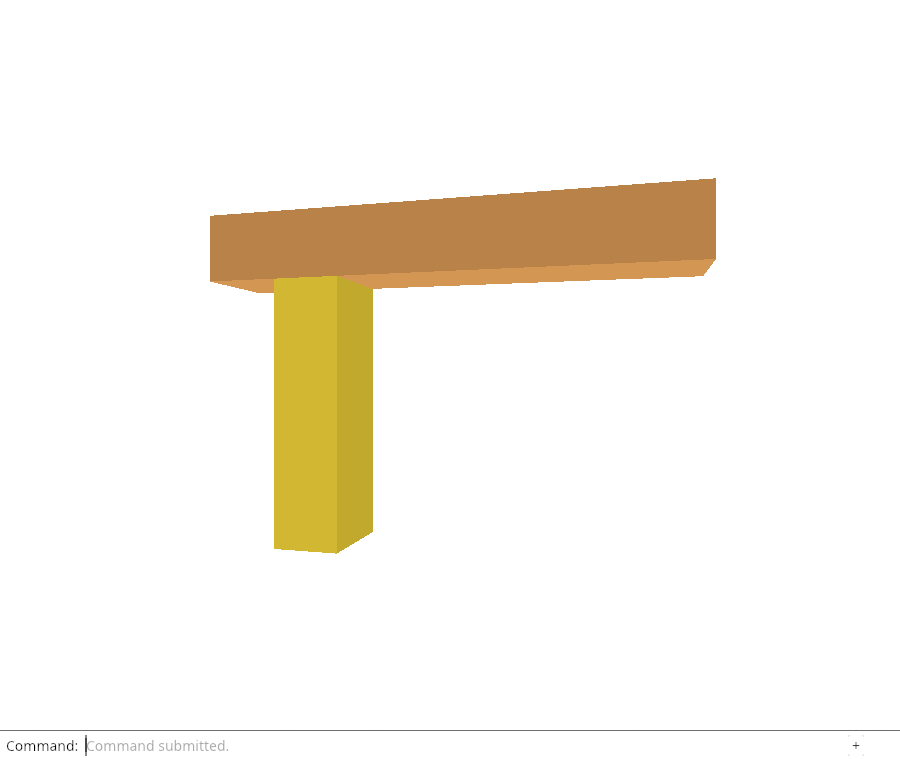
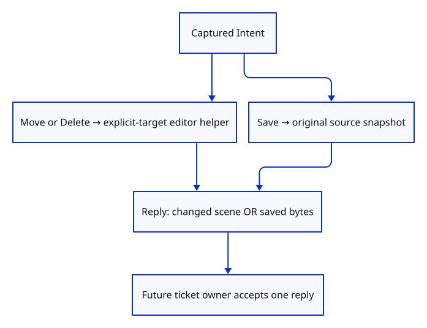

# 32gibb · Route captured Move, Delete and Save results

**Typing: 25–50 minutes.** [Estimate](typing-load.md).

Add edit_replay as a separate module. A second impl Intent block adds replay without changing capture or scope discovery. Reply carries either a Change or saved bytes, letting the future browser completion handler decide whether to update the renderer or start a download.

## Type

Continue from [Delete the original target while keeping later selection](32giba-delete.md). [Save or recover your work](recovery.md).

### 1. `src/edit_replay.rs`

Return changed-state feedback or save bytes without confusing a download with a history edit.

Create the file and type:

```rust
--8<-- "journey/code/32gibb-reply-01.rs"
```

### 2. `src/lib.rs`

Register the captured-intent result module.

<details>
<summary>Locate the existing block</summary>

```rust
pub mod edit_intent;
```

</details>

Replace that block with:

```rust
--8<-- "journey/code/32gibb-reply-02.rs"
```

## Run and check

In your project:

```sh
cd workspace/journey
REGEN_PROTO=0 cargo build --lib --locked --target wasm32-unknown-unknown -j4
REGEN_PROTO=0 CARGO_BUILD_JOBS=4 trunk serve --port 8780
```

Open `http://127.0.0.1:8780/`. Keep an existing Trunk server running; saving rebuilds it.

Run the reply checks below. Move/Delete return a scene change; Save returns original-source bytes without adding an Undo step.

**Verified checkpoint in Chrome.**



[Verification scope](release.md).

Run the state checks on your computer from your project folder:

```sh
REGEN_PROTO=0 cargo test --lib --locked --target host-tuple -j4
```

<details>
<summary>Code explanation and diagram</summary>

Move and Delete call the explicit-target editor methods already proved. Save calls document::snapshot on the current scene; that function reads original kernel doubles and current placements. It neither changes selection/camera nor adds history. Result::map wraps successful values while preserving existing errors. The enum is a Rust tagged choice: matching Saved exposes bytes; Changed exposes a renderer change.

Replay itself does not authorize an asynchronous completion. The next lesson pairs the intent with its pending ticket; only a current completion may take and execute it.

Intent → explicit-target edit or original source snapshot → Reply::Changed or Reply::Saved.



Why must Save return bytes without adding a document history entry?

Saving observes the current document. Undo must still undo the last modeling operation; returning original-source bytes preserves precision without turning a download into an edit.

Study estimate, including typing and experiments: 1–2 hours.

</details>

<details>
<summary>Optional experiment</summary>

Call History::edit during Save, then run the native test and explain why Undo now observes an extra history step.

</details>

<details>
<summary>Check and save your work</summary>

Restore experimental edits, then run from `session_viewer`:

```sh
npm --prefix ../session_tests run course -- check 32gibb-reply
npm --prefix ../session_tests run course -- save 32gibb-reply
```

Source comparison leaves your project untouched. [Save and recovery instructions](recovery.md).

</details>

<details>
<summary>Viewer coverage and verification</summary>

The pending owner will consume an intent once, then route changed-state feedback or save bytes. This lesson defines only execution and result values.

Native checks replay all three intents, compare saved source coordinates exactly and prove Save does not consume Move Undo. Cold Save fails while preserving Redo. Chrome checks the existing normal Save download and Move Undo path; browser completion has not yet been connected to this replay method.

Chrome downloads through normal Save and proves Move Undo remains available. Native tests execute all three captured intents and compare saved doubles. Owned asynchronous completion/replay remains pending.

[Full validation scope](release.md).

To reproduce the scripted acceptance of the reference checkpoint, run from `session_viewer` with the [course bundle server](release.md#reproduce) running on port 8781:

```sh
npm --prefix ../session_tests run course -- capture 32gibb-reply
```

This uses the verified reference bundle; it does not check or change your typed project.

</details>
