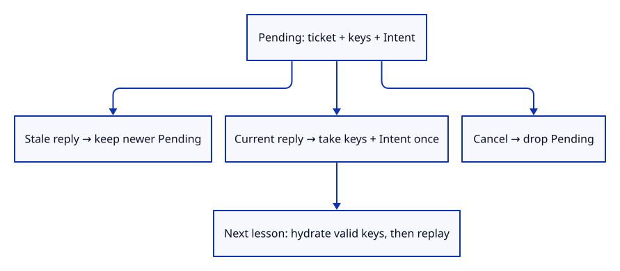
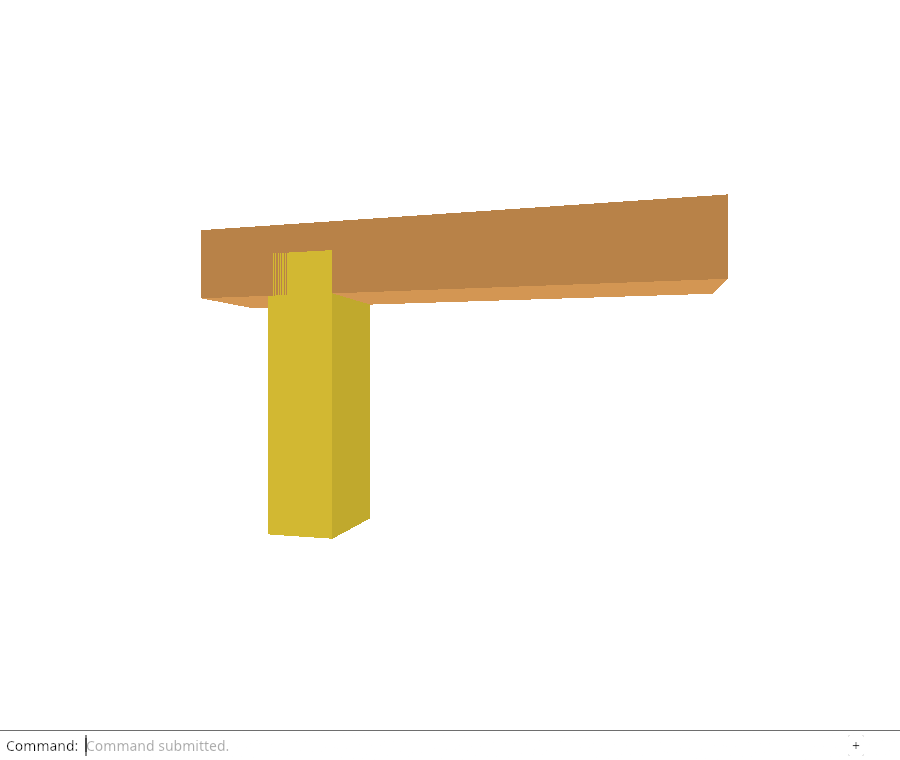

# 32gic · Own the intent with its pending source ticket

**Combined study estimate: 1–2 hours.** Includes reading, typing, reasoning and experiments.

**Typing estimate: 27–53 minutes.** 54 added or changed lines; unchanged context is excluded. [How this is estimated](typing-load.md).

**Today:** Store source keys and captured intent in one pending owner that current completion can consume once.

**Follow:** ReloadJob<Intent> → Pending { ticket, keys, payload } → current finish_with takes both once.

Generalize ReloadJob with a payload type P. Pending stores that payload beside its ticket and keys; begin_with installs them together, finish_with returns them together once, and cancel drops them together. The request sent to a future still owns only URL strings and a ticket.

P is a Rust type parameter: ReloadJob<Intent> owns a captured modeling request, while ReloadJob<()> carries the unit value, which means no additional data. The default type keeps existing explicit Reload Sources callers unchanged. A manual Default implementation starts empty without requiring Intent to implement Default.

The normal begin/finish methods are thin wrappers for the unit specialization. Existing cancellation, ticket exhaustion, duplicate-origin and browser fetch checks still run. New native checks prove an old reply cannot consume the newer Save, the current reply returns its exact intent once, and cancellation drops pending metadata without retaining a kernel document.

A matching ticket establishes current request ownership, not document validity. The next browser lesson must still hydrate with the captured keys and reject changed origin/epoch context before replay. Success and failure both consume only their own current ticket; a stale failure must never abort newer work.



## Type the change

Continue from [Route captured Move, Delete and Save results](32gibb-reply.md). Save your own work first: `npm --prefix ../session_tests run course -- save before-32gic-owner` (from `session_viewer`).

### 1. `src/reload_job.rs`

Keep the intent and source keys inside the same ticket-owned value.

Find this exact block:

```rust
struct Pending {
    ticket: u64,
    keys: Vec<ReloadKey>,
}
```

Replace that block with:

```rust
--8<-- "journey/code/32gic-owner-01.rs"
```

### 2. `src/reload_job.rs`

Allow any payload without requiring that payload to have a default value.

Find this exact block:

```rust
#[derive(Default)]
pub struct ReloadJob {
    issued: u64,
    pending: Option<Pending>,
}

impl ReloadJob {
```

Replace that block with:

```rust
--8<-- "journey/code/32gic-owner-02.rs"
```

### 3. `src/reload_job.rs`

Capture the requested operation when beginning its scoped source request.

Find this exact block:

```rust
    pub fn begin(&mut self, keys: Vec<ReloadKey>) -> Result<Request, &'static str> {
```

Replace that block with:

```rust
--8<-- "journey/code/32gic-owner-03.rs"
```

### 4. `src/reload_job.rs`

Install keys and payload together after request validation succeeds.

Find this exact block:

```rust
        self.pending = Some(Pending { ticket, keys });
```

Replace that block with:

```rust
--8<-- "journey/code/32gic-owner-04.rs"
```

### 5. `src/reload_job.rs`

Take the current payload once; stale replies leave newer work untouched.

Find this exact block:

```rust
    pub fn finish(&mut self, ticket: u64) -> Option<Vec<ReloadKey>> {
        if self.pending() != Some(ticket) { return None; }
        self.pending.take().map(|pending| pending.keys)
    }
```

Replace that block with:

```rust
--8<-- "journey/code/32gic-owner-05.rs"
```

### 6. `src/reload_job.rs`

Keep explicit Reload Sources using a unit payload and its existing interface.

Find this exact block:

```rust
    pub fn cancel(&mut self) -> bool { self.pending.take().is_some() }
}
```

Replace that block with:

```rust
--8<-- "journey/code/32gic-owner-06.rs"
```

### 7. `src/lib.rs`

Register native ownership checks without exposing test code to the browser.

Find this exact block:

```rust
pub mod edit_replay;
```

Replace that block with:

```rust
--8<-- "journey/code/32gic-owner-07.rs"
```

### 8. `src/edit_owner_tests.rs`

Prove stale/duplicate/cancelled replies cannot consume an intent or retain its source metadata.

Create the file and type:

```rust
--8<-- "journey/code/32gic-owner-08.rs"
```

## Run and look

From `session_viewer`, enter your project folder:

```sh
cd workspace/journey
REGEN_PROTO=0 cargo build --lib --locked --target wasm32-unknown-unknown -j4
REGEN_PROTO=0 CARGO_BUILD_JOBS=4 trunk serve --port 8780
```

Open `http://127.0.0.1:8780/`. If Trunk is already running in this project, leave it running; it rebuilds when you save.

Run the owner checks below. A pending batch keeps its keys and captured intent together; cancellation and one-shot delivery must release that ownership.

**Verified checkpoint in Chrome.**



[What this screenshot checks](release.md).

Run the state checks from your project folder:

```sh
REGEN_PROTO=0 cargo test --lib --locked -j4
```

<details>
<summary>Optional experiment</summary>

Move pending.take before the ticket comparison in finish_with. Run the stale completion test and explain which newer request was lost.

</details>

## Explain the change

Why does a stale completion check the current ticket before taking the pending value?

<details>
<summary>Compare your explanation</summary>

Taking first would destroy a newer request. Checking first preserves newer keys and intent; only the matching current completion can consume the pair. Cancellation drops the whole pending owner.

</details>

## Keep your working result

Return to `session_viewer` in a second terminal. Restore experimental edits before comparing:

```sh
npm --prefix ../session_tests run course -- check 32gic-owner
npm --prefix ../session_tests run course -- save 32gic-owner
```

Check compares your typed source; run the focused check above for behavior. [Recover your work](recovery.md).

<details>
<summary>Where this fits in the finished viewer</summary>

Request identity and its payload share one owner. Completion ownership is checked before document context; hydration and replay follow only after both checks.

</details>

<details>
<summary>Verification notes and browser acceptance</summary>

Chrome checks the unchanged explicit reload/download/editor paths; this lesson does not yet connect an intent-bearing browser completion.

Chrome preserves the existing explicit reload, download and modeling paths. Native tests exercise intent-bearing ticket ownership, stale/duplicate replies and cancellation. Automatic browser replay follows next.

[Full validation scope](release.md).

To reproduce the scripted acceptance of the reference checkpoint, run from `session_viewer` with the [course bundle server](release.md#reproduce) running on port 8781:

```sh
npm --prefix ../session_tests run course -- capture 32gic-owner
```

This uses the verified reference bundle; it does not check or change your typed project.

</details>
