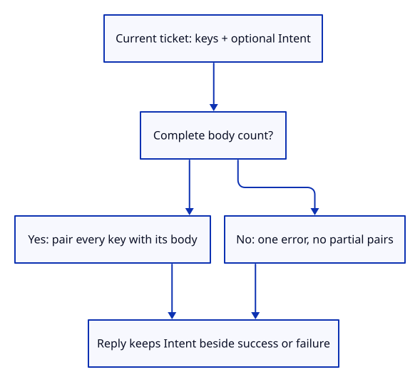
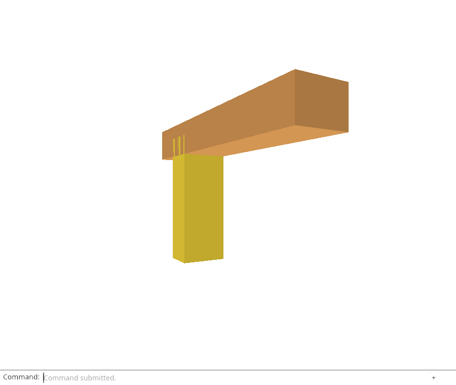

# 32gica · Pair captured intent with complete source bodies

**Combined study estimate: 1–2 hours.** Includes reading, typing, reasoning and experiments.

**Typing estimate: 30–59 minutes.** 59 added or changed lines; unchanged context is excluded. [How this is estimated](typing-load.md).

**Today:** Build a completion value that retains captured intent and rejects incomplete source-body pairings.

**In the whole viewer:** Connect the browser, drawing and input, then extend the same project. [See the destination](../journey.md#the-destination).

**Follow:** current ticket → keys + Intent → equal body count → complete pairs or error.

**Before you finish, explain:** Why must body-count validation happen before pairing bodies with source keys?

A completion must keep its captured operation beside every returned source body, or beside its failure. Reply stores an optional Intent and one Result. None describes explicit Reload Sources; Some describes captured Move, Delete or Save.

Before pairing bodies and keys, the constructor checks equal lengths. zip stops when either iterator ends; without this check a missing or extra body could silently become a partial restoration. A failure retains the operation and creates no source-body pairs.

Native tests carry all three operations through a current ticket, preserve exact file bytes and hydrate without replaying the operation. They also check network errors, missing bodies, extra bodies and the explicit None path. Hydration must preserve selection, camera and placement.

This checkpoint does not change the browser flight or connect automatic commands. Chrome checks the existing explicit reload and editor; the next lesson replaces its plain reply with this completion value.



## Type the change

Continue [Own the intent with its pending source ticket](32gic-owner.md). From `session_viewer`, save your files with `npm --prefix ../session_tests run course -- save before-32gica-reply`. A save keeps your own work; it does not fill in the next lesson.

### 1. `src/reload_reply.rs`

Keep the captured operation beside either its complete source bodies or its failure.

Create the file and type:

```rust
--8<-- "journey/code/32gica-reply-01.rs"
```

### 2. `src/lib.rs`

Register the completion value for native checks and browser delivery.

Find this exact block:

```rust
pub mod edit_replay;
```

Replace that block with:

```rust
--8<-- "journey/code/32gica-reply-02.rs"
```

### 3. `src/reload_reply_tests.rs`

Check all captured operations, exact bodies, failures, partial counts and the explicit no-operation path.

Create the file and type:

```rust
--8<-- "journey/code/32gica-reply-03.rs"
```

## Run and look

From `session_viewer`, enter your project folder:

```sh
cd workspace/journey
REGEN_PROTO=0 cargo build --lib --locked --target wasm32-unknown-unknown -j4
REGEN_PROTO=0 CARGO_BUILD_JOBS=4 trunk serve --port 8780
```

Open `http://127.0.0.1:8780/`. If Trunk is already running in this project, leave it running; it rebuilds when you save.

From your project, run `REGEN_PROTO=0 cargo run --example sample --locked -j4`. Type Open Replace, choose sample.pb, Select Next twice, Move 0.35,0,0.25, View Isometric, Orbit Right, Orbit Up, Move 1.92,0,0.93, Move 0.25,0,-0.15 and Fit. Unload Sources and Reload Sources must retain this drawing. Automatic Move/Delete/Save reload is still pending. Then type Move 0,0.25,0 and Fit. Inspect the native scope tests to compare original-target requests with Save requests. Then type Move 0.25,0,0.15, Undo and Redo. Undo restores the preceding drawing; Redo restores the move. Type Fit afterward. Type Delete, Undo, Select Next twice and Redo. Undo restores the geometry; selection must be chosen again after deleting the selected row. Finally type Select Next and Fit to inspect a remaining object. Move 0.15,0,0, Save, Undo and Redo; Save must leave the Move available to Undo. Finally type Fit. Type Move 0,0,0.15 and Fit. Inspect the native owner tests for stale, duplicate and cancelled completions. Type Orbit Right and Fit. Inspect the native completion checks before connecting automatic command replay.

**Actual Chrome screenshot.**

Native checks exercise captured Move/Delete/Save, exact source bodies and failure counts. Chrome retains the existing explicit reload/editor; browser delivery integration follows next.



*Captured from this checkpoint’s browser bundle after its browser checks passed. [Check scope and environment](release.md).*

Run the state checks from your project folder:

```sh
REGEN_PROTO=0 cargo test --lib --locked -j4
```

## Try one small experiment

Remove the body-count check and run the missing/extra body tests. Explain why zip alone cannot establish a complete response.

## Explain it in your own words

Trace the values through the files without reading the answer first. If you lose the connection, stop at the last value you can follow.

<details>
<summary>Compare your explanation</summary>

zip stops at the shorter vector. Without checking equal lengths first, a partial response could look like a complete restoration request. Failure keeps the operation but exposes no partial body pairs.

</details>

## Keep your working result

Return to `session_viewer` in a second terminal. Restore experimental edits before comparing:

```sh
npm --prefix ../session_tests run course -- check 32gica-reply
npm --prefix ../session_tests run course -- save 32gica-reply
```

The comparison spots typing differences; it does not prove behaviour. Keep three notes: what I changed; the values I followed; the question I still have. [Recover a checkpoint](recovery.md) if an experiment gets tangled.

## Where this grows

Request ownership, complete source bodies and captured intent reach one completion boundary. Document-context validation still precedes replay; automatic commands follow next.

[Validation status and course release](release.md).
