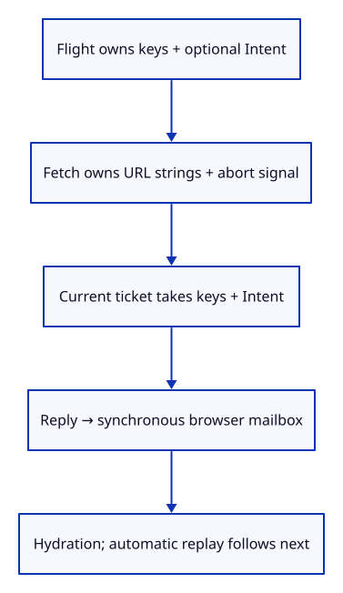
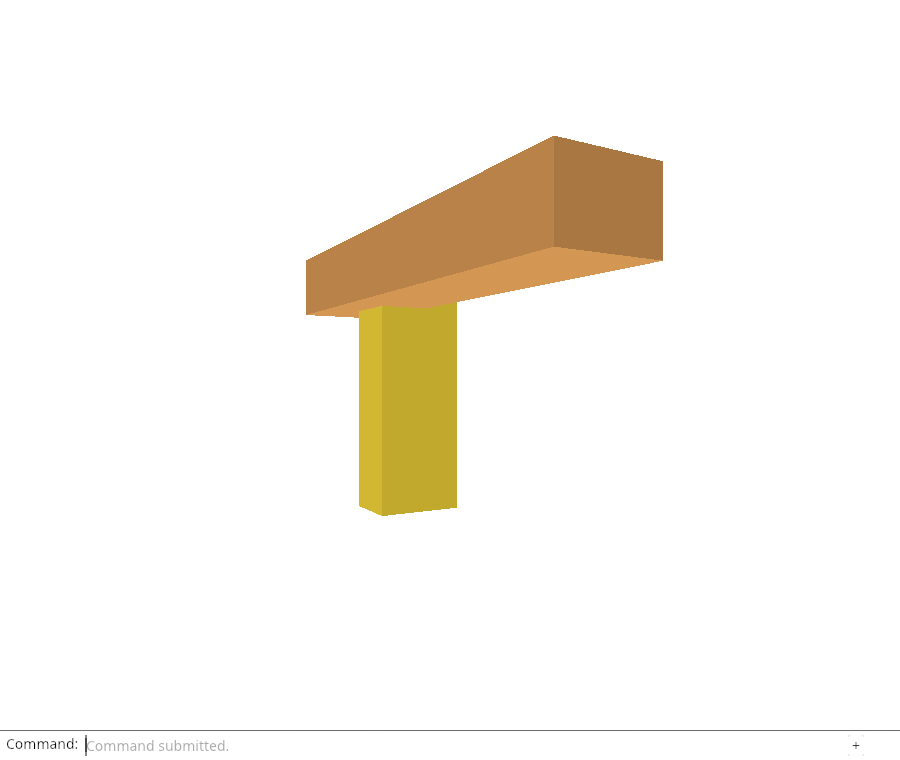

# 32gicb · Carry captured intent through browser completion

**Combined study estimate: 1–2 hours.** Includes reading, typing, reasoning and experiments.

**Typing estimate: 12–23 minutes.** 16 added or changed lines; unchanged context is excluded. [How this is estimated](typing-load.md).

**Today:** Carry optional captured intent through the abortable flight and deliver it beside complete source bodies or a current failure.

**Follow:** Flight → ReloadJob<Option<Intent>> → current finish_with → Reply → synchronous browser mailbox.

The browser flight now uses ReloadJob<Option<Intent>>. None means explicit Reload Sources; Some carries the captured operation that an automatic command will request next. start keeps its existing interface and calls start_with using None.

The async future owns URL strings, an abort signal and a ticket. Current completion takes keys and optional intent together, constructs the previously taught Reply and delivers it through the synchronous browser mailbox. A stale reply returns before touching a newer flight or its controller; cancellation retains the existing abort path.

The existing receiver reads reply.result and restores sources. Automatic commands will call start_with and replay reply.intent only after document-context validation in the next lesson. This checkpoint wires the completion boundary, not automatic replay.



## Type the change

Continue from [Pair captured intent with complete source bodies](32gica-reply.md). Save your own work first: `npm --prefix ../session_tests run course -- save before-32gicb-bridge` (from `session_viewer`).

### 1. `src/browser_reload.rs`

Use the same completion value in the browser mailbox.

<details>
<summary>Locate the existing block</summary>

```rust
pub type Reply = Result<Vec<(ReloadKey, Vec<u8>)>, String>;
```

</details>

Replace that block with:

```rust
--8<-- "journey/code/32gicb-bridge-01.rs"
```

### 2. `src/browser_reload.rs`

Preserve explicit Reload Sources while allowing a captured operation to accompany its keys.

<details>
<summary>Locate the existing block</summary>

```rust
pub fn start(shared: Shared, keys: Vec<ReloadKey>, delivery: Delivery) -> Result<(), String> {
    let (request, signal) = shared.borrow_mut().begin(keys)?;
```

</details>

Replace that block with:

```rust
--8<-- "journey/code/32gicb-bridge-02.rs"
```

### 3. `src/browser_reload.rs`

Only a current ticket may collect its captured operation and deliver the complete reply.

<details>
<summary>Locate the existing block</summary>

```rust
        let Some(keys) = shared.borrow_mut().finish(request.ticket, result.is_err()) else { return; };
        let result = result.map(|values| keys.into_iter().zip(values).collect());
        if let Err(error) = deliver(result, &delivery) {
```

</details>

Replace that block with:

```rust
--8<-- "journey/code/32gicb-bridge-03.rs"
```

### 4. `src/browser_reload.rs`

Let the existing abortable flight own an optional operation.

<details>
<summary>Locate the existing block</summary>

```rust
    job: ReloadJob,
```

</details>

Replace that block with:

```rust
--8<-- "journey/code/32gicb-bridge-04.rs"
```

### 5. `src/browser_reload.rs`

Capture the operation when starting the abortable source flight.

<details>
<summary>Locate the existing block</summary>

```rust
    fn begin(&mut self, keys: Vec<ReloadKey>) -> Result<(Request, web_sys::AbortSignal), String> {
```

</details>

Replace that block with:

```rust
--8<-- "journey/code/32gicb-bridge-05.rs"
```

### 6. `src/browser_reload.rs`

Install the optional operation and keys into one ticket owner.

<details>
<summary>Locate the existing block</summary>

```rust
        let request = self.job.begin(keys)?;
```

</details>

Replace that block with:

```rust
--8<-- "journey/code/32gicb-bridge-06.rs"
```

### 7. `src/browser_reload.rs`

Return both keys and operation only after checking completion ownership.

<details>
<summary>Locate the existing block</summary>

```rust
    fn finish(&mut self, ticket: u64, failed: bool) -> Option<Vec<ReloadKey>> {
        let keys = self.job.finish(ticket)?;
```

</details>

Replace that block with:

```rust
--8<-- "journey/code/32gicb-bridge-07.rs"
```

### 8. `src/browser.rs`

Keep the existing explicit source-restoration receiver reading the reply body.

<details>
<summary>Locate the existing block</summary>

```rust
            if let Some(result) = reload_delivery.borrow_mut().take() {
                match result.and_then(|values| editor.hydrate(values).map_err(str::to_owned)) {
```

</details>

Replace that block with:

```rust
--8<-- "journey/code/32gicb-bridge-08.rs"
```

## Run and look

From `session_viewer`, enter your project folder:

```sh
cd workspace/journey
REGEN_PROTO=0 cargo build --lib --locked --target wasm32-unknown-unknown -j4
REGEN_PROTO=0 CARGO_BUILD_JOBS=4 trunk serve --port 8780
```

Open `http://127.0.0.1:8780/`. If Trunk is already running in this project, leave it running; it rebuilds when you save.

Build the browser bundle and run the checks below. Accepted delivery now carries the intent; an aborted older flight cannot deliver it. Automatic commands are not routed yet.

**Verified checkpoint in Chrome.**



[What this screenshot checks](release.md).

Run the state checks from your project folder:

```sh
REGEN_PROTO=0 cargo test --lib --locked -j4
```

<details>
<summary>Optional experiment</summary>

Return the intent from the future rather than finish_with. Explain why cancelling the pending owner would no longer release that future’s captured request.

</details>

## Explain the change

Why does the asynchronous future retain a ticket instead of owning the pending intent and keys?

<details>
<summary>Compare your explanation</summary>

The flight can cancel and release pending ownership while a delayed future remains alive. Only a matching current ticket can take the intent and keys; a stale completion cannot disturb newer work.

</details>

## Keep your working result

Return to `session_viewer` in a second terminal. Restore experimental edits before comparing:

```sh
npm --prefix ../session_tests run course -- check 32gicb-bridge
npm --prefix ../session_tests run course -- save 32gicb-bridge
```

Check compares your typed source; run the focused check above for behavior. [Recover your work](recovery.md).

<details>
<summary>Where this fits in the finished viewer</summary>

Request ownership, complete source bodies and captured intent reach one completion boundary. Document-context validation still precedes replay; automatic commands follow next.

</details>

<details>
<summary>Verification notes and browser acceptance</summary>

Chrome checks explicit fetch, cancellation and editing through the changed delivery type. The native Reply and ticket tests still check all captured operations, exact bytes and failed completions.

Chrome checks explicit Reload Sources, cancellation and editing through the new reply. Native tests verify captured Move/Delete/Save and failures; automatic command replay is the next checkpoint.

[Full validation scope](release.md).

To reproduce the scripted acceptance of the reference checkpoint, run from `session_viewer` with the [course bundle server](release.md#reproduce) running on port 8781:

```sh
npm --prefix ../session_tests run course -- capture 32gicb-bridge
```

This uses the verified reference bundle; it does not check or change your typed project.

</details>
