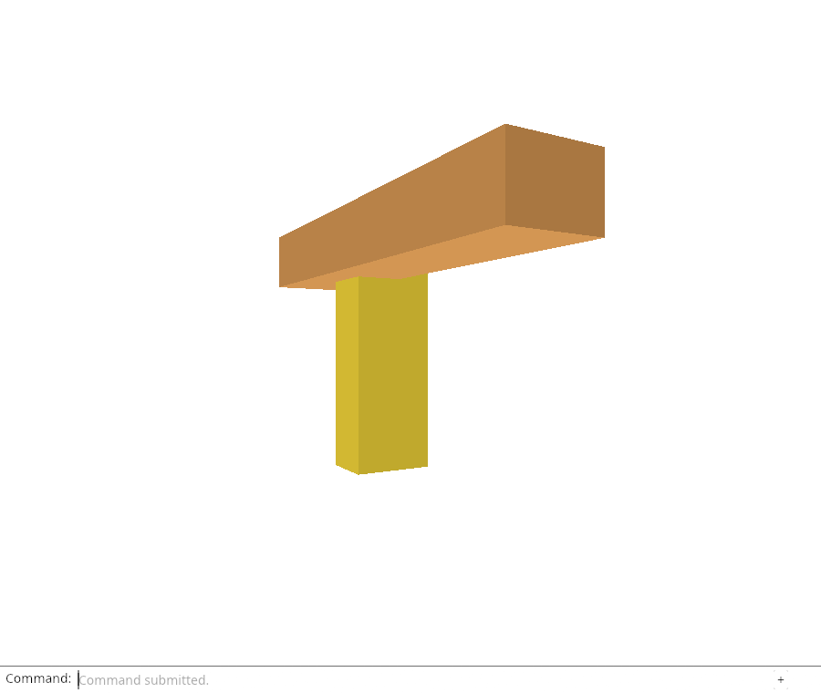
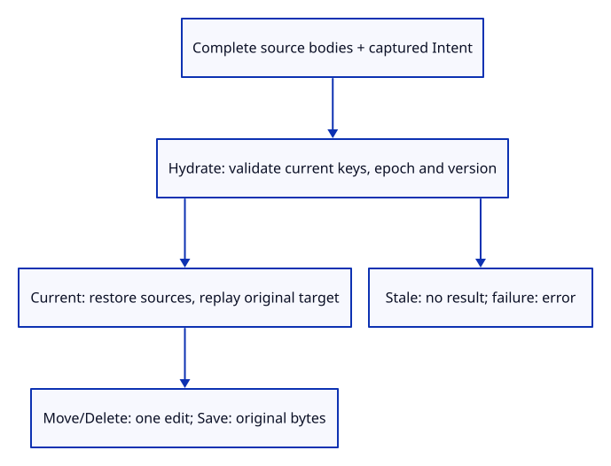

# 32gid · Validate restoration before replaying the command

**Typing: 30–59 minutes.** [Estimate](typing-load.md).

Restore the required sources before replaying a captured command. A failed or stale reply must perform no edit or download.

## Type

Continue from [Carry captured intent through browser completion](32gicb-bridge.md). [Save or recover your work](recovery.md).

### 1. `src/reload_reply.rs`

Validate every current source key and body before replay; a stale context produces no reply.

<details>
<summary>Locate the existing block</summary>

```rust
impl Reply {
```

</details>

Replace that block with:

```rust
--8<-- "journey/code/32gid-complete-01.rs"
```

### 2. `src/lib.rs`

Register native completion checks separately from the body-pairing checks.

<details>
<summary>Locate the existing block</summary>

```rust
mod reload_reply_tests;
```

</details>

Replace that block with:

```rust
--8<-- "journey/code/32gid-complete-02.rs"
```

### 3. `src/reload_complete_tests.rs`

Prove automatic native Move/Delete/Save completion, original target, later selection/camera, Undo, and stale or failed completion.

Create the file and type:

```rust
--8<-- "journey/code/32gid-complete-03.rs"
```

## Run and check

In your project:

```sh
cd workspace/journey
REGEN_PROTO=0 cargo build --lib --locked --target wasm32-unknown-unknown -j4
REGEN_PROTO=0 CARGO_BUILD_JOBS=4 trunk serve --port 8780
```

Open `http://127.0.0.1:8780/`. Keep an existing Trunk server running; saving rebuilds it.

Run the completion checks below. A valid batch restores sources before replaying its captured edit. Failed or stale batches must perform no edit or download.

**Verified checkpoint in Chrome.**



[Verification scope](release.md).

Run the state checks on your computer from your project folder:

```sh
REGEN_PROTO=0 cargo test --lib --locked --target host-tuple -j4
```

<details>
<summary>Code explanation and diagram</summary>

The reply already pairs complete bodies with the operation captured before fetching. complete now gives it one synchronous editor boundary. Hydration validates current source identity, release epoch, file version and metadata before it restores any source. A stale context returns None; a failed fetch or invalid body returns an error. Neither path replays the operation.

After successful hydration, Some(intent) calls the explicit-target replay taught earlier. Move and Delete each create one edit transaction; Save produces the original-precision document bytes without creating history. None represents explicit Reload Sources and returns a scene result. The browser will consume these results in the next checkpoint.

Reply → complete bodies → current keys and versions → hydrate → captured Intent → edit result.



Why does a stale restoration return None instead of replaying its captured Save or edit?

The source keys no longer match the current document and release epoch. The reply has lost authority; neither a scene change nor a download belongs to the replacement context.

Study estimate, including typing and experiments: 1–2 hours.

</details>

<details>
<summary>Optional experiment</summary>

Move intent.replay above hydrate and run the failed/stale completion checks. Explain which edits or downloads could escape document validation.

</details>

<details>
<summary>Check and save your work</summary>

Restore experimental edits, then run from `session_viewer`:

```sh
npm --prefix ../session_tests run course -- check 32gid-complete
npm --prefix ../session_tests run course -- save 32gid-complete
```

Source comparison leaves your project untouched. [Save and recovery instructions](recovery.md).

</details>

<details>
<summary>Viewer coverage and verification</summary>

One editor completion boundary validates restoration before applying a captured operation; fetch itself never mutates selection, camera or history.

Native checks complete all three cold-source operations, change selection and camera while waiting, verify the original target and one-step Undo, and reject a closed document and a network failure. Existing replay checks cover exact source doubles and Save history. Chrome still checks explicit browser reload because automatic command routing is connected next.

Native checks complete captured cold-source Move/Delete/Save and reject stale or failed restoration. Chrome retains explicit reload until automatic command routing is connected next.

[Full validation scope](release.md).

To reproduce the scripted acceptance of the reference checkpoint, run from `session_viewer` with the [course bundle server](release.md#reproduce) running on port 8781:

```sh
npm --prefix ../session_tests run course -- capture 32gid-complete
```

This uses the verified reference bundle; it does not check or change your typed project.

</details>
