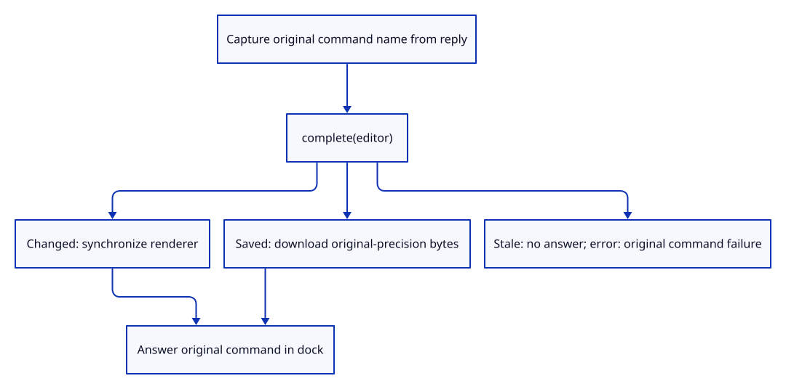
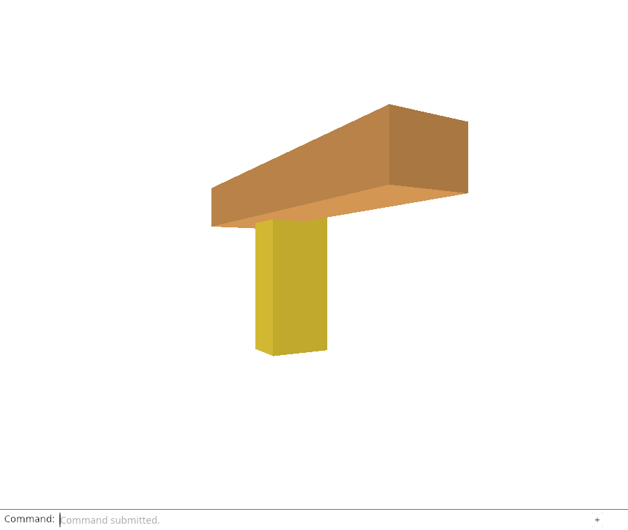

# 32gie · Deliver restored edit and Save results to the dock

**Combined study estimate: 1–2 hours.** Includes reading, typing, reasoning and experiments.

**Typing estimate: 14–27 minutes.** 23 added or changed lines; unchanged context is excluded. [How this is estimated](typing-load.md).

**Today:** Route validated scene edits and original-precision downloads back to the captured command history.

**In the whole viewer:** Connect the browser, drawing and input, then extend the same project. [See the destination](../journey.md#the-destination).

**Follow:** Current completion → captured command name → complete → Changed or Saved → dock answer.

**Before you finish, explain:** Why is the command name read from the reply before completion consumes it?

The browser receiver now calls complete instead of hydrating only the body. It records the command name from the captured intent before consuming the reply. Changed synchronizes the renderer; Saved downloads the bytes produced by the original-precision snapshot. A stale None does nothing. Errors use the same original command name.

Explicit Reload Sources still uses None intent and keeps its existing success message. save_result converts either the browser download failure or its success into one dock message. Actual automatic commands are connected next; this checkpoint prepares their result handling.

Native completion checks still exercise captured Move/Delete/Save and stale or failed restoration. Chrome exercises explicit restoration through this new receiver, including the inherited fetch and cancellation checks. It does not yet claim an automatic browser edit.



## Type the change

Continue [Validate restoration before replaying the command](32gid-complete.md). From `session_viewer`, save your files with `npm --prefix ../session_tests run course -- save before-32gie-response`. A save keeps your own work; it does not fill in the next lesson.

### 1. `src/edit_intent.rs`

Name the captured operation independently of the current input field or selection.

Find this exact block:

```rust
impl Intent {
```

Replace that block with:

```rust
--8<-- "journey/code/32gie-response-01.rs"
```

### 2. `src/browser.rs`

Consume validated edit or Save results and associate success or failure with the original command.

Find this exact block:

```rust
            if let Some(reply) = reload_delivery.borrow_mut().take() {
                match reply.result.and_then(|values| editor.hydrate(values).map_err(str::to_owned)) {
                    Ok(true) => {
                        renderer.set_scene(&editor.scene, editor.selected);
                        let message = "Editable sources restored; display retained.";
                        report(message); panel.answer("Reload Sources", message);
                    }
                    Ok(false) => {}
                    Err(error) => { report(&error); panel.answer("Reload Sources", &error); }
                }
            }
```

Replace that block with:

```rust
--8<-- "journey/code/32gie-response-02.rs"
```

### 3. `src/browser.rs`

Keep download handling shared by immediate and restored Save results.

Find this exact block:

```rust
pub async fn run() -> Result<(), JsValue> {
```

Replace that block with:

```rust
--8<-- "journey/code/32gie-response-03.rs"
```

## Run and look

From `session_viewer`, enter your project folder:

```sh
cd workspace/journey
REGEN_PROTO=0 cargo build --lib --locked --target wasm32-unknown-unknown -j4
REGEN_PROTO=0 CARGO_BUILD_JOBS=4 trunk serve --port 8780
```

Open `http://127.0.0.1:8780/`. If Trunk is already running in this project, leave it running; it rebuilds when you save.

From your project, run `REGEN_PROTO=0 cargo run --example sample --locked -j4`. Type Open Replace, choose sample.pb, Select Next twice, Move 0.35,0,0.25, View Isometric, Orbit Right, Orbit Up, Move 1.92,0,0.93, Move 0.25,0,-0.15 and Fit. Unload Sources and Reload Sources must retain this drawing. Automatic Move/Delete/Save reload is still pending. Then type Move 0,0.25,0 and Fit. Inspect the native scope tests to compare original-target requests with Save requests. Then type Move 0.25,0,0.15, Undo and Redo. Undo restores the preceding drawing; Redo restores the move. Type Fit afterward. Type Delete, Undo, Select Next twice and Redo. Undo restores the geometry; selection must be chosen again after deleting the selected row. Finally type Select Next and Fit to inspect a remaining object. Move 0.15,0,0, Save, Undo and Redo; Save must leave the Move available to Undo. Finally type Fit. Type Move 0,0,0.15 and Fit. Inspect the native owner tests for stale, duplicate and cancelled completions. Type Orbit Right and Fit. Inspect the native completion checks before connecting automatic command replay. Type Move 0,0.15,0 and Fit. Automatic Move/Delete/Save reload remains the next checkpoint. Type Move 0.1,0,0 and Fit. Native tests now complete captured operations; browser automatic commands follow next. Type Move 0,0,0.1 and Fit. Observe explicit Reload Sources still uses its original completion label.

**Actual Chrome screenshot.**

Chrome checks explicit restoration through the result-aware receiver. Native tests verify captured edit and Save replies; browser command-triggered restoration follows next.



*Captured from this checkpoint’s browser bundle after its browser checks passed. [Check scope and environment](release.md).*

Run the state checks from your project folder:

```sh
REGEN_PROTO=0 cargo test --lib --locked -j4
```

## Try one small experiment

Use the current command field as the completion label. Type a camera command while a fetch is held and explain why that label would attach the result to the wrong operation.

## Explain it in your own words

Trace the values through the files without reading the answer first. If you lose the connection, stop at the last value you can follow.

<details>
<summary>Compare your explanation</summary>

The reply owns the operation submitted before fetching. Later selection and typing do not identify that operation. Completion consumes its source bodies and intent, so capture the name first.

</details>

## Keep your working result

Return to `session_viewer` in a second terminal. Restore experimental edits before comparing:

```sh
npm --prefix ../session_tests run course -- check 32gie-response
npm --prefix ../session_tests run course -- save 32gie-response
```

The comparison spots typing differences; it does not prove behaviour. Keep three notes: what I changed; the values I followed; the question I still have. [Recover a checkpoint](recovery.md) if an experiment gets tangled.

## Where this grows

Asynchronous result ownership follows the submitted operation; neither the latest input nor later selection renames the completed command.

[Validation status and course release](release.md).
