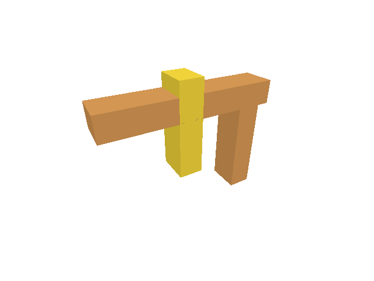

# 32gif · Automatically restore sources for Move, Delete and Save

**Combined study estimate: 1–2 hours.** Includes reading, typing, reasoning and experiments.

**Typing estimate: 25–49 minutes.** 36 added or changed lines; unchanged context is excluded. [How this is estimated](typing-load.md).

**Today:** Connect cold-source edits and Save to captured reload and validated replay without requiring Reload Sources first.

**In the whole viewer:** Connect the browser, drawing and input, then extend the same project. [See the destination](../journey.md#the-destination).

**Follow:** Typed command → capture original intent → required cold keys → fetch → validated completion → one edit or download.

**Before you finish, explain:** Which commands should keep working while source restoration is pending?

restore_for finds only the captured operation’s required cold source keys. Move and Delete need the original target’s source; Save needs all active cold sources. It cancels older pending work, returns false for a warm operation, and otherwise starts the existing abortable flight with Some(intent).

The shared action path captures Move/Delete before applying them. Its Result<Option<Change>, String> distinguishes an immediate change (Some), a waiting operation (None), and a failure (Err). map(Some) wraps an immediate editor result; and_then carries an earlier error forward without applying the action. A pending restoration leaves drawing, placement and edit history untouched. Camera and selection commands still run immediately; completed replay uses the captured target and the current placement, while preserving the later view and selection. Save uses the same decision and downloads only after completion has restored every required source.

Zero Move and Delete with no selection request no fetch. Warm commands retain their normal behavior. Close, Undo, Redo, source unload and document replacement keep the cancellation taught earlier. A newer real edit or Save supersedes an older pending intent even when the newer operation is warm.

Chrome uses held real source responses to check original-target Move and Delete, later selection and camera, one-step Undo, automatic Save download and cancellation. These controlled waits test ordering, not phone performance. Exact source-coordinate preservation remains covered by native Save/replay checks; the following acceptance lesson broadens browser failures and precision.


## Type the change

Continue [Deliver restored edit and Save results to the dock](32gie-response.md). From `session_viewer`, save your files with `npm --prefix ../session_tests run course -- save before-32gif-auto`. A save keeps your own work; it does not fill in the next lesson.

### 1. `src/browser_reload.rs`

A new edit supersedes older pending work. Warm edits need no fetch; cold edits capture their required keys and operation.

Find this exact block:

```rust
pub fn start(shared: Shared, keys: Vec<ReloadKey>, delivery: Delivery) -> Result<(), String> {
```

Replace that block with:

```rust
--8<-- "journey/code/32gif-auto-01.rs"
```

### 2. `src/browser.rs`

Save reloads every active cold source before producing its original-precision download; warm Save remains immediate.

Find this exact block:

```rust
                match crate::document::snapshot(&editor.scene) {
                    Ok(bytes) => match crate::file_output::download(&bytes) {
                        Ok(()) => panel.result(&format!("Saved editable document ({} bytes)", bytes.len())),
                        Err(error) => panel.result(&format!("Save failed: {error:?}")),
                    },
                    Err(error) => panel.result(error),
                }
```

Replace that block with:

```rust
--8<-- "journey/code/32gif-auto-02.rs"
```

### 3. `src/browser.rs`

Capture Move/Delete before fetching; camera and selection commands remain immediate while pending work keeps its original target.

Find this exact block:

```rust
            match editor.apply(action) {
                Ok(Change::Scene) => {
```

Replace that block with:

```rust
--8<-- "journey/code/32gif-auto-03.rs"
```

### 4. `src/browser.rs`

A deferred command has no scene change yet; failures retain normal dock reporting.

Find this exact block:

```rust
                Ok(Change::View) => {}
                Err(error) => {
                    report(error);
                    if event.type_() == "viewer-file" { panel.answer("Open", error); }
                    else { panel.result(error); }
                }
```

Replace that block with:

```rust
--8<-- "journey/code/32gif-auto-04.rs"
```

### 5. `src/browser.rs`

Expose read-only placement, selection and camera values so Chrome checks the original target and later view exactly. These values add no controls.

Find this exact block:

```rust
    canvas.set_attribute("data-object-count", &editor.scene.objects().len().to_string())?;
```

Replace that block with:

```rust
--8<-- "journey/code/32gif-auto-05.rs"
```

## Run and look

From `session_viewer`, enter your project folder:

```sh
cd workspace/journey
REGEN_PROTO=0 cargo build --lib --locked --target wasm32-unknown-unknown -j4
REGEN_PROTO=0 CARGO_BUILD_JOBS=4 trunk serve --port 8780
```

Open `http://127.0.0.1:8780/`. If Trunk is already running in this project, leave it running; it rebuilds when you save.

Open sample.pb with Open Replace, Select Next, Move 0.35,0,0.25, View Isometric and Fit. Unload Sources, then type Move 0.25,0,0.15 without Reload Sources. The command restores its source and moves once; Undo restores the placement. Repeat with Delete and Undo, then Unload Sources and Save. Save downloads the editable document without creating an Undo step.

**Native render check — not a browser screenshot.**



*Read directly from this checkpoint’s GPU texture. Browser controls and event delivery remain unverified until the browser check passes.*

Run the state checks from your project folder:

```sh
REGEN_PROTO=0 cargo test --lib --locked -j4
```

## Try one small experiment

Hold a source response, submit Move, select another object and orbit, then release it. Explain why replay must use the captured object identity but preserve the later selection and camera.

## Explain it in your own words

Trace the values through the files without reading the answer first. If you lose the connection, stop at the last value you can follow.

<details>
<summary>Compare your explanation</summary>

Camera and selection commands execute immediately. The pending operation retains its original target and arguments. A new real edit or Save supersedes earlier pending work; Close, Undo, Redo, Unload Sources and replacement already cancel its authority.

</details>

## Keep your working result

Return to `session_viewer` in a second terminal. Restore experimental edits before comparing:

```sh
npm --prefix ../session_tests run course -- check 32gif-auto
npm --prefix ../session_tests run course -- save 32gif-auto
```

The comparison spots typing differences; it does not prove behaviour. Keep three notes: what I changed; the values I followed; the question I still have. [Recover a checkpoint](recovery.md) if an experiment gets tangled.

## Where this grows

Automatic editable-source restoration obeys command ownership, document-context revocation, original targets, current placement, original precision and ordinary history boundaries.

[Validation status and course release](release.md).
