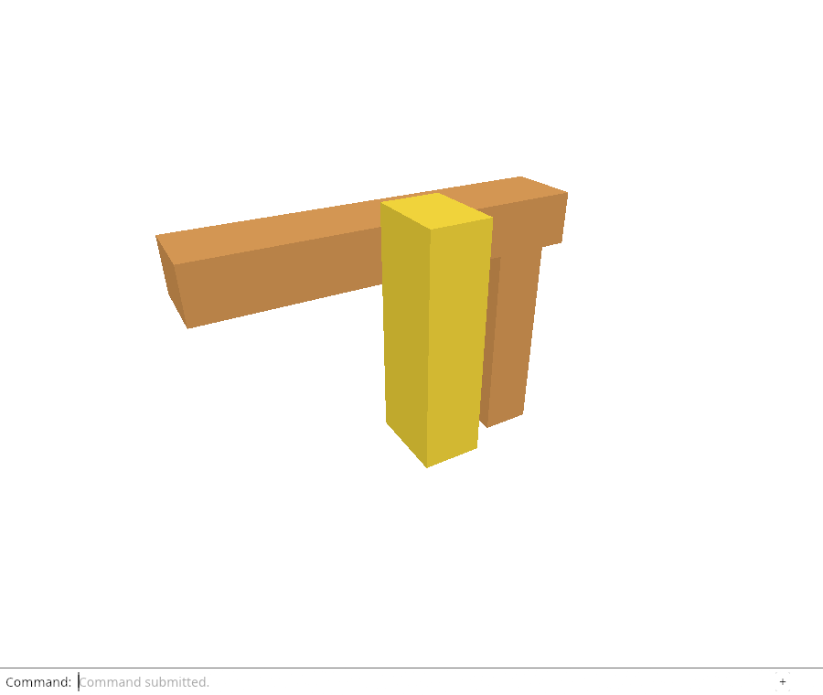
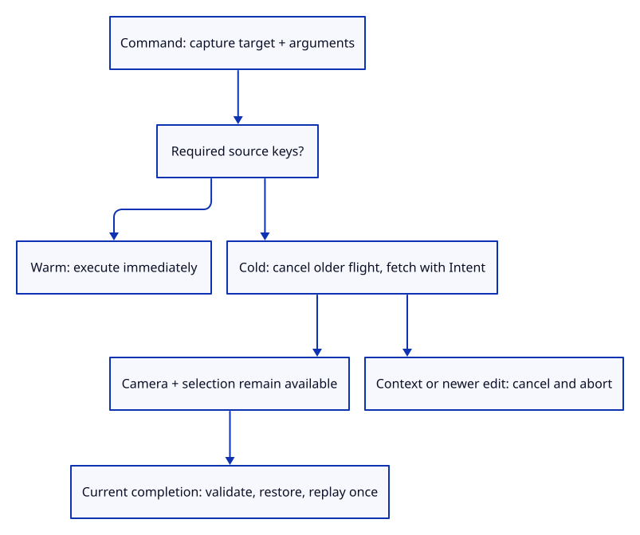

# 32gif · Automatically restore sources for Move, Delete and Save

**Typing: 25–49 minutes.** [Estimate](typing-load.md).

Restore only the sources required by a captured command: Move/Delete need the target; Save needs all active cold sources. Cancel older pending work, return immediately for warm work, or start the abortable flight with its intent.

## Type

Continue from [Deliver restored edit and Save results to the dock](32gie-response.md). [Save or recover your work](recovery.md).

### 1. `src/browser_reload.rs`

A new edit supersedes older pending work. Warm edits need no fetch; cold edits capture their required keys and operation.

<details>
<summary>Locate the existing block</summary>

```rust
pub fn start(shared: Shared, keys: Vec<ReloadKey>, delivery: Delivery) -> Result<(), String> {
```

</details>

Replace that block with:

```rust
--8<-- "journey/code/32gif-auto-01.rs"
```

### 2. `src/browser.rs`

Save reloads every active cold source before producing its original-precision download; warm Save remains immediate.

<details>
<summary>Locate the existing block</summary>

```rust
                match crate::document::snapshot(&editor.scene) {
                    Ok(bytes) => match crate::file_output::download(&bytes) {
                        Ok(()) => panel.result(&format!("Saved editable document ({} bytes)", bytes.len())),
                        Err(error) => panel.result(&format!("Save failed: {error:?}")),
                    },
                    Err(error) => panel.result(error),
                }
```

</details>

Replace that block with:

```rust
--8<-- "journey/code/32gif-auto-02.rs"
```

### 3. `src/browser.rs`

Capture Move/Delete before fetching; camera and selection commands remain immediate while pending work keeps its original target.

<details>
<summary>Locate the existing block</summary>

```rust
            match editor.apply(action) {
                Ok(Change::Scene) => {
```

</details>

Replace that block with:

```rust
--8<-- "journey/code/32gif-auto-03.rs"
```

### 4. `src/browser.rs`

A deferred command has no scene change yet; failures retain normal dock reporting.

<details>
<summary>Locate the existing block</summary>

```rust
                Ok(Change::View) => {}
                Err(error) => {
                    report(error);
                    if event.type_() == "viewer-file" { panel.answer("Open", error); }
                    else { panel.result(error); }
                }
```

</details>

Replace that block with:

```rust
--8<-- "journey/code/32gif-auto-04.rs"
```

### 5. `src/browser.rs`

Expose read-only placement, selection and camera values so Chrome checks the original target and later view exactly. These values add no controls.

<details>
<summary>Locate the existing block</summary>

```rust
    canvas.set_attribute("data-object-count", &editor.scene.objects().len().to_string())?;
```

</details>

Replace that block with:

```rust
--8<-- "journey/code/32gif-auto-05.rs"
```

## Run and check

In your project:

```sh
cd workspace/journey
REGEN_PROTO=0 cargo build --lib --locked --target wasm32-unknown-unknown -j4
REGEN_PROTO=0 CARGO_BUILD_JOBS=4 trunk serve --port 8780
```

Open `http://127.0.0.1:8780/`. Keep an existing Trunk server running; saving rebuilds it.

Open `sample.pb`, select an object and type `Unload Sources`, then `Move 0.25,0,0.15`. Move restores its source automatically and runs once. `Undo` returns the object to its previous placement.

**Verified checkpoint in Chrome.**



[Verification scope](release.md).

Run the state checks on your computer from your project folder:

```sh
REGEN_PROTO=0 cargo test --lib --locked --target host-tuple -j4
```

<details>
<summary>Code explanation and diagram</summary>

`Result<Option<Change>, String>` distinguishes an immediate change, waiting, and failure. `map(Some)` wraps an immediate result; `and_then` preserves earlier errors. Waiting leaves placement, drawing and history untouched.

On completion, replay against the captured target and current placement, preserving later camera and selection changes. Save downloads only after required sources return. Zero Move or Delete without selection fetches nothing.

Close, Undo, Redo, unloading and replacement cancel work. A newer real edit or Save supersedes an earlier intent, even when the newer operation is warm.

Typed command → capture original intent → required cold keys → fetch → validated completion → one edit or download.



Which commands should keep working while source restoration is pending?

Camera and selection commands execute immediately. The pending operation retains its original target and arguments. A new real edit or Save supersedes earlier pending work; Close, Undo, Redo, Unload Sources and replacement already cancel its authority.

Study estimate, including typing and experiments: 1–2 hours.

</details>

<details>
<summary>Optional experiment</summary>

Hold a source response, submit Move, select another object and orbit, then release it. Explain why replay must use the captured object identity but preserve the later selection and camera.

</details>

<details>
<summary>Check and save your work</summary>

Restore experimental edits, then run from `session_viewer`:

```sh
npm --prefix ../session_tests run course -- check 32gif-auto
npm --prefix ../session_tests run course -- save 32gif-auto
```

Source comparison leaves your project untouched. [Save and recovery instructions](recovery.md).

</details>

<details>
<summary>Viewer coverage and verification</summary>

Automatic editable-source restoration obeys command ownership, document-context revocation, original targets, current placement, original precision and ordinary history boundaries.

Chrome uses held real source responses to check original-target Move and Delete, later selection and camera, one-step Undo, automatic Save download and cancellation. These controlled waits test ordering, not phone performance. Exact source-coordinate preservation remains covered by native Save/replay checks; the following acceptance lesson broadens browser failures and precision.

The proof placement separates the post and beam front faces to avoid coplanar depth competition. It does not establish the later rendering-quality policy.

Visible Chrome types real cold-source Move/Delete/Save commands, holds fetch responses, changes selection and camera, then checks replay, download, Undo and cancellation. Controlled waits establish ordering, not device speed.

[Full validation scope](release.md).

To reproduce the scripted acceptance of the reference checkpoint, run from `session_viewer` with the [course bundle server](release.md#reproduce) running on port 8781:

```sh
npm --prefix ../session_tests run course -- capture 32gif-auto
```

This uses the verified reference bundle; it does not check or change your typed project.

</details>
