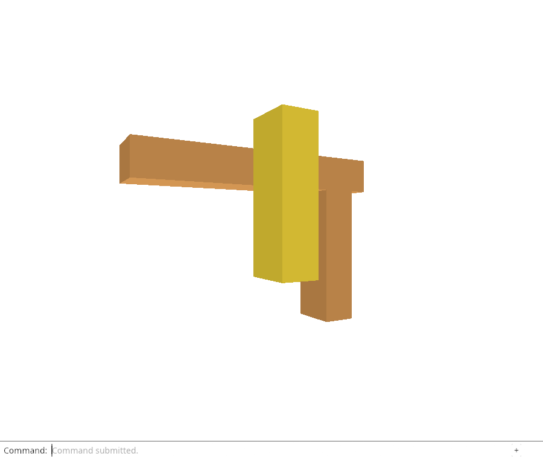
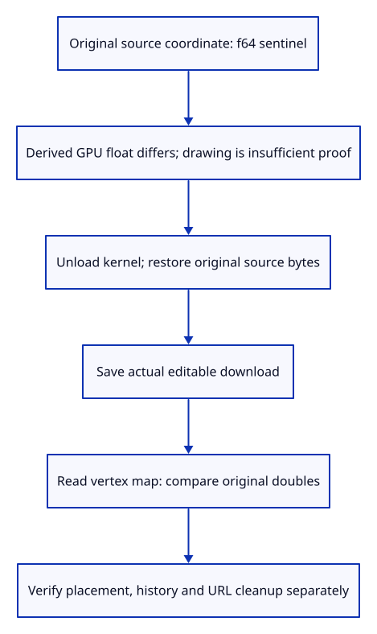

# 32gj · Prove restored Save keeps the source doubles

**Typing: 19–38 minutes.** [Estimate](typing-load.md).

Add `precise_bytes` to the specimen builder with one coordinate that cannot survive an `f32` round trip. Keep the ordinary specimen function for existing checks.

## Type

Continue from [Automatically restore sources for Move, Delete and Save](32gif-auto.md). [Save or recover your work](recovery.md).

### 1. `src/specimen.rs`

Add a source coordinate that cannot survive an f64-to-f32 round trip; keep the original specimen available.

<details>
<summary>Locate the existing block</summary>

```rust
pub fn bytes() -> Vec<u8> {
    use session_rust::{Color, Mesh, Session, Xform};
    let mut session = Session::new("Three-piece frame");
    for (name, size, centre) in [
        ("Left post", [0.25, 0.35, 1.0], [-0.65, 0.0, 0.5]),
        ("Right post", [0.25, 0.35, 1.0], [0.65, 0.0, 0.5]),
        ("Top beam", [1.8, 0.35, 0.25], [0.0, 0.0, 1.125]),
    ] {
        let mut mesh = Mesh::create_box(size[0], size[1], size[2]);
        mesh.name = name.to_owned();
        mesh.transform(&Xform::translation(centre[0], centre[1], centre[2]));
        mesh.set_objectcolor(Color::new(0.75, 0.35, 0.1, 1.0));
        assert!(session.add_mesh(mesh, None).is_some());
    }
    session.pb_dumps()
}
```

</details>

Replace that block with:

```rust
--8<-- "journey/code/32gj-precision-01.rs"
```

### 2. `examples/sample.rs`

The browser’s actual uploaded sample now contains the precision sentinel.

<details>
<summary>Locate the existing block</summary>

```rust
viewer_journey::specimen::bytes()
```

</details>

Replace that block with:

```rust
--8<-- "journey/code/32gj-precision-02.rs"
```

### 3. `src/lib.rs`

Register the exact-coordinate restoration acceptance check.

<details>
<summary>Locate the existing block</summary>

```rust
mod reload_complete_tests;
```

</details>

Replace that block with:

```rust
--8<-- "journey/code/32gj-precision-03.rs"
```

### 4. `src/reload_precision_tests.rs`

Verify exact source-coordinate restoration with a real precision sentinel and unchanged edit history.

Create the file and type:

```rust
--8<-- "journey/code/32gj-precision-04.rs"
```

## Run and check

In your project:

```sh
cd workspace/journey
REGEN_PROTO=0 cargo build --lib --locked --target wasm32-unknown-unknown -j4
REGEN_PROTO=0 CARGO_BUILD_JOBS=4 trunk serve --port 8780
```

Open `http://127.0.0.1:8780/`. Keep an existing Trunk server running; saving rebuilds it.

Open `sample.pb`, type `Unload Sources`, then `Save`. Run the precision checks below: the restored Save must retain the exact source double rather than its rounded display value.

**Verified checkpoint in Chrome.**



[Verification scope](release.md).

Run the state checks on your computer from your project folder:

```sh
REGEN_PROTO=0 cargo test --lib --locked --target host-tuple -j4
```

<details>
<summary>Code explanation and diagram</summary>

Save while sources are warm, then unload and trigger restoration through Save. Decode both actual downloads and compare the source coordinate exactly. The derived display is unsuitable evidence because it intentionally rounds to floats.

The native and browser checks use the same uploaded specimen. They compare original coordinates and preserve the moved placement; the native test also checks Undo/Redo.

Original f64 sentinel → derived f32 display → unload kernel → reload original bytes → Save → exact source doubles.



Why is equal drawing insufficient proof that Save preserved source coordinates?

The GPU display already rounds coordinates to f32. Two different f64 values may draw identically. Compare the actual downloaded source coordinates and include a value whose f32 round trip differs.

Study estimate, including typing and experiments: 1–2 hours.

</details>

<details>
<summary>Optional experiment</summary>

Replace snapshot geometry with the display floats. Predict why screenshots could still pass, then run the native and downloaded-coordinate checks.

</details>

<details>
<summary>Check and save your work</summary>

Restore experimental edits, then run from `session_viewer`:

```sh
npm --prefix ../session_tests run course -- check 32gj-precision
npm --prefix ../session_tests run course -- save 32gj-precision
```

Source comparison leaves your project untouched. [Save and recovery instructions](recovery.md).

</details>

<details>
<summary>Viewer coverage and verification</summary>

Original source geometry determines editable Save; equal rendered pixels cannot establish coordinate precision.

The native acceptance test moves the object, unloads its editable source, completes a captured Save with the original bytes, and compares every original vertex. It also proves the sentinel would change through f32 and Save leaves the previous Move available to Undo and Redo.

Visible Chrome downloads a warm reference, unloads sources and downloads the automatic restored Save. A small test-only protobuf reader follows the documented Session → Objects → Mesh → vertex map fields, orders vertex keys and compares all double values with the actual uploaded file. It rejects a float-rounded substitute and checks both actual downloads, separate placement matrices, delayed download URL cleanup and Close releasing source URLs. This reader is verification tooling, not a second viewer loader.

The inherited automatic-command checks remain active. Broader network, body and multiple-origin failure acceptance follows next.

The proof placement separates the post and beam front faces to avoid coplanar depth competition. It does not establish the later rendering-quality policy.

Chrome checks actual warm and cold-source Save downloads against the precision specimen, exact double coordinates, placement preservation, delayed download URL cleanup and source URL release on Close.

[Full validation scope](release.md).

To reproduce the scripted acceptance of the reference checkpoint, run from `session_viewer` with the [course bundle server](release.md#reproduce) running on port 8781:

```sh
npm --prefix ../session_tests run course -- capture 32gj-precision
```

This uses the verified reference bundle; it does not check or change your typed project.

</details>
