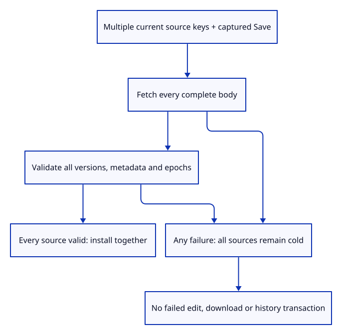
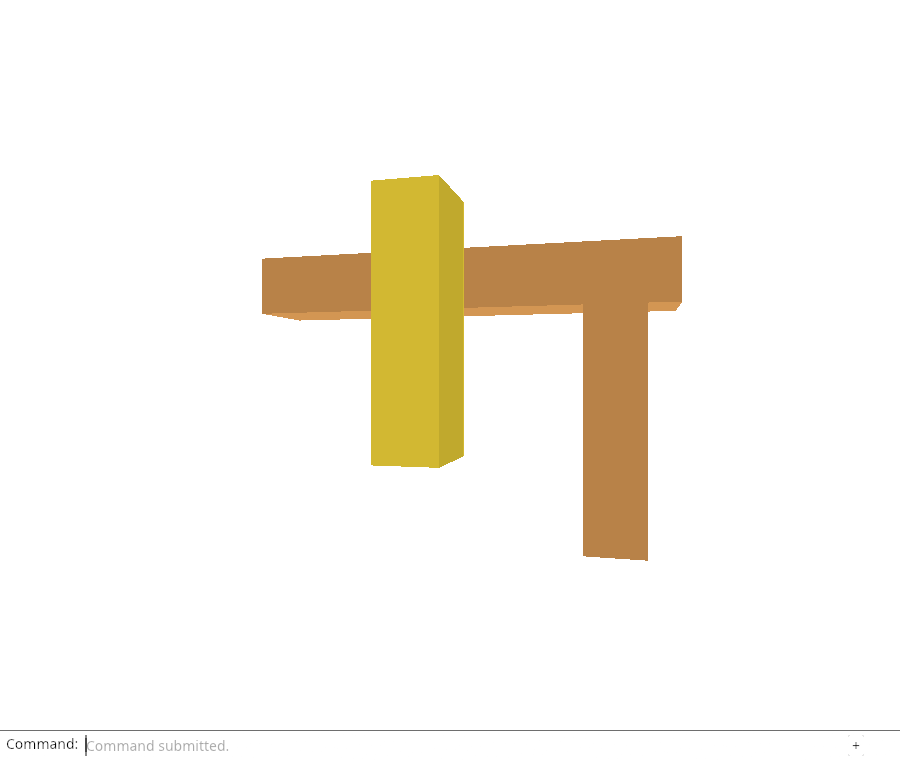

# 32gja · Prove failed restoration cannot partly commit

**Combined study estimate: 1–2 hours.** Includes reading, typing, reasoning and experiments.

**Typing estimate: 20–40 minutes.** 40 added or changed lines; unchanged context is excluded. [How this is estimated](typing-load.md).

**Today:** Verify automatic command failures preserve cold drawing, placement and history, including all-or-nothing multiple-source Save.

**In the whole viewer:** Connect the browser, drawing and input, then extend the same project. [See the destination](../journey.md#the-destination).

**Follow:** Captured operation → complete body set → validate every source → all restored or none → no edit/download on failure.

**Before you finish, explain:** Why must the first valid source remain cold when a second source fails?

The restoration implementation already separates preparation from installation. This acceptance checkpoint makes the boundary observable across two independently imported origins. Native checks combine a current Save with a network failure, missing body or changed second source and prove both sources remain cold. Duplicate or stale keys revoke the complete reply without replay.

Chrome sends actual Move/Delete/Save commands through HTTP failure, invalid Content-Length, missing body, rejected fetch, oversized body, failed stream, invalid response type and changed source bytes. Each failure must leave placement, selection, camera, displayed pixels, residency and GPU counters unchanged; Save starts no download. It also imports a second source and fails its fetch after the first body has succeeded. No partial source restoration or document edit is accepted.

The precision checkpoint remains active. Finally, a held real response is released after Close and its source URL must already be revoked. Controlled failures and waits test ownership and atomicity, not real device speed.



The final proof placement moves the post clear of the beam. Keeping two front faces in exactly the same plane can produce depth competition; this demonstration separates the solids instead of claiming the later rendering-quality lessons are already implemented.

## Type the change

Continue [Prove restored Save keeps the source doubles](32gj-precision.md). From `session_viewer`, save your files with `npm --prefix ../session_tests run course -- save before-32gja-failures`. A save keeps your own work; it does not fill in the next lesson.

### 1. `src/lib.rs`

Register multiple-source completion acceptance checks.

Find this exact block:

```rust
mod reload_precision_tests;
```

Replace that block with:

```rust
--8<-- "journey/code/32gja-failures-01.rs"
```

### 2. `src/reload_failure_tests.rs`

A failure, missing body, changed file, duplicate key or stale epoch must not partially restore a multi-source Save.

Create the file and type:

```rust
--8<-- "journey/code/32gja-failures-02.rs"
```

## Run and look

From `session_viewer`, enter your project folder:

```sh
cd workspace/journey
REGEN_PROTO=0 cargo build --lib --locked --target wasm32-unknown-unknown -j4
REGEN_PROTO=0 CARGO_BUILD_JOBS=4 trunk serve --port 8780
```

Open `http://127.0.0.1:8780/`. If Trunk is already running in this project, leave it running; it rebuilds when you save.

Open sample.pb with Open Replace, Select Next, Move 0.35,0,0.25, View Isometric and Fit. Unload Sources, then type Move 0.25,0,0.15 without Reload Sources. The command restores its source and moves once; Undo restores the placement. Repeat with Delete and Undo, then Unload Sources and Save. Save downloads the editable document without creating an Undo step. The sample now includes an original double that differs from its f32 display value. Inspect the actual Save download with the precision checker. Type Orbit Up and Fit for the final proof view. Run the combined acceptance checks. Failed restoration must leave the visible scene unchanged and sources cold. Type Orbit Right and Fit for the final proof view. Finish with Move 0,-0.5,0 and Fit to separate the moved post from the beam; the final proof view avoids coplanar overlapping faces.

**Actual Chrome screenshot.**

Visible Chrome checks automatic Move/Delete/Save failures, unchanged drawing/state/GPU counters, multiple-source Save atomicity, no failed download, and Close revoking a source URL before a held reply is released.



*Captured from this checkpoint’s browser bundle after its browser checks passed. [Check scope and environment](release.md).*

Run the state checks from your project folder:

```sh
REGEN_PROTO=0 cargo test --lib --locked -j4
```

## Try one small experiment

Install each prepared source as soon as its fetch succeeds, then fail the second source. Explain which native and browser residency assertions identify the partial commit.

## Explain it in your own words

Trace the values through the files without reading the answer first. If you lose the connection, stop at the last value you can follow.

<details>
<summary>Compare your explanation</summary>

Save represents one document operation. Installing the first source before checking the remaining responses would leave a partially restored editor after the operation failed. Validate the complete set before installation.

</details>

## Keep your working result

Return to `session_viewer` in a second terminal. Restore experimental edits before comparing:

```sh
npm --prefix ../session_tests run course -- check 32gja-failures
npm --prefix ../session_tests run course -- save 32gja-failures
```

The comparison spots typing differences; it does not prove behaviour. Keep three notes: what I changed; the values I followed; the question I still have. [Recover a checkpoint](recovery.md) if an experiment gets tangled.

## Where this grows

Document restoration validates every response before committing editable source owners; errors and abandoned work cannot partially mutate the current document.

[Validation status and course release](release.md).
