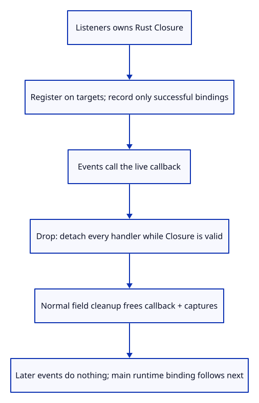
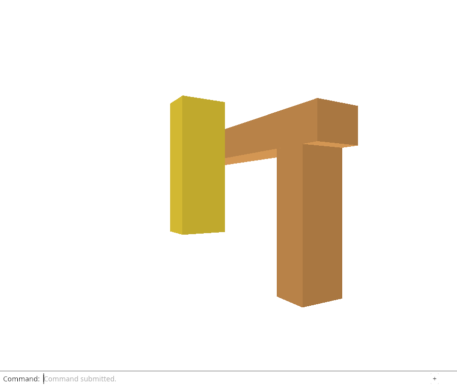

# 33 · Own browser listeners instead of forgetting callbacks

**Combined study estimate: 1–2 hours.** Includes reading, typing, reasoning and experiments.

**Typing estimate: 21–41 minutes.** 51 added or changed lines; unchanged context is excluded. [How this is estimated](typing-load.md).

**Today:** Build a browser listener owner that detaches every registered event before freeing the Rust callback and its captured data.

**Follow:** Rust Closure → successful EventTarget bindings → owner Drop → remove handlers → free captured values.

A Closure owns the Rust environment used by a JavaScript callback. Listeners keeps that closure beside each successfully registered target and event name. One callback can serve the canvas, window and document. listen records a binding only after registration succeeds; if later setup fails, dropping the owner removes earlier registrations.

Drop runs before Rust drops the fields. Its loop removes each handler while callback still exists, then normal field cleanup releases the closure and captured values. Registration uses passive false so the existing wheel and pointer prevention behavior can be retained during integration. The next checkpoint replaces the main viewer’s forgotten callback with this owner and adds explicit runtime disposal. This checkpoint prepares ownership; it does not yet stop the existing viewer runtime.



## Type the change

Continue from [Prove failed restoration cannot partly commit](32gja-failures.md). Save your own work first: `npm --prefix ../session_tests run course -- save before-33-owner` (from `session_viewer`).

### 1. `src/listeners.rs`

Own one Rust callback and every successful browser registration; detach handlers before its captured values drop. The debug probe exercises real EventTargets.

Create the file and type:

```rust
--8<-- "journey/code/33-owner-01.rs"
```

### 2. `src/lib.rs`

Register browser-only lifetime ownership without changing native rendering.

Find this exact block:

```rust
#[cfg(target_arch = "wasm32")]
mod panel;
```

Replace that block with:

```rust
--8<-- "journey/code/33-owner-02.rs"
```

## Run and look

From `session_viewer`, enter your project folder:

```sh
cd workspace/journey
REGEN_PROTO=0 cargo build --lib --locked --target wasm32-unknown-unknown -j4
REGEN_PROTO=0 CARGO_BUILD_JOBS=4 trunk serve --port 8780
```

Open `http://127.0.0.1:8780/`. If Trunk is already running in this project, leave it running; it rebuilds when you save.

In the debug browser console, run `Array.from(window.wasmBindings.listener_probe())`. Expect `[2, 2, 0]`: two live calls, no calls after Drop, and no retained captured owner.

**Verified checkpoint in Chrome.**



[What this screenshot checks](release.md).

Run the state checks from your project folder:

```sh
REGEN_PROTO=0 cargo test --lib --locked -j4
```

<details>
<summary>Optional experiment</summary>

Remove the Drop loop and dispatch the probe events after dropping the owner. Predict the invalid-closure error before running it; refresh to restore the verified checkpoint.

</details>

## Explain the change

Why must event listeners be removed before the Rust closure is dropped?

<details>
<summary>Compare your explanation</summary>

The browser keeps JavaScript references to the callback. Dropping its Rust environment first would leave a registered handler that can invoke an invalid closure. Detach every handler while the closure is still valid.

</details>

## Keep your working result

Return to `session_viewer` in a second terminal. Restore experimental edits before comparing:

```sh
npm --prefix ../session_tests run course -- check 33-owner
npm --prefix ../session_tests run course -- save 33-owner
```

Check compares your typed source; run the focused check above for behavior. [Recover your work](recovery.md).

<details>
<summary>Where this fits in the finished viewer</summary>

Browser callback lifetime is owned explicitly, as in the production command and pointer-cancellation agents. Full viewer runtime binding and pending-work disposal follow next.

</details>

<details>
<summary>Verification notes and browser acceptance</summary>

A debug-only exported probe registers the same callback on two real browser EventTargets. Two dispatched events must increment the count twice. After dropping the owner, the same events must do nothing and a Weak observer must show the captured value has been released. Chrome calls this probe through Trunk’s real WebAssembly bindings; it adds no feature controls to the HTML. Native editor checks remain inherited, while listener behavior is specifically verified in the browser.

Chrome calls the debug WebAssembly probe against real EventTargets and verifies two live calls, no post-Drop calls, and release of captured ownership. Existing editor/reload/precision/failure checks remain active; main runtime disposal follows next.

[Full validation scope](release.md).

To reproduce the scripted acceptance of the reference checkpoint, run from `session_viewer` with the [course bundle server](release.md#reproduce) running on port 8781:

```sh
npm --prefix ../session_tests run course -- capture 33-owner
```

This uses the verified reference bundle; it does not check or change your typed project.

</details>
