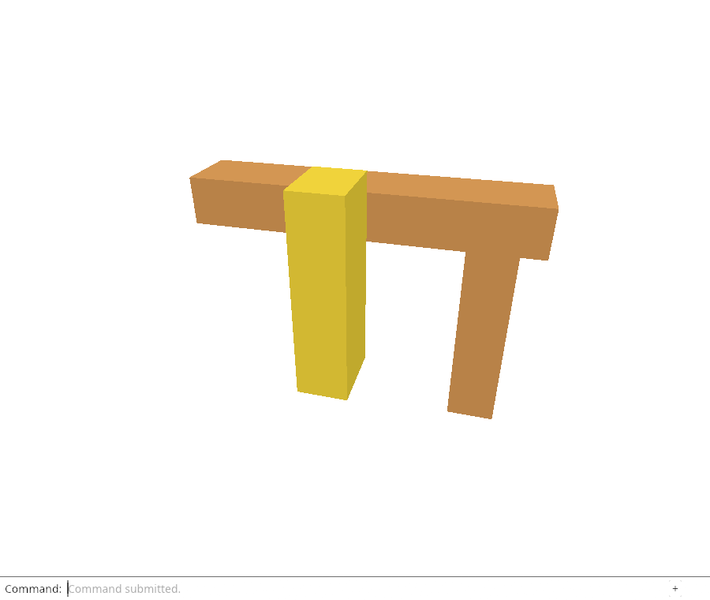
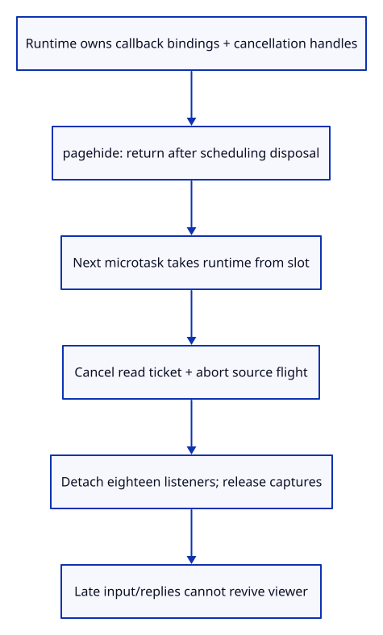

# 33a · Dispose the viewer without leaving pending work alive

**Typing: 19–37 minutes.** [Estimate](typing-load.md).

Keep the viewer’s callbacks alive after startup returns. Final page exit releases them; replacing the runtime releases the previous owner.

## Type

Continue from [Own browser listeners instead of forgetting callbacks](33-owner.md). [Save or recover your work](recovery.md).

### 1. `src/browser_runtime.rs`

Keep the live owner in one runtime slot; Drop cancels read/fetch authority before listeners and captured editor/GPU owners are released.

Create the file and type:

```rust
--8<-- "journey/code/33a-runtime-01.rs"
```

### 2. `src/lib.rs`

Register browser runtime ownership beside the listener owner.

<details>
<summary>Locate the existing block</summary>

```rust
mod listeners;
```

</details>

Replace that block with:

```rust
--8<-- "journey/code/33a-runtime-02.rs"
```

### 3. `src/browser.rs`

Retain cancellation handles outside the moving callback. Defer page-exit disposal until the active callback has returned.

<details>
<summary>Locate the existing block</summary>

```rust
    let update = Closure::<dyn FnMut(web_sys::Event)>::new(move |event: web_sys::Event| {
        let shortcut
```

</details>

Replace that block with:

```rust
--8<-- "journey/code/33a-runtime-03.rs"
```

### 4. `src/browser.rs`

Transfer the event callback into the owner before attaching its targets.

<details>
<summary>Locate the existing block</summary>

```rust
    for name in [
        "pointerdown",
```

</details>

Replace that block with:

```rust
--8<-- "journey/code/33a-runtime-04.rs"
```

### 5. `src/browser.rs`

Register all eighteen live bindings through the owner; retain it in the runtime instead of forgetting the Rust callback.

<details>
<summary>Locate the existing block</summary>

```rust
        canvas.add_event_listener_with_callback(name, update.as_ref().unchecked_ref())?;
    }
    let options = web_sys::AddEventListenerOptions::new();
    options.set_passive(false);
    canvas.add_event_listener_with_callback_and_add_event_listener_options(
        "wheel",
        update.as_ref().unchecked_ref(),
        &options,
    )?;
    window.add_event_listener_with_callback("resize", update.as_ref().unchecked_ref())?;
    window.add_event_listener_with_callback("blur", update.as_ref().unchecked_ref())?;
    document.add_event_listener_with_callback("change", update.as_ref().unchecked_ref())?;
    document.add_event_listener_with_callback("cancel", update.as_ref().unchecked_ref())?;
    window.add_event_listener_with_callback("viewer-file", update.as_ref().unchecked_ref())?;
    window.add_event_listener_with_callback("viewer-file-error", update.as_ref().unchecked_ref())?;
    window.add_event_listener_with_callback("viewer-reload", update.as_ref().unchecked_ref())?;
    // Both event sources retain this one callback for the lifetime of the page.
    update.forget();
```

</details>

Replace that block with:

```rust
--8<-- "journey/code/33a-runtime-05.rs"
```

## Run and check

In your project:

```sh
cd workspace/journey
REGEN_PROTO=0 cargo build --lib --locked --target wasm32-unknown-unknown -j4
REGEN_PROTO=0 CARGO_BUILD_JOBS=4 trunk serve --port 8780
```

Open `http://127.0.0.1:8780/`. Keep an existing Trunk server running; saving rebuilds it.

In the debug console, dispatch `window.dispatchEvent(new Event("pagehide"))`. On the next task, `window.wasmBindings.runtime_running()` must be false. Reload the same page to restart.

**Verified checkpoint in Chrome.**



[Verification scope](release.md).

Run the state checks on your computer from your project folder:

```sh
REGEN_PROTO=0 cargo test --lib --locked --target host-tuple -j4
```

<details>
<summary>Code explanation and diagram</summary>

The main viewer now transfers update into Listeners and records all canvas, document and window bindings. A thread-local Option<Runtime> keeps that owner alive after run returns. install replaces any earlier owner; stop takes the current owner out of the slot and consumes it. The slot’s mutable borrow has ended before Runtime is dropped.

Runtime’s Drop first cancels the read gate and abortable source flight. It then allows the listener owner to detach handlers and release the callback, editor, renderer and other captured values. Cancelling releases pending source keys even when an asynchronous task remains alive. This is ownership cleanup; it does not claim browser or driver memory is reclaimed at the same instant.

pagehide schedules stop through spawn_local and returns immediately. Its task runs on the next microtask so the event callback is no longer active when it is freed. Document Close retains its existing meaning and can still be followed by Open. Page exit disposes the viewer itself.

Live runtime → pagehide → next microtask → cancel read/fetch → detach eighteen listeners → release captures.



Why is disposal deferred until the next microtask instead of dropping the runtime inside its own event callback?

The pagehide callback is still executing from the owned closure. Disposal waits for that invocation to return, then cancels work and drops the closure safely. spawn_local schedules the task for the next microtask even when its future is immediately ready.

Study estimate, including typing and experiments: 1–2 hours.

</details>

<details>
<summary>Optional experiment</summary>

Skip read/fetch cancellation in Runtime::drop, hold a source response and dispose the viewer. Explain which source URL or late-read acceptance checks reveal retained or revived authority.

</details>

<details>
<summary>Check and save your work</summary>

Restore experimental edits, then run from `session_viewer`:

```sh
npm --prefix ../session_tests run course -- check 33a-runtime
npm --prefix ../session_tests run course -- save 33a-runtime
```

Source comparison leaves your project untouched. [Save and recovery instructions](recovery.md).

</details>

<details>
<summary>Viewer coverage and verification</summary>

Browser listener, document and asynchronous request ownership end together. GPU-loss recovery can now dispose this runtime before starting another one.

Chrome checks the actual main callback’s eighteen removals, an aborted held source request, source URL release, no new GPU submissions after disposal, ignored input and late replies, and cancellation of a held file read before URL adoption. Each restart reloads the same test page; no feature buttons are added. The inherited command/navigation/precision/failure checks remain active.

Chrome verifies real viewer page-exit disposal, eighteen listener removals, source abort/URL release, no later submissions, ignored input/completions, and cancelled file URL adoption; ordinary document Close still permits reopening.

[Full validation scope](release.md).

To reproduce the scripted acceptance of the reference checkpoint, run from `session_viewer` with the [course bundle server](release.md#reproduce) running on port 8781:

```sh
npm --prefix ../session_tests run course -- capture 33a-runtime
```

This uses the verified reference bundle; it does not check or change your typed project.

</details>
