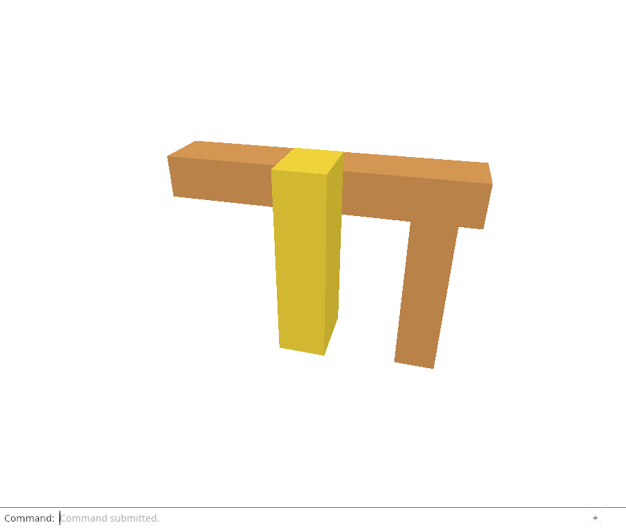
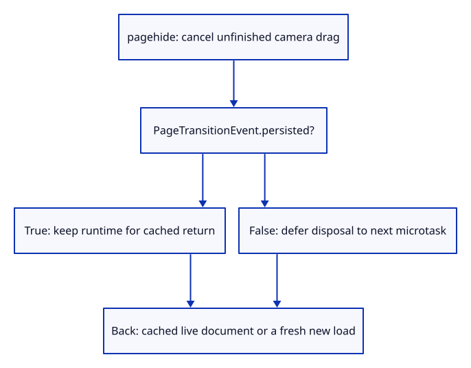

# 33b · Keep a cached viewer ready for Back navigation

**Typing: 3–5 minutes.** [Estimate](typing-load.md).

The [HTML lifecycle contract](https://html.spec.whatwg.org/dev/nav-history-apis.html#the-pagetransitionevent-interface) distinguishes final departure from a page that may return from the back/forward cache. A cached page reuses its existing document and scripts. Disposing its callbacks without restarting them would leave that restored viewer unable to accept commands.

## Type

Continue from [Dispose the viewer without leaving pending work alive](33a-runtime.md). [Save or recover your work](recovery.md).

### 1. `Cargo.toml`

Enable the browser event type that tells us whether the page may return from its cache.

<details>
<summary>Locate the existing block</summary>

```toml
"AddEventListenerOptions", "Event",
```

</details>

Replace that block with:

```toml
--8<-- "journey/code/33b-cache-01.rs"
```

### 2. `src/browser.rs`

Cancel an unfinished drag, retain the cached page’s live owner, and dispose only a final page exit.

<details>
<summary>Locate the existing block</summary>

```rust
        if event.type_() == "pagehide" {
            wasm_bindgen_futures::spawn_local(async { crate::browser_runtime::stop(); });
```

</details>

Replace that block with:

```rust
--8<-- "journey/code/33b-cache-02.rs"
```

## Run and check

In your project:

```sh
cd workspace/journey
REGEN_PROTO=0 cargo build --lib --locked --target wasm32-unknown-unknown -j4
REGEN_PROTO=0 CARGO_BUILD_JOBS=4 trunk serve --port 8780
```

Open `http://127.0.0.1:8780/`. Keep an existing Trunk server running; saving rebuilds it.

In the debug console, run `window.dispatchEvent(new PageTransitionEvent("pagehide", {persisted: true}))`, then the same for `"pageshow"`. `window.wasmBindings.runtime_running()` stays true and typed commands still work.

**Verified checkpoint in Chrome.**



[Verification scope](release.md).

Run the state checks from your project folder:

```sh
REGEN_PROTO=0 cargo test --lib --locked -j4
```

<details>
<summary>Code explanation and diagram</summary>

The handler cancels an unfinished camera gesture, then checks the actual PageTransitionEvent. A persisted transition keeps the runtime. A final exit still schedules the disposal proved in the previous checkpoint. A plain synthetic Event has no persisted flag and retains the previous final-exit behavior. No new listener or feature control is needed.

pagehide → cancel drag → persisted? → keep owner for cached return; otherwise deferred disposal.



Does every pagehide mean the page and its WebAssembly instance are going away forever?

No. PageTransitionEvent.persisted marks a page that may be reused on Back navigation. Retain its runtime in that case; a final exit still disposes the viewer.

Study estimate, including typing and experiments: 1–2 hours.

</details>

<details>
<summary>Optional experiment</summary>

Remove the persisted check and run the retained-runtime assertions. Explain why a fresh normal load could conceal the broken cached-return path.

</details>

<details>
<summary>Check and save your work</summary>

Restore experimental edits, then run from `session_viewer`:

```sh
npm --prefix ../session_tests run course -- check 33b-cache
npm --prefix ../session_tests run course -- save 33b-cache
```

Source comparison leaves your project untouched. [Save and recovery instructions](recovery.md).

</details>

<details>
<summary>Viewer coverage and verification</summary>

A final disposal and a temporarily cached document have different ownership lifetimes. Device-loss recovery remains the next subject.

Chrome dispatches persisted hide/show events, verifies unchanged drawing, placement, selection and camera, and then uses real commands and a drag to prove the retained viewer works. It also navigates the SAME test tab away and Back: if Chrome caches the WebGPU page, its document token and drawing must survive; if the browser performs a fresh load, a newly running viewer is required. The test logs which path actually occurred, rather than claiming cache eligibility from a synthetic event. Final-exit and delayed source/file disposal checks remain inherited.

Chrome checks persisted transition handling, cancelled drag, retained state and working commands, then a real same-tab away/Back navigation. The test records whether Chrome reused the page or loaded it fresh; final-exit disposal remains verified.

[Full validation scope](release.md).

To reproduce the scripted acceptance of the reference checkpoint, run from `session_viewer` with the [course bundle server](release.md#reproduce) running on port 8781:

```sh
npm --prefix ../session_tests run course -- capture 33b-cache
```

This uses the verified reference bundle; it does not check or change your typed project.

</details>
