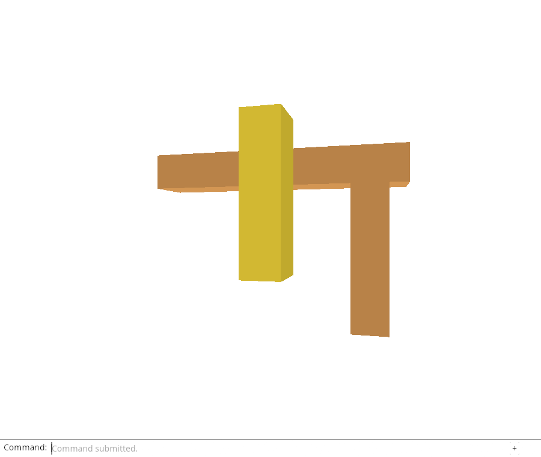
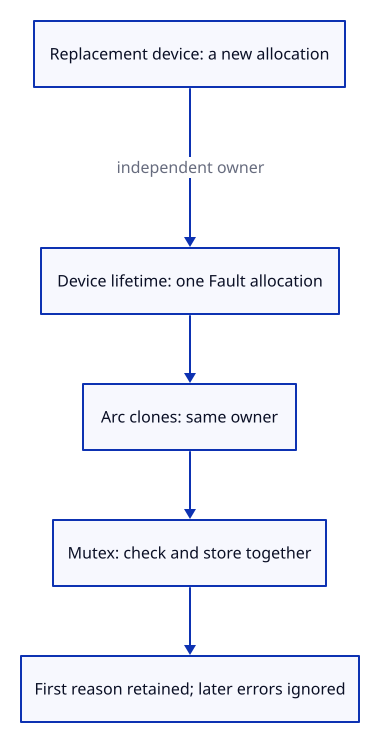

# 34 · Keep the first GPU failure with its device

**Typing: 19–38 minutes.** [Estimate](typing-load.md).

Keep the first GPU error: later errors caused by the same loss must not overwrite its reason. This lesson adds the shared value; the next connects it to GPU callbacks.

`Fault` owns an `Arc<Mutex<Option<String>>>`. `Arc::clone` shares one allocation. Locking the mutex makes checking and storing the first message one operation. `remember` returns true only to the first writer; `message` returns a copy so no lock stays held while reporting the error.

## Type

Continue from [Keep a cached viewer ready for Back navigation](33b-cache.md). [Save or recover your work](recovery.md).

### 1. `src/gpu_fault.rs`

Create the shared first-failure value; callback clones identify the same device lifetime.

Create the file and type:

```rust
--8<-- "journey/code/34-fault-01.rs"
```

### 2. `src/gpu_fault_tests.rs`

Verify first-reason retention, replacement-device isolation and concurrent callback delivery.

Create the file and type:

```rust
--8<-- "journey/code/34-fault-02.rs"
```

### 3. `src/lib.rs`

Expose the signal and include its native tests.

<details>
<summary>Locate the existing block</summary>

```rust
pub mod background;
```

</details>

Replace that block with:

```rust
--8<-- "journey/code/34-fault-03.rs"
```

## Run and check

In your project:

```sh
cd workspace/journey
REGEN_PROTO=0 cargo build --lib --locked --target wasm32-unknown-unknown -j4
REGEN_PROTO=0 CARGO_BUILD_JOBS=4 trunk serve --port 8780
```

Open `http://127.0.0.1:8780/`. Keep an existing Trunk server running; saving rebuilds it.

Run the first-failure checks below. Two callback writers must share one original reason; a replacement device gets a separate Fault. Browser GPU callbacks are connected next.

**Verified checkpoint in Chrome.**



[Verification scope](release.md).

Run the state checks on your computer from your project folder:

```sh
REGEN_PROTO=0 cargo test --lib --locked --target host-tuple -j4
```

<details>
<summary>Code explanation and diagram</summary>

Give a replacement device a new `Fault::default()`. `Arc::ptr_eq` compares allocations, so a late callback from the old device cannot identify the replacement as its owner. No mutex guard crosses an `.await`.

callback clone → lock shared failure → first reason wins → later errors cannot overwrite it.



Why must a late error from an old GPU device remain separate from a new device’s failure state?

Each new device gets a fresh Arc allocation. Clones share that allocation; same_device compares allocation identity so an old callback cannot be mistaken for the replacement.

Study estimate, including typing and experiments: 1–2 hours.

</details>

<details>
<summary>Optional experiment</summary>

Change the first.is_some guard so every callback overwrites the stored reason. Run the tests and explain which useful evidence is lost. Then make a replacement by cloning the old Fault and explain why its identity test fails.

</details>

<details>
<summary>Check and save your work</summary>

Restore experimental edits, then run from `session_viewer`:

```sh
npm --prefix ../session_tests run course -- check 34-fault
npm --prefix ../session_tests run course -- save 34-fault
```

Source comparison leaves your project untouched. [Save and recovery instructions](recovery.md).

</details>

<details>
<summary>Viewer coverage and verification</summary>

The production device module records the first GPU failure in shared state. This value prepares callback integration, stopped submissions, diagnostics and bounded recovery; those are still upcoming.

Chrome verifies the inherited command, source-restoration and page-lifetime behavior and captures Orbit Up. The new first-failure ownership is checked by native Rust tests; GPU callback integration comes next.

[Full validation scope](release.md).

To reproduce the scripted acceptance of the reference checkpoint, run from `session_viewer` with the [course bundle server](release.md#reproduce) running on port 8781:

```sh
npm --prefix ../session_tests run course -- capture 34-fault
```

This uses the verified reference bundle; it does not check or change your typed project.

</details>
