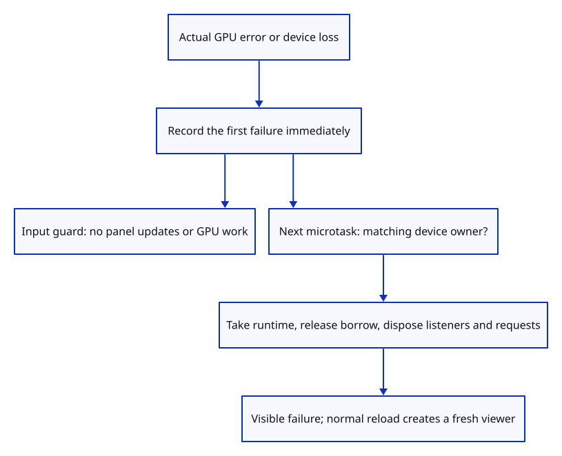
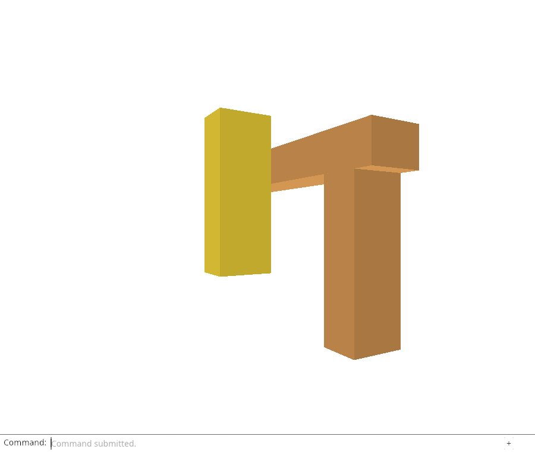

# 34a · Stop the viewer when its GPU device fails

**Combined study estimate: 1–2 hours.** Includes reading, typing, reasoning and experiments.

**Typing estimate: 15–30 minutes.** 28 added or changed lines; unchanged context is excluded. [How this is estimated](typing-load.md).

**Today:** Connect actual GPU failure callbacks, stop new UI and GPU work, and dispose only the runtime that belongs to the failed device.

**In the whole viewer:** Connect the browser, drawing and input, then extend the same project. [See the destination](../journey.md#the-destination).

**Follow:** GPU callback → first fault recorded → input guard → deferred matching-owner disposal → visible failure.

**Before you finish, explain:** Why record a failure before deferring cleanup, and why check the device identity again during cleanup?

The pinned wgpu Device API provides on_uncaptured_error and set_device_lost_callback. Both callbacks keep clones of our Fault value; neither captures a browser window or renderer. Their messages retain the original error or device-loss reason.

failed records the first reason synchronously. It then schedules cleanup for the next microtask, using the deferred-callback lifetime established earlier. The input handler checks the same signal before the command panel can allocate resources or submit work. Cleanup compares allocation identity with the installed runtime, takes only a matching owner and releases the slot borrow before Drop cancels pending requests and removes handlers. An old callback cannot dispose an independently installed replacement.

The visible status reports Cannot draw after cleanup. It is startup/failure feedback, with no feature buttons. This checkpoint does not download diagnostics, restore unsaved edits or automatically recover. Those responsibilities follow.

Chrome intercepts requestDevice in the test only and calls the real GPUDevice.destroy(). It observes the real lost promise and then verifies visible device-loss feedback, disposed runtime and zero further queue writes, submissions, allocations or surface configuration for attempted keyboard, camera, resize and late event input. A normal same-tab reload creates a working viewer again. The test’s observer is not part of the tutorial application.



## Type the change

Continue [Keep the first GPU failure with its device](34-fault.md). From `session_viewer`, save your files with `npm --prefix ../session_tests run course -- save before-34a-stop`. A save keeps your own work; it does not fill in the next lesson.

### 1. `src/browser_runtime.rs`

Retain the device failure identity beside the callbacks that use that device.

Find this exact block:

```rust
    reload: Shared,
}
```

Replace that block with:

```rust
--8<-- "journey/code/34a-stop-01.rs"
```

### 2. `src/browser_runtime.rs`

Only the matching device may dispose the active runtime; drop its owner after the slot borrow ends.

Find this exact block:

```rust
pub fn install(listeners: Listeners, request: Rc<RefCell<ReadGate>>, reload: Shared) {
    ACTIVE.with(|slot| slot.replace(Some(Runtime { _listeners: listeners, request, reload })));
}
```

Replace that block with:

```rust
--8<-- "journey/code/34a-stop-02.rs"
```

### 3. `src/browser.rs`

Mark failure immediately, then defer identity-checked disposal and visible feedback until callbacks return.

Find this exact block:

```rust
fn save_result(bytes: &[u8]) -> Result<String, String> {
```

Replace that block with:

```rust
--8<-- "journey/code/34a-stop-03.rs"
```

### 4. `src/browser.rs`

Connect the real error and device-loss callbacks to this device’s shared signal.

Find this exact block:

```rust
    device.on_uncaptured_error(std::sync::Arc::new(|error| report(&error.to_string())));
```

Replace that block with:

```rust
--8<-- "journey/code/34a-stop-04.rs"
```

### 5. `src/browser.rs`

Refuse new input, UI updates and GPU work as soon as the callback marks a failure.

Find this exact block:

```rust
    let owned_reload = std::rc::Rc::clone(&reload);
    let update = Closure::<dyn FnMut(web_sys::Event)>::new(move |event: web_sys::Event| {
```

Replace that block with:

```rust
--8<-- "journey/code/34a-stop-05.rs"
```

### 6. `src/browser.rs`

Install the runtime with the same device identity used by its failure callbacks.

Find this exact block:

```rust
    crate::browser_runtime::install(listeners, owned_request, owned_reload);
```

Replace that block with:

```rust
--8<-- "journey/code/34a-stop-06.rs"
```

## Run and look

From `session_viewer`, enter your project folder:

```sh
cd workspace/journey
REGEN_PROTO=0 cargo build --lib --locked --target wasm32-unknown-unknown -j4
REGEN_PROTO=0 CARGO_BUILD_JOBS=4 trunk serve --port 8780
```

Open `http://127.0.0.1:8780/`. If Trunk is already running in this project, leave it running; it rebuilds when you save.

Import sample.pb, Select Next, and use Move or Orbit Up. Device loss is normally external; the browser acceptance calls the real GPUDevice.destroy() through a test-only observer. Failure shows Cannot draw, and old input cannot submit another frame. Reload the SAME page to start a new viewer; unsaved placement is not recovered.

**Actual Chrome screenshot.**

Chrome destroys a real GPUDevice, verifies visible loss feedback and disposed listeners, and observes no GPU work from subsequent input. A same-tab reload produces the final working screenshot; it does not recover unsaved edits.



*Captured from this checkpoint’s browser bundle after its browser checks passed. [Check scope and environment](release.md).*

Run the state checks from your project folder:

```sh
REGEN_PROTO=0 cargo test --lib --locked -j4
```

## Try one small experiment

Move the failure guard below panel.update and explain which GPU writes could happen before it. Then remove the identity check in stop_if and explain how an older callback could stop a new runtime.

## Explain it in your own words

Trace the values through the files without reading the answer first. If you lose the connection, stop at the last value you can follow.

<details>
<summary>Compare your explanation</summary>

The immediate signal blocks any intervening input or GPU updates. Deferred cleanup waits for the active callback to return; its identity check prevents an old device’s callback from stopping a replacement.

</details>

## Keep your working result

Return to `session_viewer` in a second terminal. Restore experimental edits before comparing:

```sh
npm --prefix ../session_tests run course -- check 34a-stop
npm --prefix ../session_tests run course -- save 34a-stop
```

The comparison spots typing differences; it does not prove behaviour. Keep three notes: what I changed; the values I followed; the question I still have. [Recover a checkpoint](recovery.md) if an experiment gets tangled.

## Where this grows

Production records the first GPU failure and gates UI/uploads/rendering before further GPU work. This checkpoint establishes the stopped lifetime. Structured diagnostics, persisted reports and bounded recovery remain next.

[Validation status and course release](release.md).
