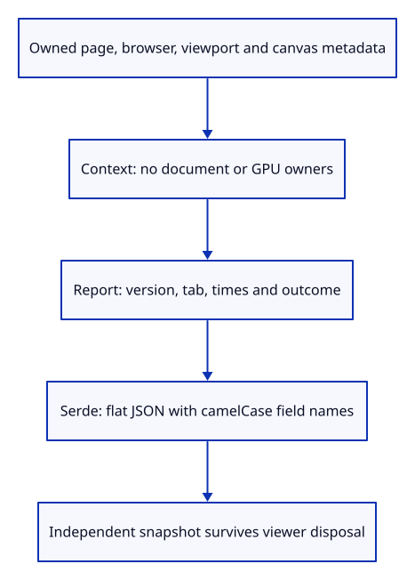
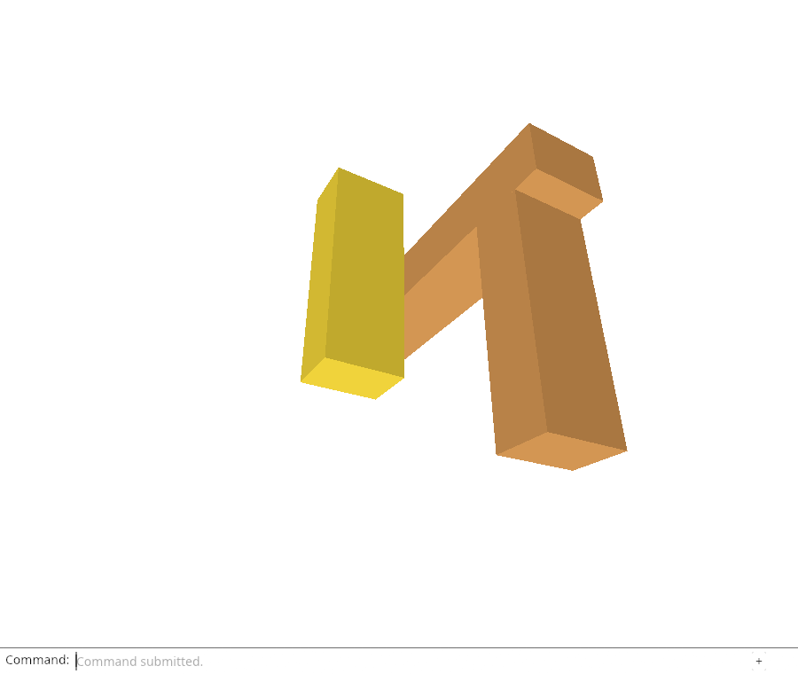

# 34b · Describe a viewer run without keeping its document

**Combined study estimate: 1–2 hours.** Includes reading, typing, reasoning and experiments.

**Typing estimate: 25–49 minutes.** 65 added or changed lines; unchanged context is excluded. [How this is estimated](typing-load.md).

**Today:** Define owned diagnostic context and a serializable run outcome, without retaining scene or GPU owners.

**In the whole viewer:** Connect the browser, drawing and input, then extend the same project. [See the destination](../journey.md#the-destination).

**Follow:** browser metadata → owned Context → Report header → explicit JSON → independent snapshot.

**Before you finish, explain:** Why does a diagnostic snapshot own small strings and dimensions instead of keeping the editor or renderer?

After GPU failure, the viewer may no longer be able to paint its command dock. Its report therefore needs an independent lifetime. Begin with a plain Rust value, before wiring browser observations and downloads. Context records the page origin/path, browser identity, secure/WebGPU availability, CSS viewport, drawing buffer and display density. Callers will supply a page without its query string; this model does not itself sanitize arbitrary input.

Strings own their text and dimensions are small copied arrays. Report contains no Editor, Session, GPU device or reference-counted document. Cloning it makes an independent snapshot. Outcome distinguishes a live run, a drawn scene, ordinary close and failure; it does not call a stale running report proof of a crash.

Serde derives define JSON serialization and parsing. rename_all writes browser-style camelCase names. flatten places Context fields at the top level while keeping the Rust responsibilities separate. The schema version lets the later storage reader reject incompatible reports. new initializes lastSeen from started, then keeps the original start separately from later observations.

Native tests check actual JSON names, header values, round-trip decoding and independent context after resize. Chrome verifies the already-wired loss/input/lifetime behavior and a new proof view. This header is not yet populated from the live browser, downloadable or stored. Events, first-failure retention and browser connection follow.



## Type the change

Continue [Stop the viewer when its GPU device fails](34a-stop.md). From `session_viewer`, save your files with `npm --prefix ../session_tests run course -- save before-34b-report`. A save keeps your own work; it does not fill in the next lesson.

### 1. `src/diagnostic.rs`

Create a serializable report header with owned browser context and explicit run outcome.

Create the file and type:

```rust
--8<-- "journey/code/34b-report-01.rs"
```

### 2. `src/diagnostic_tests.rs`

Check the actual JSON field names, round trip and independence of a retained snapshot.

Create the file and type:

```rust
--8<-- "journey/code/34b-report-02.rs"
```

### 3. `src/lib.rs`

Expose the report model and include its native tests.

Find this exact block:

```rust
pub mod gpu_fault;
```

Replace that block with:

```rust
--8<-- "journey/code/34b-report-03.rs"
```

## Run and look

From `session_viewer`, enter your project folder:

```sh
cd workspace/journey
REGEN_PROTO=0 cargo build --lib --locked --target wasm32-unknown-unknown -j4
REGEN_PROTO=0 CARGO_BUILD_JOBS=4 trunk serve --port 8780
```

Open `http://127.0.0.1:8780/`. If Trunk is already running in this project, leave it running; it rebuilds when you save.

Import sample.pb, Select Next, and use Move or Orbit Up. Device loss is normally external; the browser acceptance calls the real GPUDevice.destroy() through a test-only observer. Failure shows Cannot draw, and old input cannot submit another frame. Reload the SAME page to start a new viewer; unsaved placement is not recovered. In a working run, finish with Orbit Up and Fit. Run the native tests to inspect the report’s JSON header; the Diagnostic Report command is introduced after browser wiring.

**Actual Chrome screenshot.**

Chrome verifies the inherited real GPU-loss and restart acceptance, then captures Orbit Up. The report header’s schema and ownership are checked natively; live reporting is not wired yet.



*Captured from this checkpoint’s browser bundle after its browser checks passed. [Check scope and environment](release.md).*

Run the state checks from your project folder:

```sh
REGEN_PROTO=0 cargo test --lib --locked -j4
```

## Try one small experiment

Remove serde(flatten), run the JSON assertion, and explain how the public format changed. Then compare the live and cloned report after changing its drawing-buffer size.

## Explain it in your own words

Trace the values through the files without reading the answer first. If you lose the connection, stop at the last value you can follow.

<details>
<summary>Compare your explanation</summary>

The report must survive the viewer’s disposal without extending scene or GPU lifetimes. Owned metadata records the relevant context independently; document values and rendering handles are absent.

</details>

## Keep your working result

Return to `session_viewer` in a second terminal. Restore experimental edits before comparing:

```sh
npm --prefix ../session_tests run course -- check 34b-report
npm --prefix ../session_tests run course -- save 34b-report
```

The comparison spots typing differences; it does not prove behaviour. Keep three notes: what I changed; the values I followed; the question I still have. [Recover a checkpoint](recovery.md) if an experiment gets tangled.

## Where this grows

Production diagnostics retain browser/page/viewport/drawing-buffer context outside the renderer and version their reports. This checkpoint establishes that value; bounded observations, downloads, storage policy and recovery follow.

[Validation status and course release](release.md).
