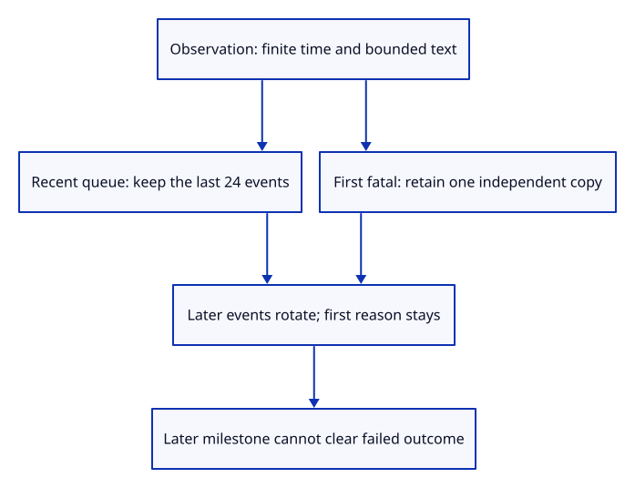
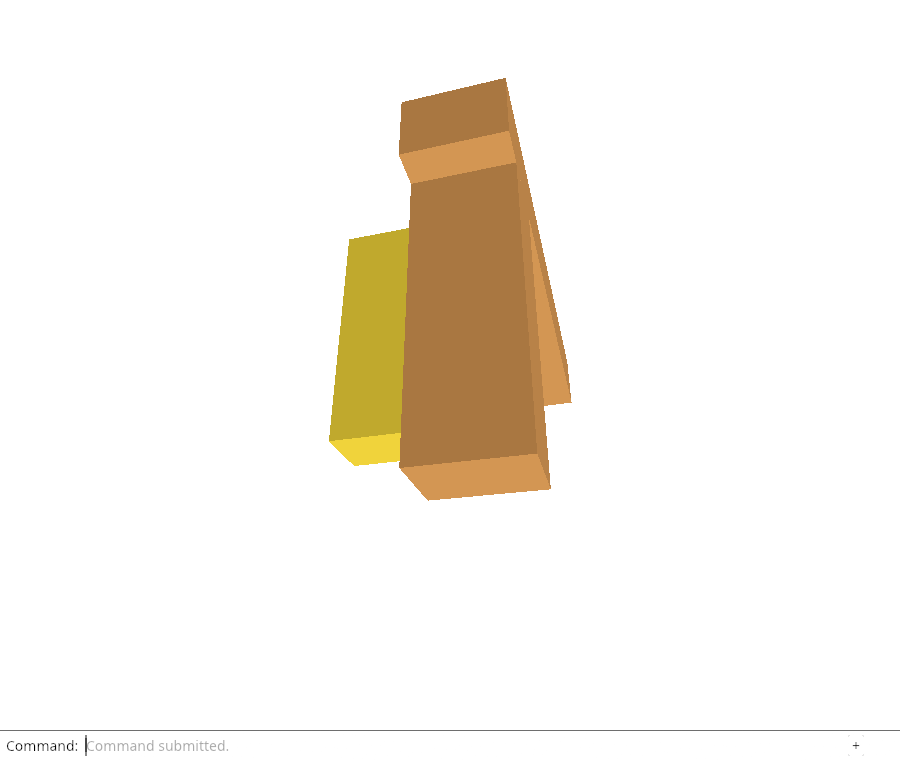

# 34ba · Keep recent events without losing the first failure

**Combined study estimate: 1–2 hours.** Includes reading, typing, reasoning and experiments.

**Typing estimate: 30–60 minutes.** 60 added or changed lines; unchanged context is excluded. [How this is estimated](typing-load.md).

**Today:** Bound diagnostic observations while keeping the original failure independently of recent event rotation.

**Follow:** finite relative time → bounded event → first failure retained → last 24 observations → stable failed outcome.

Keep recent observations and the first fatal reason separately. `VecDeque` is a queue: pop its oldest entry before appending when it reaches 24 events. The first-failure field survives that rotation.

`record` rejects negative or non-finite elapsed time before mutation, caps kind/message text at 64/4096 Unicode scalar values, updates lastSeen and appends one event. A fatal event sets Failed only once; a later ready milestone cannot clear the failure.

These limits govern recording. Deserialized JSON still needs an admission check before the viewer trusts it.



## Type the change

Continue from [Describe a viewer run without keeping its document](34b-report.md). Save your own work first: `npm --prefix ../session_tests run course -- save before-34ba-events` (from `session_viewer`).

### 1. `src/diagnostic.rs`

Describe an observation separately from its bounded owner and preserve its relative timing.

Find this exact block:

```rust
#[derive(Clone, Debug, PartialEq, Serialize, Deserialize)]
#[serde(rename_all = "camelCase")]
pub struct Report {
```

Replace that block with:

```rust
--8<-- "journey/code/34ba-events-01.rs"
```

### 2. `src/diagnostic.rs`

Retain the recent event window separately from the first failure, so rotation cannot erase it.

Find this exact block:

```rust
    pub context: Context,
}
```

Replace that block with:

```rust
--8<-- "journey/code/34ba-events-02.rs"
```

### 3. `src/diagnostic.rs`

Validate relative time, bound observation text/history, and make failure survive later milestones and event rotation.

Find this exact block:

```rust
        Self { version: 1, tab, last_seen: started.clone(), started, outcome: Outcome::Running, context }
    }
}
```

Replace that block with:

```rust
--8<-- "journey/code/34ba-events-03.rs"
```

### 4. `src/diagnostic_tests.rs`

Prove bounded history/text, retained first failure, ready-state semantics and atomic rejection of invalid timing.

Find this exact block:

```rust
use crate::diagnostic::{Context, Outcome, Report};

fn context() -> Context {
    Context { page: "https://example.test/viewer/".into(), browser: "Test browser".into(),
        secure_context: true, webgpu: true, viewport: [900, 760], canvas: [900, 760], device_pixel_ratio: 1.0 }
}

#[test]
fn report_starts_running_with_flat_browser_context() {
    let report = Report::new("tab-a".into(), "2026-10-03T18:00:00.000Z".into(), context());
    let value = serde_json::to_value(&report).unwrap();
    assert_eq!(value["version"], 1); assert_eq!(value["outcome"], "running");
    assert_eq!(value["started"], value["lastSeen"]);
    assert_eq!(value["secureContext"], true); assert_eq!(value["devicePixelRatio"], 1.0);
    assert_eq!(value["viewport"], serde_json::json!([900, 760]));
    assert!(value.get("context").is_none());
    assert_eq!(serde_json::from_value::<Report>(value).unwrap(), report);
}

#[test]
fn report_snapshot_keeps_its_own_context() {
    let mut live = Report::new("tab-a".into(), "start".into(), context()); let snapshot = live.clone();
    live.context.canvas = [618, 1373]; live.context.device_pixel_ratio = 2.625;
    live.outcome = Outcome::Ready;
    assert_eq!(snapshot.context.canvas, [900, 760]); assert_eq!(snapshot.outcome, Outcome::Running);
    assert_eq!(serde_json::from_str::<Report>(&serde_json::to_string(&live).unwrap()).unwrap(), live);
}
```

Replace that block with:

```rust
--8<-- "journey/code/34ba-events-04.rs"
```

## Run and look

From `session_viewer`, enter your project folder:

```sh
cd workspace/journey
REGEN_PROTO=0 cargo build --lib --locked --target wasm32-unknown-unknown -j4
REGEN_PROTO=0 CARGO_BUILD_JOBS=4 trunk serve --port 8780
```

Open `http://127.0.0.1:8780/`. If Trunk is already running in this project, leave it running; it rebuilds when you save.

Run the event checks below. After 30 observations, exactly 24 remain, while the first fatal reason is preserved separately. Recording a success must not clear failure.

**Verified checkpoint in Chrome.**



[What this screenshot checks](release.md).

Run the state checks from your project folder:

```sh
REGEN_PROTO=0 cargo test --lib --locked -j4
```

<details>
<summary>Optional experiment</summary>

Store failure only in the recent queue and run the rotation test. Then remove the failed-outcome guard and explain why a later successful milestone would misdescribe the run.

</details>

## Explain the change

Why keep the first failure separately from the recent event queue?

<details>
<summary>Compare your explanation</summary>

Recent observations rotate to bound memory. The original failure must remain available even after follow-on errors evict that event from the recent window.

</details>

## Keep your working result

Return to `session_viewer` in a second terminal. Restore experimental edits before comparing:

```sh
npm --prefix ../session_tests run course -- check 34ba-events
npm --prefix ../session_tests run course -- save 34ba-events
```

Check compares your typed source; run the focused check above for behavior. [Recover your work](recovery.md).

<details>
<summary>Where this fits in the finished viewer</summary>

Production diagnostics retain 24 recent events and the first fatal reason separately. This checkpoint implements that policy in the cumulative Rust report. Phases/resources/adapter metadata, browser connection, downloads and bounded storage/recovery still follow.

</details>

<details>
<summary>Verification notes and browser acceptance</summary>

Native tests drive 30 follow-on errors, verify the exact 24-event window, preserve the first failure through a later success milestone, round-trip the report, cap multibyte text without cutting a character and reject invalid timings without mutation. The browser still verifies inherited GPU-loss behavior; actual report observation is wired next.

Chrome verifies inherited real GPU loss, cancellation and restart, then captures Orbit Right. Native tests establish bounded report observations and first-failure retention; the browser report producer follows next.

[Full validation scope](release.md).

To reproduce the scripted acceptance of the reference checkpoint, run from `session_viewer` with the [course bundle server](release.md#reproduce) running on port 8781:

```sh
npm --prefix ../session_tests run course -- capture 34ba-events
```

This uses the verified reference bundle; it does not check or change your typed project.

</details>
