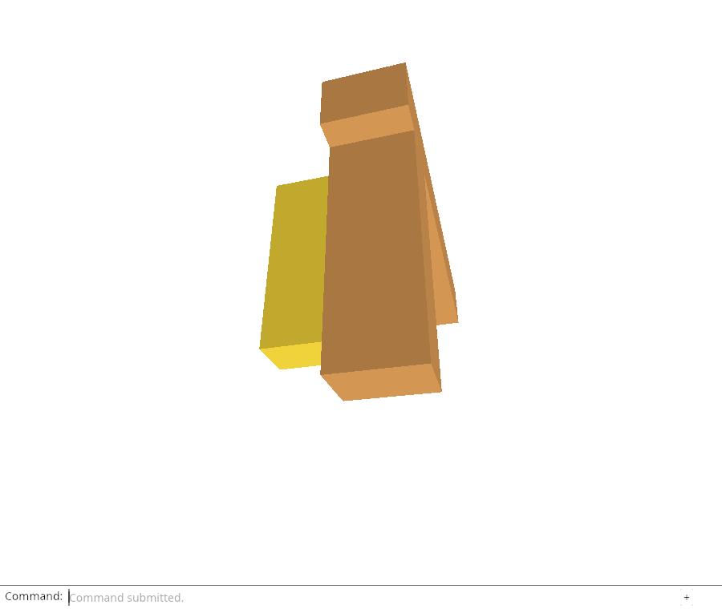
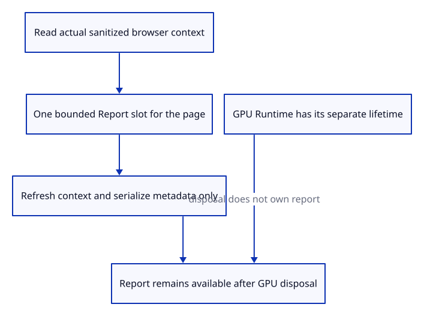

# 34c · Read live diagnostic context outside the GPU runtime

**Typing: 24–48 minutes.** [Estimate](typing-load.md).

Populate the report from the page before requesting a GPU. One thread-local `RefCell<Option<Report>>` owns metadata independently of the drawing runtime. `RefCell` checks short shared/mutable borrows at runtime.

`context` reads the real viewport, canvas, density and browser details. Build the page value from origin and path, excluding query and fragment. `Reflect` reads WebGPU availability without generated WebGPU bindings.

## Type

Continue from [Keep recent events without losing the first failure](34ba-events.md). [Save or recover your work](recovery.md).

### 1. `src/browser_report.rs`

Own one bounded report for the page and read actual browser metadata without keeping any viewer or GPU owner.

Create the file and type:

```rust
--8<-- "journey/code/34c-browser-01.rs"
```

### 2. `Cargo.toml`

Enable typed browser address, identity and monotonic-clock access.

<details>
<summary>Locate the existing block</summary>

```toml
"PageTransitionEvent", "Event",
```

</details>

Replace that block with:

```toml
--8<-- "journey/code/34c-browser-02.rs"
```

### 3. `src/lib.rs`

Compile the browser report bridge only for WebAssembly.

<details>
<summary>Locate the existing block</summary>

```rust
#[cfg(target_arch = "wasm32")]
mod browser_runtime;
```

</details>

Replace that block with:

```rust
--8<-- "journey/code/34c-browser-03.rs"
```

### 4. `src/browser.rs`

Start diagnostic context before awaiting the GPU connection; failure observation and downloads are connected next.

<details>
<summary>Locate the existing block</summary>

```rust
    let instance = wgpu::Instance::new(wgpu::InstanceDescriptor {
```

</details>

Replace that block with:

```rust
--8<-- "journey/code/34c-browser-04.rs"
```

## Run and check

In your project:

```sh
cd workspace/journey
REGEN_PROTO=0 cargo build --lib --locked --target wasm32-unknown-unknown -j4
REGEN_PROTO=0 CARGO_BUILD_JOBS=4 trunk serve --port 8780
```

Open `http://127.0.0.1:8780/`. Keep an existing Trunk server running; saving rebuilds it.

In the debug console, inspect `window.wasmBindings.diagnostic_snapshot()`. Its viewport and canvas dimensions must match this browser. Resize and read again: context should refresh without changing the scene.

**Verified checkpoint in Chrome.**



[Verification scope](release.md).

Run the state checks from your project folder:

```sh
REGEN_PROTO=0 cargo test --lib --locked -j4
```

<details>
<summary>Code explanation and diagram</summary>

`start` creates a fresh run ID and UTC start time. `observe` combines `performance.now()` timing with a UTC timestamp. `diagnostic_snapshot` refreshes context and serializes the current report. Its debug export lets you inspect the JSON in the console; it does not add a feature button.

Readiness and fatal observations are wired in the next lesson.

page begins → sanitized context → independent report slot → current context → JSON snapshot.



Why does the report live outside the Runtime that GPU failure disposes?

A failed Runtime releases input, source and GPU owners. Its report must remain readable afterward, so a separate bounded metadata slot owns it without retaining those resources.

Study estimate, including typing and experiments: 1–2 hours.

</details>

<details>
<summary>Optional experiment</summary>

Put the report inside Runtime instead, trigger the actual device-loss check, and explain why it would disappear with the evidence it was meant to retain. Compare a URL containing a query parameter with the report’s page field.

</details>

<details>
<summary>Check and save your work</summary>

Restore experimental edits, then run from `session_viewer`:

```sh
npm --prefix ../session_tests run course -- check 34c-browser
npm --prefix ../session_tests run course -- save 34c-browser
```

Source comparison leaves your project untouched. [Save and recovery instructions](recovery.md).

</details>

<details>
<summary>Viewer coverage and verification</summary>

Production diagnostic context lives outside the renderer. This browser bridge establishes that independent report lifetime and real metadata; current/fatal downloads, adapter/phases/resources, bounded storage and recovery remain next.

Chrome compares real browser/canvas dimensions, density, identity, sanitized URL, timestamps and run identifiers with the JSON. Reading a snapshot leaves GPU counters unchanged. It then changes the test viewport and verifies fresh context, reloads the same test tab to require a new run ID and reproduces the final proof scene. Readiness/failure observations and the typed download command are connected in the next checkpoint; this report still says running.

Chrome verifies real diagnostic context, sanitized URL, fresh dimensions, snapshot reads without GPU writes and a new run identifier on same-tab reload. Readiness/failure recording and downloads follow next.

[Full validation scope](release.md).

To reproduce the scripted acceptance of the reference checkpoint, run from `session_viewer` with the [course bundle server](release.md#reproduce) running on port 8781:

```sh
npm --prefix ../session_tests run course -- capture 34c-browser
```

This uses the verified reference bundle; it does not check or change your typed project.

</details>
