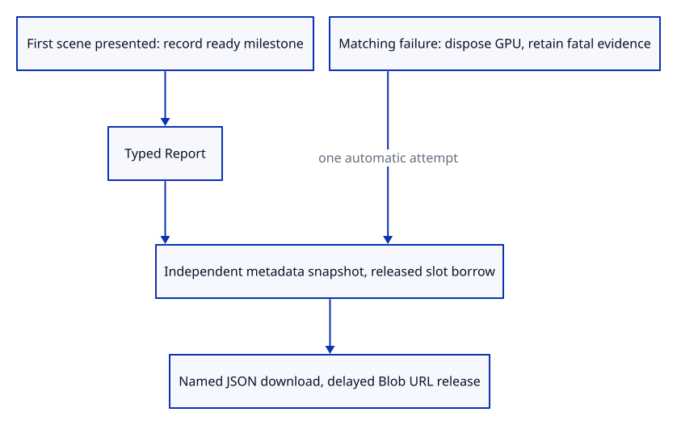
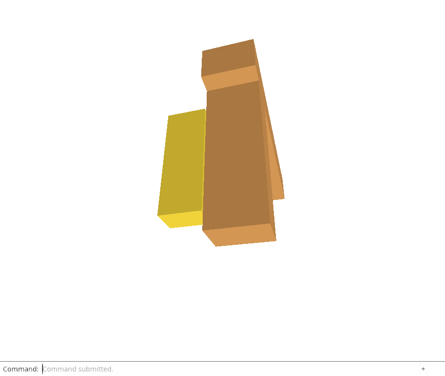

# 34d · Download diagnostics through the real command line

**Combined study estimate: 1–2 hours.** Includes reading, typing, reasoning and experiments.

**Typing estimate: 13–26 minutes.** 26 added or changed lines; unchanged context is excluded. [How this is estimated](typing-load.md).

**Today:** Download a current ready-run report with Diagnostic Report and attempt one independent first-failure download after GPU disposal.

**Follow:** first scene presented → ready report → typed Diagnostic Report → JSON Blob → actual download → delayed URL cleanup.

Add `Diagnostic Report` to the command dock. It downloads the current metadata as `viewer-diagnostic.json`. The first presented scene records a geometry-on-screen milestone and marks a healthy run Ready.

Finish serializing before clicking the temporary download anchor. This releases the report’s `RefCell` borrow before browser behavior can call back into Rust. The existing download owner revokes its Blob URL after ten seconds.

A GPU failure first stops its matching runtime, then records the fatal reason and attempts one report download. Startup failures are recorded too when metadata initialization succeeded. Browsers may block automatic downloads; storing a report for later retrieval comes next. `Save` still writes the editable document and neither download consumes Undo.



## Type the change

Continue from [Read live diagnostic context outside the GPU runtime](34c-browser.md). Save your own work first: `npm --prefix ../session_tests run course -- save before-34d-download` (from `session_viewer`).

### 1. `src/file_output.rs`

Reuse the existing owned Blob/anchor cleanup for a named report while keeping Save’s filename unchanged.

<details>
<summary>Locate the existing block</summary>

```rust
pub fn download(bytes: &[u8]) -> Result<(), JsValue> {
    let window
```

</details>

Replace that block with:

```rust
--8<-- "journey/code/34d-download-01.rs"
```

### 2. `src/file_output.rs`

Choose the diagnostic JSON filename without changing the document download contract.

<details>
<summary>Locate the existing block</summary>

```rust
    anchor.set_download("viewer.session");
```

</details>

Replace that block with:

```rust
--8<-- "journey/code/34d-download-02.rs"
```

### 3. `src/browser_report.rs`

Download a current metadata snapshot and attempt one automatic download for the first fatal observation.

<details>
<summary>Locate the existing block</summary>

```rust
#[cfg_attr(debug_assertions, wasm_bindgen::prelude::wasm_bindgen)]
```

</details>

Replace that block with:

```rust
--8<-- "journey/code/34d-download-03.rs"
```

### 4. `src/browser.rs`

Keep the matching device’s failure evidence after its GPU runtime is disposed.

<details>
<summary>Locate the existing block</summary>

```rust
        if crate::browser_runtime::stop_if(&fault) { report(&format!("Cannot draw: {message}")); }
```

</details>

Replace that block with:

```rust
--8<-- "journey/code/34d-download-04.rs"
```

### 5. `src/browser.rs`

Expose diagnostics through the actual command dock without an HTML feature button.

<details>
<summary>Locate the existing block</summary>

```rust
            "Save",
            "Example Box",
```

</details>

Replace that block with:

```rust
--8<-- "journey/code/34d-download-05.rs"
```

### 6. `src/browser.rs`

Mark the report ready only after the initial scene frame is presented.

<details>
<summary>Locate the existing block</summary>

```rust
        )?;
    }
    let input_canvas = canvas.clone();
```

</details>

Replace that block with:

```rust
--8<-- "journey/code/34d-download-06.rs"
```

### 7. `src/browser.rs`

Handle the typed report command separately from document Save and edit history.

<details>
<summary>Locate the existing block</summary>

```rust
            } else if line == "save" {
```

</details>

Replace that block with:

```rust
--8<-- "journey/code/34d-download-07.rs"
```

### 8. `src/lib.rs`

Capture startup failure after diagnostic initialization, even when no GPU runtime could be installed.

<details>
<summary>Locate the existing block</summary>

```rust
            browser::report(&format!("Cannot draw: {error:?}"));
```

</details>

Replace that block with:

```rust
--8<-- "journey/code/34d-download-08.rs"
```

## Run and look

From `session_viewer`, enter your project folder:

```sh
cd workspace/journey
REGEN_PROTO=0 cargo build --lib --locked --target wasm32-unknown-unknown -j4
REGEN_PROTO=0 CARGO_BUILD_JOBS=4 trunk serve --port 8780
```

Open `http://127.0.0.1:8780/`. If Trunk is already running in this project, leave it running; it rebuilds when you save.

Type `Diagnostic Report` and open `viewer-diagnostic.json`. A drawn scene should have outcome `ready` and a geometry-on-screen event. The document and Undo history stay unchanged.

**Verified checkpoint in Chrome.**



[What this screenshot checks](release.md).

Run the state checks from your project folder:

```sh
REGEN_PROTO=0 cargo test --lib --locked -j4
```

<details>
<summary>Optional experiment</summary>

Keep the report inside the GPU Runtime and explain why the fatal download would lose it. Then compare the actual document Save and diagnostic downloads and explain why they cannot be used interchangeably.

</details>

## Explain the change

Why can the failed viewer download a report after GPU input and drawing have stopped?

<details>
<summary>Compare your explanation</summary>

The independent report owns metadata only. JSON serialization and the existing Blob/anchor download need no GPU resources, so disposal can stop the renderer without destroying its evidence.

</details>

## Keep your working result

Return to `session_viewer` in a second terminal. Restore experimental edits before comparing:

```sh
npm --prefix ../session_tests run course -- check 34d-download
npm --prefix ../session_tests run course -- save 34d-download
```

Check compares your typed source; run the focused check above for behavior. [Recover your work](recovery.md).

<details>
<summary>Where this fits in the finished viewer</summary>

Production exposes Diagnostic Report through the command dock and attempts an automatic first-failure report download. This endpoint establishes current/fatal downloads. Persisted reports, detailed adapter/load/resource telemetry and bounded automatic recovery remain future work.

</details>

<details>
<summary>Verification notes and browser acceptance</summary>

Chrome types Diagnostic Report and reads the actual JSON download. It verifies ready context and milestone timing, unchanged placement/camera/history/GPU counters, then confirms Move Undo still works. It destroys the real GPUDevice, captures the actual failed download, checks the first reason, unchanged message after repeated input and no further GPU work. A startup adapter rejection produces a failed report without a runtime. Normal same-tab reload restarts the working viewer.

Chrome reads actual typed ready-report and real GPU-loss/startup-failure JSON downloads, checks scene/history/camera/GPU invariants and late-input blocking, then reloads the same test page for its final working picture.

[Full validation scope](release.md).

To reproduce the scripted acceptance of the reference checkpoint, run from `session_viewer` with the [course bundle server](release.md#reproduce) running on port 8781:

```sh
npm --prefix ../session_tests run course -- capture 34d-download
```

This uses the verified reference bundle; it does not check or change your typed project.

</details>
