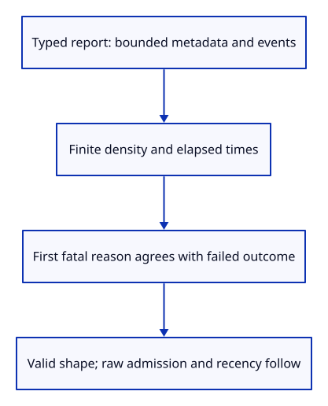
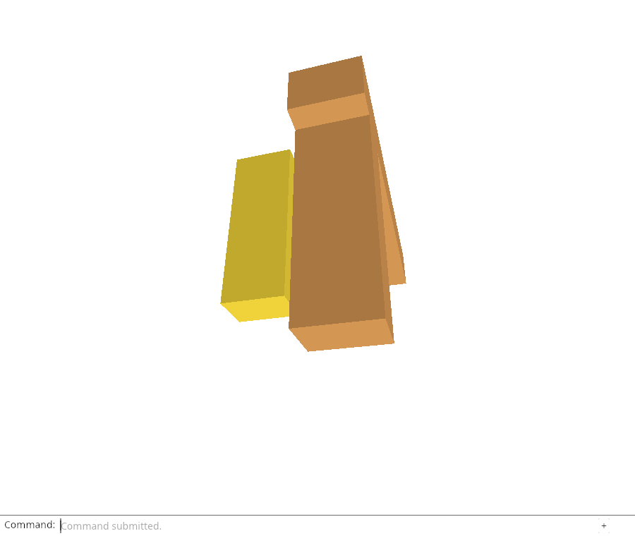

# 34e · Check the bounded shape of a diagnostic report

**Combined study estimate: 1–2 hours.** Includes reading, typing, reasoning and experiments.

**Typing estimate: 30–60 minutes.** 52 added or changed lines; unchanged context is excluded. [How this is estimated](typing-load.md).

**Today:** Validate a typed report’s limits and failure/outcome invariants before the later storage decoder adopts it.

**In the whole viewer:** Connect the browser, drawing and input, then extend the same project. [See the destination](../journey.md#the-destination).

**Follow:** typed report → bounded metadata and observations → consistent failure/outcome → valid shape.

**Before you finish, explain:** Why must a deserialized report satisfy our shape invariants before it can be used?

The report now has a shape validator. It bounds identifiers, timestamp text, metadata and observations, requires finite positive display density and finite nonnegative event timing, and rejects unsanitized page metadata. A first fatal event must agree with the failed outcome. Recent fatal observations require retained failure; the first failure itself may remain outside the rotated recent window.

These checks apply to typed values, including values made by deserialization. They do not enforce input byte size, reject unknown raw JSON fields or parse timestamps. Those are the next decoder and recency responsibilities; no stored value is adopted yet.

record trims with while rather than if so a caller that directly deserializes an oversized queue cannot keep it oversized after a valid new observation. This repair does not replace admission validation. Native tests reject inconsistent metadata/failure, overlong Unicode text and oversized events, and verify repaired bounds with the original first failure preserved.

Chrome verifies inherited real diagnostic downloads and GPU-loss/restart behavior. Browser storage is connected only after the complete admission and recency checks.



## Type the change

Continue [Download diagnostics through the real command line](34d-download.md). From `session_viewer`, save your files with `npm --prefix ../session_tests run course -- save before-34e-schema`. A save keeps your own work; it does not fill in the next lesson.

### 1. `src/diagnostic.rs`

Validate shape, limits and failure/outcome consistency before trusting a decoded stored value.

Find this exact block:

```rust
    pub fn failure(&self) -> Option<&Event> { self.failure.as_ref() }
```

Replace that block with:

```rust
--8<-- "journey/code/34e-schema-01.rs"
```

### 2. `src/diagnostic.rs`

Keep recording bounded even if a caller bypasses admission and directly deserializes an oversized queue.

Find this exact block:

```rust
        if self.events.len() == 24 { self.events.pop_front(); }
```

Replace that block with:

```rust
--8<-- "journey/code/34e-schema-02.rs"
```

### 3. `src/diagnostic_shape_tests.rs`

Verify typed metadata, bounded queues and consistent first-failure state.

Create the file and type:

```rust
--8<-- "journey/code/34e-schema-03.rs"
```

### 4. `src/lib.rs`

Include the native shape-invariant checks.

Find this exact block:

```rust
pub mod diagnostic;
```

Replace that block with:

```rust
--8<-- "journey/code/34e-schema-04.rs"
```

## Run and look

From `session_viewer`, enter your project folder:

```sh
cd workspace/journey
REGEN_PROTO=0 cargo build --lib --locked --target wasm32-unknown-unknown -j4
REGEN_PROTO=0 CARGO_BUILD_JOBS=4 trunk serve --port 8780
```

Open `http://127.0.0.1:8780/`. If Trunk is already running in this project, leave it running; it rebuilds when you save.

Import sample.pb, move its selected beam, then type Diagnostic Report to download viewer-diagnostic.json. Save still downloads viewer.session. Run the native tests for this lesson’s report policy. Finish the healthy proof view with Move 0.05,0,0 and Fit. Chrome also verifies an actual GPU-loss report and startup-failure download, followed by a healthy reload. Saved previous reports and unsaved-edit recovery are not connected yet.

**Actual Chrome screenshot.**

Chrome checks inherited actual diagnostic downloads and failure/restart behavior. Native tests establish typed report shape; raw JSON admission and browser storage follow.



*Captured from this checkpoint’s browser bundle after its browser checks passed. [Check scope and environment](release.md).*

Run the state checks from your project folder:

```sh
REGEN_PROTO=0 cargo test --lib --locked -j4
```

## Try one small experiment

Directly deserialize 25 recent events, inspect valid(), then record one new observation and inspect it again. Explain why queue repair cannot validate the rest of the stored format.

## Explain it in your own words

Trace the values through the files without reading the answer first. If you lose the connection, stop at the last value you can follow.

<details>
<summary>Compare your explanation</summary>

Deserialization alone does not enforce our version, metadata limits, bounded event window or consistent first-failure/outcome state. Those checks are separate from JSON syntax and later timestamp recency.

</details>

## Keep your working result

Return to `session_viewer` in a second terminal. Restore experimental edits before comparing:

```sh
npm --prefix ../session_tests run course -- check 34e-schema
npm --prefix ../session_tests run course -- save 34e-schema
```

The comparison spots typing differences; it does not prove behaviour. Keep three notes: what I changed; the values I followed; the question I still have. [Recover a checkpoint](recovery.md) if an experiment gets tangled.

## Where this grows

The saved-report reader must validate its metadata before use. This endpoint establishes typed shape invariants; raw JSON admission, recency, real storage, telemetry and recovery follow.

[Validation status and course release](release.md).
