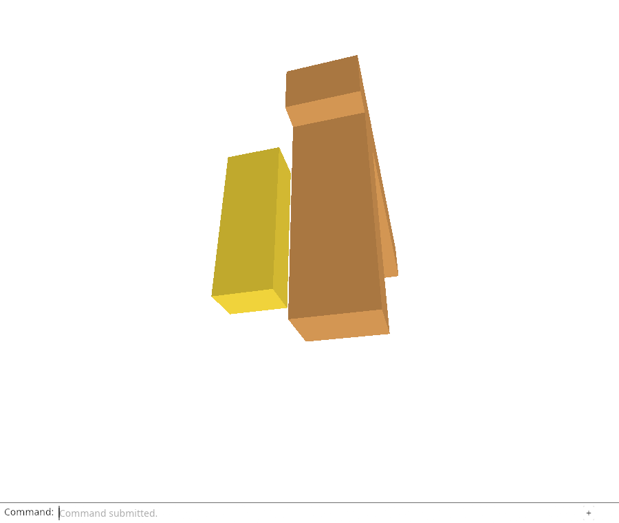
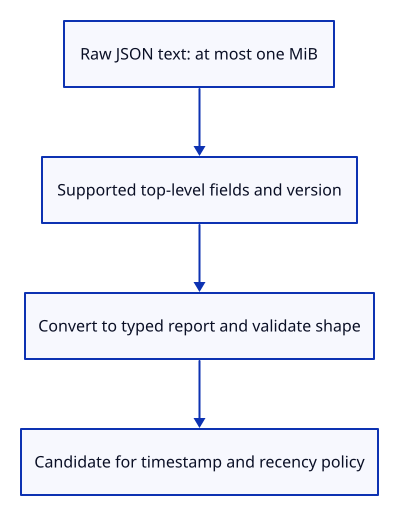

# 34ea · Admit only supported bounded saved JSON

**Typing: 27–53 minutes.** [Estimate](typing-load.md).

Admit saved JSON through one boundary. First reject input above one MiB. Then inspect its raw keys and version, decode it as `Report`, and run the typed shape validator.

## Type

Continue from [Check the bounded shape of a diagnostic report](34e-schema.md). [Save or recover your work](recovery.md).

### 1. `src/report_store.rs`

Bound raw input and reject unsupported JSON fields before adopting a valid typed report.

Create the file and type:

```rust
--8<-- "journey/code/34ea-decode-01.rs"
```

### 2. `src/report_store_tests.rs`

Prove actual stored JSON admission and byte/text/schema boundaries.

Create the file and type:

```rust
--8<-- "journey/code/34ea-decode-02.rs"
```

### 3. `src/lib.rs`

Expose the decoder and its native acceptance checks.

<details>
<summary>Locate the existing block</summary>

```rust
pub mod diagnostic;
```

</details>

Replace that block with:

```rust
--8<-- "journey/code/34ea-decode-03.rs"
```

## Run and check

In your project:

```sh
cd workspace/journey
REGEN_PROTO=0 cargo build --lib --locked --target wasm32-unknown-unknown -j4
REGEN_PROTO=0 CARGO_BUILD_JOBS=4 trunk serve --port 8780
```

Open `http://127.0.0.1:8780/`. Keep an existing Trunk server running; saving rebuilds it.

Run the decoder checks below. Supported JSON at the byte limit is accepted; oversized, unknown-schema or inconsistent JSON is rejected before storage adoption.

**Verified checkpoint in Chrome.**



[Verification scope](release.md).

Run the state checks on your computer from your project folder:

```sh
REGEN_PROTO=0 cargo test --lib --locked --target host-tuple -j4
```

<details>
<summary>Code explanation and diagram</summary>

Reject unsupported fields before typed conversion. Otherwise an older reader could accept a newer report and silently strip its telemetry when exporting it.

Each layer answers one question: is the input bounded, is its format supported, and is its value consistent? Timestamp parsing and age policy remain separate.

raw text byte limit → JSON fields/version → typed shape validator → candidate for recency.



Why inspect raw JSON fields before deserializing the report?

The typed deserializer can ignore unknown fields. Rejecting unsupported fields first prevents a later export from silently stripping newer telemetry.

Study estimate, including typing and experiments: 1–2 hours.

</details>

<details>
<summary>Optional experiment</summary>

Remove the raw-field whitelist, add an unknown telemetry field and explain why a later typed export could lose it. Compare the exact one-MiB whitespace-padded JSON with the one-byte-larger value.

</details>

<details>
<summary>Check and save your work</summary>

Restore experimental edits, then run from `session_viewer`:

```sh
npm --prefix ../session_tests run course -- check 34ea-decode
npm --prefix ../session_tests run course -- save 34ea-decode
```

Source comparison leaves your project untouched. [Save and recovery instructions](recovery.md).

</details>

<details>
<summary>Viewer coverage and verification</summary>

Saved reports need byte/schema/shape admission before recency and UI use. This endpoint adds that decoder; selection, real storage, telemetry and bounded recovery follow.

Native tests use actual JSON at the exact byte limit and one byte beyond it, reject malformed/versioned/inconsistent/unsupported values, and bound arrays and multibyte text. A valid first failure round-trips. Chrome retains the existing report-download and loss acceptance; localStorage adoption is still not connected.

Native tests validate actual saved JSON boundaries and unsupported schema. Chrome checks inherited actual diagnostics and GPU-loss acceptance; browser storage adoption comes later.

[Full validation scope](release.md).

To reproduce the scripted acceptance of the reference checkpoint, run from `session_viewer` with the [course bundle server](release.md#reproduce) running on port 8781:

```sh
npm --prefix ../session_tests run course -- capture 34ea-decode
```

This uses the verified reference bundle; it does not check or change your typed project.

</details>
