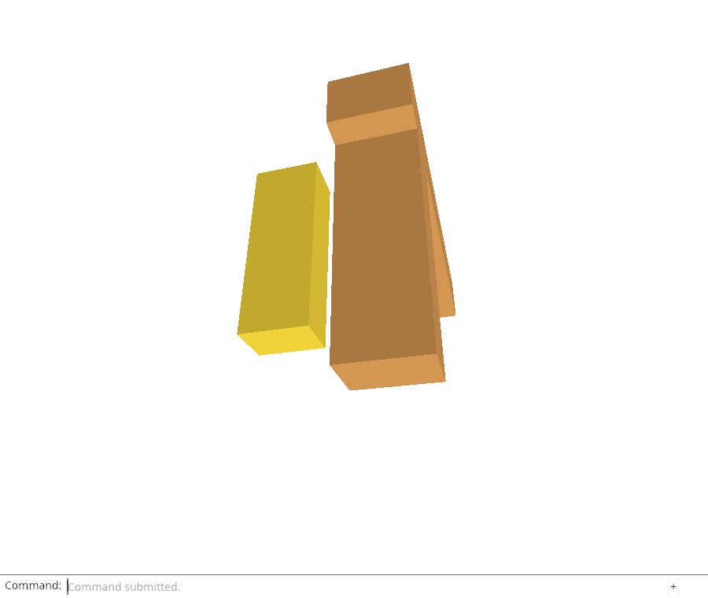
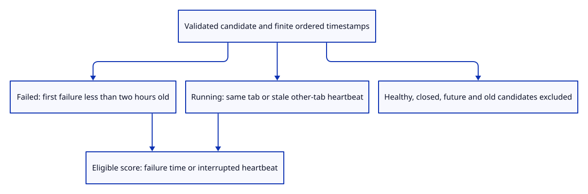

# 34eb · Choose a recent failure without blaming active tabs

**Typing: 25–49 minutes.** [Estimate](typing-load.md).

Choose previous failure evidence by fatal time. An old failed tab may keep updating lastSeen; its heartbeat must not make the original failure recent again.

## Type

Continue from [Admit only supported bounded saved JSON](34ea-decode.md). [Save or recover your work](recovery.md).

### 1. `src/report_recency.rs`

Interpret a validated report’s chronology and return an eligible timestamp for ranking, using an injected clock parser.

Create the file and type:

```rust
--8<-- "journey/code/34eb-recency-01.rs"
```

### 2. `src/report_recency_tests.rs`

Cover the original stale-heartbeat regression, active tabs, temporal cutoffs and failure-time ranking.

Create the file and type:

```rust
--8<-- "journey/code/34eb-recency-02.rs"
```

### 3. `src/lib.rs`

Expose native selection policy before binding it to browser storage.

<details>
<summary>Locate the existing block</summary>

```rust
pub mod report_store;
```

</details>

Replace that block with:

```rust
--8<-- "journey/code/34eb-recency-03.rs"
```

## Run and check

In your project:

```sh
cd workspace/journey
REGEN_PROTO=0 cargo build --lib --locked --target wasm32-unknown-unknown -j4
REGEN_PROTO=0 CARGO_BUILD_JOBS=4 trunk serve --port 8780
```

Open `http://127.0.0.1:8780/`. Keep an existing Trunk server running; saving rebuilds it.

Run the recency checks below. A fresh heartbeat must not make an old fatal event eligible. An actively running other tab must not produce an interruption notice.

**Verified checkpoint in Chrome.**



[Verification scope](release.md).

Run the state checks on your computer from your project folder:

```sh
REGEN_PROTO=0 cargo test --lib --locked --target host-tuple -j4
```

<details>
<summary>Code explanation and diagram</summary>

Supply timestamp parsing as a function so native tests can use a fixed clock. Reject non-finite or out-of-order times. A fatal event qualifies for two hours and ranks by its own timestamp.

A Running report qualifies when its heartbeat is under two hours old and belongs to this tab, or another tab inactive for more than two minutes. An active other tab, Ready run or Closed run stays quiet. Interrupted means unfinished, not proven crashed.

validated report → timestamp parser → ordered finite times → failure/heartbeat freshness → ranking timestamp.



Why does a failed report’s fresh heartbeat not prove the failure itself was recent?

A still-open failed tab can keep updating lastSeen for days. Failure freshness must use the first fatal timestamp; heartbeat age is used separately for interrupted running tabs.

Study estimate, including typing and experiments: 1–2 hours.

</details>

<details>
<summary>Optional experiment</summary>

Rank failures by lastSeen instead of the first fatal timestamp. Explain why an old tab with a running heartbeat could displace a newer real failure. Then treat all running tabs as interrupted and identify the false notice.

</details>

<details>
<summary>Check and save your work</summary>

Restore experimental edits, then run from `session_viewer`:

```sh
npm --prefix ../session_tests run course -- check 34eb-recency
npm --prefix ../session_tests run course -- save 34eb-recency
```

Source comparison leaves your project untouched. [Save and recovery instructions](recovery.md).

</details>

<details>
<summary>Viewer coverage and verification</summary>

Production previous-report notices now date failure independently of heartbeat and reject invalid/future chronology. The course policy establishes candidate eligibility; browser storage, lifecycle telemetry and bounded recovery follow.

Native tests use a deterministic clock port for heartbeat/failure boundaries, future and ordering cases. The next checkpoint proves invalid clocks and healthy-run exclusions. Browser Date.parse and saved-value selection follow that proof; there is no previous-report notice or storage adoption here yet. Chrome retains all existing real diagnostics/loss/download checks.

Native tests verify failure/heartbeat recency and ranking, including the original stale-failure case. Chrome retains real diagnostics/loss acceptance. Additional clock exclusions and browser storage follow.

[Full validation scope](release.md).

To reproduce the scripted acceptance of the reference checkpoint, run from `session_viewer` with the [course bundle server](release.md#reproduce) running on port 8781:

```sh
npm --prefix ../session_tests run course -- capture 34eb-recency
```

This uses the verified reference bundle; it does not check or change your typed project.

</details>
