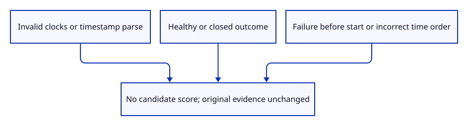
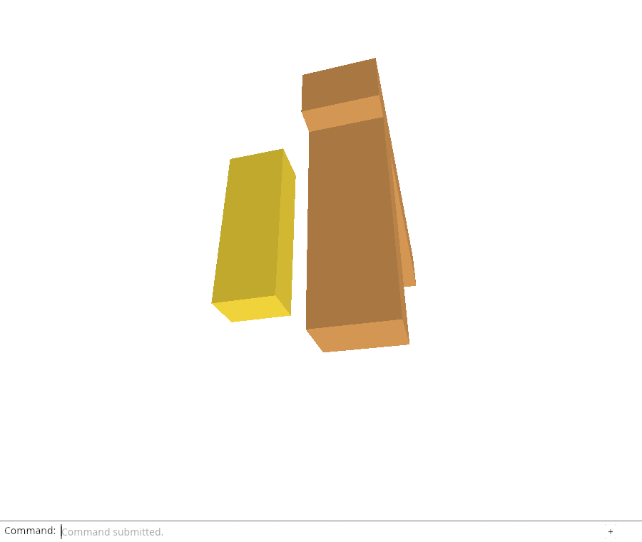

# 34ec · Prove saved-run exclusions before adopting storage

**Combined study estimate: 1–2 hours.** Includes reading, typing, reasoning and experiments.

**Typing estimate: 13–26 minutes.** 19 added or changed lines; unchanged context is excluded. [How this is estimated](typing-load.md).

**Today:** Complete timestamp-policy acceptance before a stored candidate can create a notice or previous-report download.

**Follow:** candidate → invalid clock/healthy state/incorrect chronology → excluded without mutation.

Complete the previous-run policy with rejected examples. Use a fixed clock to test invalid timestamps, reversed start/heartbeat order, and a failure dated before its run.

Ready and Closed must never produce interruption evidence. Compare the report before and after selection: eligibility reads its metadata without changing it.

This step adds the boundary checks. The browser storage reader is connected next.



## Type the change

Continue from [Choose a recent failure without blaming active tabs](34eb-recency.md). Save your own work first: `npm --prefix ../session_tests run course -- save before-34ec-proof` (from `session_viewer`).

### 1. `src/report_recency_tests.rs`

Prove invalid clocks, healthy/closed runs, invalid failure ordering and unchanged metadata cannot become interruption evidence.

Find this exact block:

```rust
use crate::{diagnostic::Outcome, diagnostic_shape_tests::report, report_recency::eligible};

#[test]
fn previous_run_selection_respects_actual_failure_time() {
    let now = 1_000_000_000.0;
    for (name, failed, same, seen_age, failure_age, expected) in [
        ("old failure, fresh heartbeat", true, false, 5000.0, 259_200_000.0, false),
        ("recent failure", true, false, 5000.0, 10000.0, true),
        ("failure at cutoff", true, false, 5000.0, 7_200_000.0, false),
        ("failure after heartbeat", true, false, 5000.0, 1000.0, false),
        ("future heartbeat", true, false, -1.0, 1000.0, false),
        ("future failure", true, false, 0.0, -1.0, false),
        ("active other tab", false, false, 120_000.0, 0.0, false),
        ("interrupted other tab", false, false, 120_001.0, 0.0, true),
        ("stale other tab", false, false, 7_200_000.0, 0.0, false),
        ("interrupted same tab", false, true, 0.0, 0.0, true),
    ] {
        let mut value = report(); value.started = "start".into();
        if failed { value.record("failed".into(), 1.0, "fatal", "original").unwrap(); }
        value.last_seen = "seen".into(); value.tab = if same { "current" } else { "other" }.into();
        let parser = |time: &str| match time { "start" => now - 259_200_000.0, "seen" => now - seen_age,
            "failed" => now - failure_age, _ => f64::NAN };
        let selected = eligible(&value, now, "current", parser);
        assert_eq!(selected.is_some(), expected, "{name}");
        if expected { assert_eq!(selected, Some(now - if failed { failure_age } else { seen_age })); }
    }
}
```

Replace that block with:

```rust
--8<-- "journey/code/34ec-proof-01.rs"
```

## Run and look

From `session_viewer`, enter your project folder:

```sh
cd workspace/journey
REGEN_PROTO=0 cargo build --lib --locked --target wasm32-unknown-unknown -j4
REGEN_PROTO=0 CARGO_BUILD_JOBS=4 trunk serve --port 8780
```

Open `http://127.0.0.1:8780/`. If Trunk is already running in this project, leave it running; it rebuilds when you save.

Run the exclusion checks below. Ready/Closed reports and invalid clocks must remain ineligible, with the input report unchanged.

**Verified checkpoint in Chrome.**



[What this screenshot checks](release.md).

Run the state checks from your project folder:

```sh
REGEN_PROTO=0 cargo test --lib --locked -j4
```

<details>
<summary>Optional experiment</summary>

Make the default outcome branch return a score for Ready, then run the tests and describe the false notice. Make the parser return NaN for the failure and explain why comparison/ranking must reject it.

</details>

## Explain the change

Why test healthy and invalid-clock cases before wiring the policy to localStorage?

<details>
<summary>Compare your explanation</summary>

The browser will see values from other tabs and old or edited storage. A false interruption notice is visible user behavior, so exclusions need explicit acceptance before adoption.

</details>

## Keep your working result

Return to `session_viewer` in a second terminal. Restore experimental edits before comparing:

```sh
npm --prefix ../session_tests run course -- check 34ec-proof
npm --prefix ../session_tests run course -- save 34ec-proof
```

Check compares your typed source; run the focused check above for behavior. [Recover your work](recovery.md).

<details>
<summary>Where this fits in the finished viewer</summary>

Previous-report notices must avoid blaming a live or healthy tab and must reject invalid chronology. These native exclusions complete the policy acceptance before browser storage is connected.

</details>

<details>
<summary>Verification notes and browser acceptance</summary>

Native tests reject invalid current clocks, failed timestamp parsing, start after heartbeat and a first failure before start. Ready and closed runs remain quiet. The same report compares equal before and after policy evaluation: selection reads metadata without altering its evidence. Browser Date.parse and storage are still connected next.

Chrome retains actual report-download, GPU-loss and startup-restart acceptance. This proof adds no timer, listener, visible control or storage adoption.

Native tests prove invalid/healthy/closed/bad-order candidates are excluded without mutation. Chrome retains existing real diagnostic/loss/download acceptance; browser storage follows next.

[Full validation scope](release.md).

To reproduce the scripted acceptance of the reference checkpoint, run from `session_viewer` with the [course bundle server](release.md#reproduce) running on port 8781:

```sh
npm --prefix ../session_tests run course -- capture 34ec-proof
```

This uses the verified reference bundle; it does not check or change your typed project.

</details>
