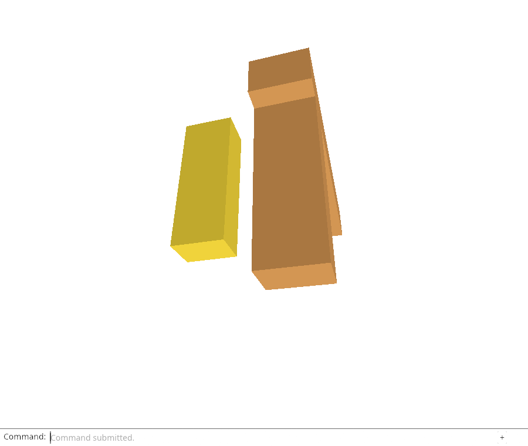
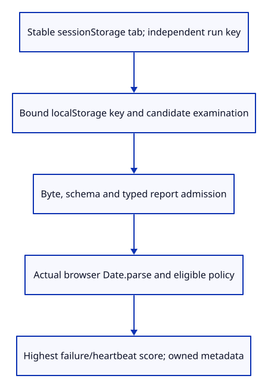

# 34f · Read previous reports from real browser storage

**Typing: 21–41 minutes.** [Estimate](typing-load.md).

Read previous reports from browser storage. `Store` keeps a storage handle, this tab’s stable ID and the new run key. Session storage preserves the tab ID across reloads; unavailable storage uses a fresh ID without stopping startup.

## Type

Continue from [Prove saved-run exclusions before adopting storage](34ec-proof.md). [Save or recover your work](recovery.md).

### 1. `src/report_storage.rs`

Read bounded validated candidates from actual browser storage and rank with the real Date parser; retain only metadata and storage handles.

Create the file and type:

```rust
--8<-- "journey/code/34f-storage-01.rs"
```

### 2. `src/lib.rs`

Build the storage owner only for the browser target and expose its debug acceptance probe.

<details>
<summary>Locate the existing block</summary>

```rust
mod browser_report;
```

</details>

Replace that block with:

```rust
--8<-- "journey/code/34f-storage-02.rs"
```

### 3. `Cargo.toml`

Enable the pinned browser Storage bindings without changing package versions.

<details>
<summary>Locate the existing block</summary>

```toml
"Location", "Navigator",
```

</details>

Replace that block with:

```toml
--8<-- "journey/code/34f-storage-03.rs"
```

## Run and check

In your project:

```sh
cd workspace/journey
REGEN_PROTO=0 cargo build --lib --locked --target wasm32-unknown-unknown -j4
REGEN_PROTO=0 CARGO_BUILD_JOBS=4 trunk serve --port 8780
```

Open `http://127.0.0.1:8780/`. Keep an existing Trunk server running; saving rebuilds it.

In the debug console, run `JSON.parse(window.wasmBindings.previous_storage_probe()).tab`. Reload and run it again: the tab ID stays the same.

**Verified checkpoint in Chrome.**



[Verification scope](release.md).

Run the state checks on your computer from your project folder:

```sh
REGEN_PROTO=0 cargo test --lib --locked --target host-tuple -j4
```

<details>
<summary>Code explanation and diagram</summary>

Scan at most 256 storage keys and 32 keys in the course namespace. Pass each candidate through bounded decoding and the recency policy. Browser `Date.parse` supplies actual timestamp interpretation.

Rank failures by first fatal time and unfinished runs by heartbeat. Reading removes nothing. This lesson introduces the reader; bounded writes and the previous-report command follow.

sessionStorage tab → localStorage candidates → byte/schema/shape admission → Date.parse recency → latest eligible evidence.



Why keep tab identity separate from the new run’s storage key?

The tab identity survives a reload so interruption policy can recognize its old run. A fresh storage key identifies each run independently; reusing the tab as the run key would overwrite the previous evidence.

Study estimate, including typing and experiments: 1–2 hours.

</details>

<details>
<summary>Optional experiment</summary>

Change selection to rank lastSeen, then compare the two saved failures whose heartbeat order disagrees with failure order. Explain which evidence should win and why. Deny browser storage and explain why current diagnostics must remain usable.

</details>

<details>
<summary>Check and save your work</summary>

Restore experimental edits, then run from `session_viewer`:

```sh
npm --prefix ../session_tests run course -- check 34f-storage
npm --prefix ../session_tests run course -- save 34f-storage
```

Source comparison leaves your project untouched. [Save and recovery instructions](recovery.md).

</details>

<details>
<summary>Viewer coverage and verification</summary>

The production reader uses browser storage and stable tab identity. This endpoint connects the native admission/recency policy to actual storage reads. Bounded writes, live report adoption and the previous-report command follow.

Additional verification: Run the storage browser acceptance in the expandable notes below. The reader must choose eligible evidence from real browser storage and retain the tab ID across reloads. Live persistence follows next.

Headed Chrome uses real Web Storage and UTC timestamp parsing to test candidate selection, stable tab identity, independent run keys and denied storage. Current viewer reports are still not persisted at this checkpoint.

[Full validation scope](release.md).

To reproduce the scripted acceptance of the reference checkpoint, run from `session_viewer` with the [course bundle server](release.md#reproduce) running on port 8781:

```sh
npm --prefix ../session_tests run course -- capture 34f-storage
```

This uses the verified reference bundle; it does not check or change your typed project.

</details>
