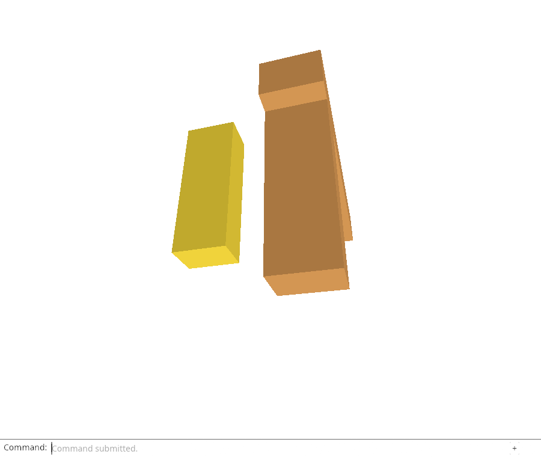
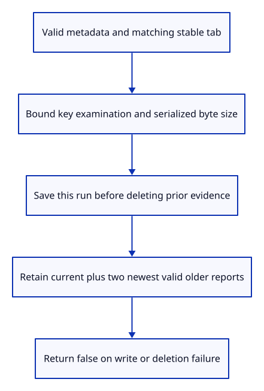

# 34fa · Retain only three diagnostic runs

**Typing: 18–36 minutes.** [Estimate](typing-load.md).

Keep the current run and two older reports. Validate the report and its matching tab ID before writing. Repeated writes reuse the current run key.

Prepare the retention list, write the current value, then remove excess course-owned keys. Leave unrelated storage alone. Retention ranks heartbeat age; failure selection still ranks fatal time.

## Type

Continue from [Read previous reports from real browser storage](34f-storage.md). [Save or recover your work](recovery.md).

### 1. `src/report_storage.rs`

Admit metadata, save to this run’s key and retain at most two older valid reports; refuse unbounded namespace examination and tolerate unavailable storage.

<details>
<summary>Locate the existing block</summary>

```rust
    pub fn previous(&self) -> Option<Report> {
```

</details>

Replace that block with:

```rust
--8<-- "journey/code/34fa-retain-01.rs"
```

### 2. `src/report_storage.rs`

Verify repeated writes use the same key and reach actual Web Storage; this debug export is not a runtime feature control.

<details>
<summary>Locate the existing block</summary>

```rust
    serde_json::json!({"tab": store.tab, "key": store.key, "previous": store.previous()}).to_string()
}
```

</details>

Replace that block with:

```rust
--8<-- "journey/code/34fa-retain-02.rs"
```

## Run and check

In your project:

```sh
cd workspace/journey
REGEN_PROTO=0 cargo build --lib --locked --target wasm32-unknown-unknown -j4
REGEN_PROTO=0 CARGO_BUILD_JOBS=4 trunk serve --port 8780
```

Open `http://127.0.0.1:8780/`. Keep an existing Trunk server running; saving rebuilds it.

Run the storage-write browser acceptance below. Writing a fourth run must leave the current run and the two newest older reports, preserving unrelated storage keys.

**Verified checkpoint in Chrome.**



[Verification scope](release.md).

Run the state checks on your computer from your project folder:

```sh
REGEN_PROTO=0 cargo test --lib --locked --target host-tuple -j4
```

<details>
<summary>Code explanation and diagram</summary>

A failed write preserves earlier values. A later deletion failure may leave the new report already stored, so return false without claiming rollback. Refuse oversized reports or namespaces before mutation. Storage denial must never stop the viewer.

valid matching-tab report → bounded existing namespace → current run write → two older reports → release other owned keys.



Why write the current run before pruning the older keys?

A failed write must leave existing evidence intact. Only after current metadata is saved can the owner remove older values while keeping two prior reports. Deletion failures are reported rather than claimed as successful retention.

Study estimate, including typing and experiments: 1–2 hours.

</details>

<details>
<summary>Optional experiment</summary>

Make setItem throw and compare all existing values before and after. Then make removal throw after a successful write; explain why returning false cannot mean the current value was rolled back.

</details>

<details>
<summary>Check and save your work</summary>

Restore experimental edits, then run from `session_viewer`:

```sh
npm --prefix ../session_tests run course -- check 34fa-retain
npm --prefix ../session_tests run course -- save 34fa-retain
```

Source comparison leaves your project untouched. [Save and recovery instructions](recovery.md).

</details>

<details>
<summary>Viewer coverage and verification</summary>

Production diagnostics persist bounded metadata independently of the GPU. The course now has a tested writer; startup/current-event integration and typed previous-report download follow.

Headed Chrome reads the actual saved JSON, tests stable-key repeated writes and a fourth run reducing the set to three, retains the two newest old values, removes malformed owned values and preserves unrelated keys. Storage denial and an excessive namespace return false without mutation. These probes exercise the physical storage boundary before live report persistence is connected.

Actual Web Storage contains the saved JSON and only three retained runs after successful pruning. Chrome checks repeated keys, malformed cleanup, unrelated-key preservation and denied/excessive storage; live persistence follows next.

[Full validation scope](release.md).

To reproduce the scripted acceptance of the reference checkpoint, run from `session_viewer` with the [course bundle server](release.md#reproduce) running on port 8781:

```sh
npm --prefix ../session_tests run course -- capture 34fa-retain
```

This uses the verified reference bundle; it does not check or change your typed project.

</details>
