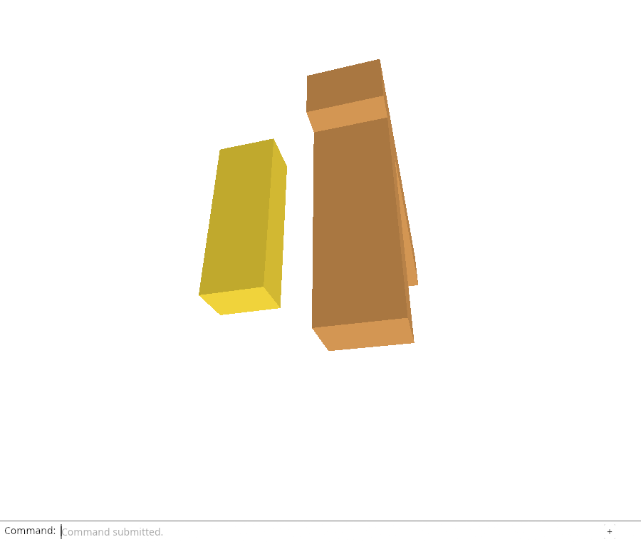
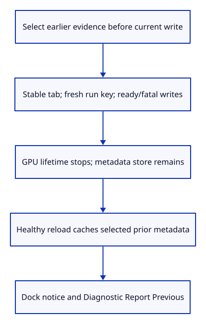

# 34fb · Retrieve saved failure evidence through the command line

**Typing: 25–49 minutes.** [Estimate](typing-load.md).

Persist live diagnostics and add `Diagnostic Report Previous`. At startup, select earlier evidence before writing the new Running report. Cache the chosen previous metadata separately so current writes cannot erase it.

After an observation, clone the report and end its `RefCell` borrow before storage or download work. Ready/fatal updates use the same bounded writer; storage errors leave current drawing and downloads available.

## Type

Continue from [Retain only three diagnostic runs](34fa-retain.md). [Save or recover your work](recovery.md).

### 1. `src/browser_report.rs`

Keep current and previous diagnostic metadata independent of the GPU runtime and source documents.

<details>
<summary>Locate the existing block</summary>

```rust
thread_local! { static REPORT: RefCell<Option<Report>> = const { RefCell::new(None) }; }
```

</details>

Replace that block with:

```rust
--8<-- "journey/code/34fb-store-01.rs"
```

### 2. `src/browser_report.rs`

Select earlier evidence before writing this new run, retain stable tab identity and let denied storage leave startup usable.

<details>
<summary>Locate the existing block</summary>

```rust
    let report = Report::new(uuid::Uuid::new_v4().to_string(), js_sys::Date::new_0().to_iso_string().into(), context()?);
    REPORT.with(|slot| slot.replace(Some(report)));
    Ok(())
```

</details>

Replace that block with:

```rust
--8<-- "journey/code/34fb-store-02.rs"
```

### 3. `src/browser_report.rs`

Save successful observations after releasing the current-report borrow; storage failure cannot replace a diagnostic error or interrupt drawing.

<details>
<summary>Locate the existing block</summary>

```rust
    REPORT.with(|slot| {
        let mut slot = slot.borrow_mut(); let report = slot.as_mut().ok_or("No report")?;
        report.context = context;
        report.record(js_sys::Date::new_0().to_iso_string().into(), elapsed, kind, message).map_err(JsValue::from_str)
    })
```

</details>

Replace that block with:

```rust
--8<-- "journey/code/34fb-store-03.rs"
```

### 4. `src/browser_report.rs`

Persist refreshed current context while retaining manual downloads when storage is unavailable.

<details>
<summary>Locate the existing block</summary>

```rust
    let json = diagnostic_snapshot()?;
```

</details>

Replace that block with:

```rust
--8<-- "journey/code/34fb-store-04.rs"
```

### 5. `src/browser_report.rs`

Serialize independent previous metadata before the download callback; report interruption separately from proof of a crash.

<details>
<summary>Locate the existing block</summary>

```rust
pub fn fatal(message: &str) {
```

</details>

Replace that block with:

```rust
--8<-- "journey/code/34fb-store-05.rs"
```

### 6. `src/browser.rs`

Expose previous-report retrieval as a named command in the actual dock.

<details>
<summary>Locate the existing block</summary>

```rust
            "Diagnostic Report",
```

</details>

Replace that block with:

```rust
--8<-- "journey/code/34fb-store-06.rs"
```

### 7. `src/browser.rs`

Show an eligible previous-run notice in the existing command dock, keeping HTML free of feature buttons.

<details>
<summary>Locate the existing block</summary>

```rust
    panel.update(None, &canvas)?;
    if resize(
```

</details>

Replace that block with:

```rust
--8<-- "journey/code/34fb-store-07.rs"
```

### 8. `src/browser.rs`

Dispatch current and previous JSON downloads without changing document history or the stopped-runtime failure guard.

<details>
<summary>Locate the existing block</summary>

```rust
            } else if line == "diagnostic report" {
                let result = crate::browser_report::download().map(|()| "Diagnostic report downloaded.".to_owned())
```

</details>

Replace that block with:

```rust
--8<-- "journey/code/34fb-store-08.rs"
```

### 9. `src/panel.rs`

Expose the existing drawn status in the same diagnostic inspector so Chrome can verify the initial notice and command errors.

<details>
<summary>Locate the existing block</summary>

```rust
            "controls": controls, "command": self.model.command, "history": self.model.history,
```

</details>

Replace that block with:

```rust
--8<-- "journey/code/34fb-store-09.rs"
```

## Run and check

In your project:

```sh
cd workspace/journey
REGEN_PROTO=0 cargo build --lib --locked --target wasm32-unknown-unknown -j4
REGEN_PROTO=0 CARGO_BUILD_JOBS=4 trunk serve --port 8780
```

Open `http://127.0.0.1:8780/`. Keep an existing Trunk server running; saving rebuilds it.

After the browser acceptance saves a real GPU failure, reload its test page and type `Diagnostic Report Previous`. The download must retain that failure while the new viewer draws normally.

**Verified checkpoint in Chrome.**



[Verification scope](release.md).

Run the state checks from your project folder:

```sh
REGEN_PROTO=0 cargo test --lib --locked -j4
```

<details>
<summary>Code explanation and diagram</summary>

Show eligible failure/interruption feedback in the existing dock. The previous-report command downloads the cached JSON; missing evidence gives a command error. GPU disposal leaves this metadata alive. Diagnostics do not restore unsaved document edits.

startup selects previous → current running/ready/fatal metadata persists → healthy reload → dock notice → Diagnostic Report Previous.



Why select previous evidence before saving the new running report?

Selection must examine earlier runs. The new run would otherwise look like a same-tab interrupted candidate before startup finishes. Keep its metadata separate and preserve the selected previous report even after the current run becomes ready.

Study estimate, including typing and experiments: 1–2 hours.

</details>

<details>
<summary>Optional experiment</summary>

Move previous selection after the initial current write and inspect the false same-tab interruption candidate. Then deny storage and explain why successful current downloads must remain separate from persistence.

</details>

<details>
<summary>Check and save your work</summary>

Restore experimental edits, then run from `session_viewer`:

```sh
npm --prefix ../session_tests run course -- check 34fb-store
npm --prefix ../session_tests run course -- save 34fb-store
```

Source comparison leaves your project untouched. [Save and recovery instructions](recovery.md).

</details>

<details>
<summary>Viewer coverage and verification</summary>

Production keeps saved diagnostics independently of GPU lifetime. The cumulative course now connects bounded persistence and typed previous-report retrieval. Heartbeat/lifecycle/error observations, complete load/adapter/resource telemetry and bounded GPU recovery still follow; unsaved scene restoration is not claimed.

Headed Chrome destroys a real GPU device, reads the actual saved failure, reloads the same test page, and downloads that unchanged previous failure from a healthy run. It checks stable tab identity, distinct run keys, three-report retention, preserved scene/history and delayed download URL cleanup. It also proves healthy and active-other-tab values stay quiet and denied storage still permits current-report downloads. Diagnostics do not restore unsaved document edits.

Chrome destroys an actual GPU device, recovers persisted metadata after a same-page reload and downloads it through Diagnostic Report Previous. Scene/history, stable tab/new run keys, retention, URL release, quiet exclusions and denied-storage current downloads are checked.

[Full validation scope](release.md).

To reproduce the scripted acceptance of the reference checkpoint, run from `session_viewer` with the [course bundle server](release.md#reproduce) running on port 8781:

```sh
npm --prefix ../session_tests run course -- capture 34fb-store
```

This uses the verified reference bundle; it does not check or change your typed project.

</details>
