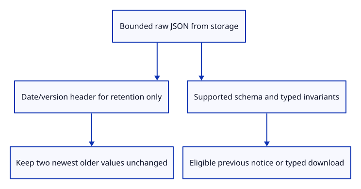
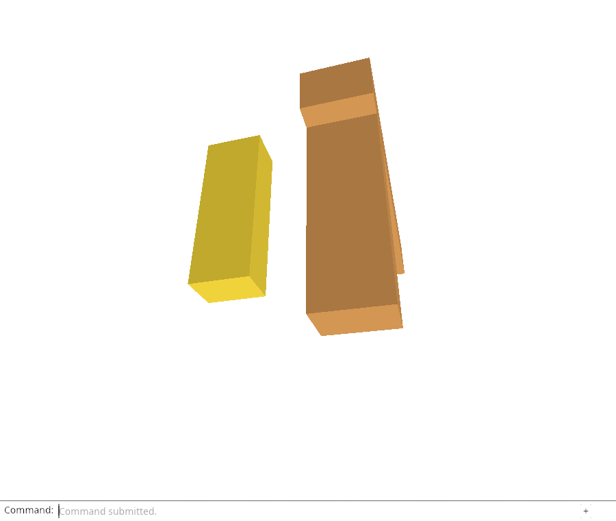

# 34fc · Preserve unsupported telemetry while pruning

**Combined study estimate: 1–2 hours.** Includes reading, typing, reasoning and experiments.

**Typing estimate: 26–51 minutes.** 45 added or changed lines; unchanged context is excluded. [How this is estimated](typing-load.md).

**Today:** Separate trusted-report admission from raw storage retention so an older viewer cannot strip or prematurely delete newer telemetry.

**In the whole viewer:** Connect the browser, drawing and input, then extend the same project. [See the destination](../journey.md#the-destination).

**Follow:** bounded raw JSON header → retention score → keep original stored bytes; supported schema → typed admission → candidate notice/download.

**Before you finish, explain:** Why does refusing to adopt an unsupported report not justify treating it as malformed during pruning?

The preceding writer had a compatibility counterexample. Its reports() reader intentionally rejects unsupported fields and versions, but using that same decoded list to choose retention deleted a newer-format value even when it was the newest saved evidence. Rejection prevents an older export from stripping fields; pruning must not undo that protection.

retention_time parses at most one MiB and requires a positive integer version plus bounded timestamp text with a finite, non-future time. It permits unsupported fields and future format versions, returning only their retention score. It does not adopt the value, validate a full report, create a notice or serialize a replacement. Dateable values with invalid typed shape can occupy a retained slot; they remain excluded by the strict reader.

The writer reads each bounded owned older value before mutation and ranks these header scores. The two newest older values stay in place byte for byte. Unsupported versions compete under the same three-total-report policy; they are not retained forever. Syntax errors, unbounded text or unusable headers can be pruned after the current write succeeds. A failed read aborts the write entirely, avoiding deletion of evidence that could not be inspected.

Native tests separate retention from admission and cover byte/date/version bounds without mutating input. Headed Chrome stores actual unknown telemetry in version2, preserves its exact whitespace-bearing JSON through repeated writes and proves the typed reader still refuses it. A controlled getItem denial leaves all prior values unchanged and performs no current write. All inherited real GPU-loss, reload, previous-download and scene/history checks remain.



## Type the change

Continue [Retrieve saved failure evidence through the command line](34fb-store.md). From `session_viewer`, save your files with `npm --prefix ../session_tests run course -- save before-34fc-retention`. A save keeps your own work; it does not fill in the next lesson.

### 1. `src/report_store.rs`

Read a bounded date/version header for retention without adopting, converting or rewriting unsupported telemetry.

Find this exact block:

```rust
pub const MAX_BYTES: usize = 1024 * 1024;
```

Replace that block with:

```rust
--8<-- "journey/code/34fc-retention-01.rs"
```

### 2. `src/report_storage.rs`

Retain raw supported or unsupported bounded JSON by header time; a failed read aborts before writing or pruning.

Find this exact block:

```rust
        let mut old = self.reports(); old.retain(|(key, _)| key != &self.key);
        old.retain(|(_, report)| js_sys::Date::parse(&report.last_seen).is_finite());
        old.sort_by(|a, b| js_sys::Date::parse(&b.1.last_seen).total_cmp(&js_sys::Date::parse(&a.1.last_seen)));
        let keep: Vec<_> = old.iter().take(2).map(|(key, _)| key).collect();
```

Replace that block with:

```rust
--8<-- "journey/code/34fc-retention-02.rs"
```

### 3. `src/report_store_tests.rs`

Prove unsupported fields/versions remain dateable without admission, with unchanged input and bounded header parsing.

Find this exact block:

```rust
use crate::{diagnostic::Report, diagnostic_shape_tests::report, report_store::{decode, MAX_BYTES}};

#[test]
fn stored_json_rejects_invalid_shape() {
    let good = serde_json::to_value(report()).unwrap();
    for (key, bad) in [("version", serde_json::json!(2)), ("tab", serde_json::json!("")),
        ("page", serde_json::json!("https://example.test/?private=1")), ("devicePixelRatio", serde_json::json!(0)),
        ("events", serde_json::json!([{"time":"now","kind":"fatal","message":"bad","elapsedMs":null}])),
        ("outcome", serde_json::json!("failed")), ("unknown", serde_json::json!(true))] {
        let mut value = good.clone(); value[key] = bad;
        assert!(decode(&value.to_string()).is_none(), "{key}");
    }
    assert!(decode("{").is_none());
}

#[test]
fn stored_json_bounds_bytes_events_and_text() {
    let json = serde_json::to_string(&report()).unwrap();
    let padding = MAX_BYTES - json.len(); let padded = json + &" ".repeat(padding);
    assert!(decode(&padded).is_some()); assert!(decode(&(padded + " ")).is_none());
    let mut value = serde_json::to_value(report()).unwrap();
    let event = serde_json::json!({"time":"now","kind":"phase","message":"test","elapsedMs":1.0});
    value["events"] = serde_json::json!(vec![event; 25]); assert!(decode(&value.to_string()).is_none());
    let mut bypass: Report = serde_json::from_value(value).unwrap();
    bypass.record("later".into(), 2.0, "phase", "bounded").unwrap();
    assert_eq!(serde_json::to_value(bypass).unwrap()["events"].as_array().unwrap().len(), 24);
    let mut failure = report(); failure.record("later".into(), 1.0, "fatal", "first reason").unwrap();
    let json = serde_json::to_string(&failure).unwrap(); assert_eq!(decode(&json), Some(failure));
    let mut value: serde_json::Value = serde_json::from_str(&json).unwrap();
    value["failure"]["message"] = serde_json::json!("😀".repeat(4097)); assert!(decode(&value.to_string()).is_none());
}
```

Replace that block with:

```rust
--8<-- "journey/code/34fc-retention-03.rs"
```

## Run and look

From `session_viewer`, enter your project folder:

```sh
cd workspace/journey
REGEN_PROTO=0 cargo build --lib --locked --target wasm32-unknown-unknown -j4
REGEN_PROTO=0 CARGO_BUILD_JOBS=4 trunk serve --port 8780
```

Open `http://127.0.0.1:8780/`. If Trunk is already running in this project, leave it running; it rebuilds when you save.

Run native tests and the viewer. Diagnostic Report and Diagnostic Report Previous retain the previous lesson’s behavior. Chrome stores a newer-format report with unknown telemetry and proves successful pruning retains its exact original JSON while leaving it ineligible for typed adoption. A failed older-value read aborts before any storage mutation. Finish the healthy proof view with Move 0,-0.05,0 and Fit.

**Actual Chrome screenshot.**

Chrome preserves exact raw JSON from a newer-format report through actual pruning, refuses typed adoption and aborts safely when reading an older value is denied. Full inherited live diagnostics and scene/history checks pass.



*Captured from this checkpoint’s browser bundle after its browser checks passed. [Check scope and environment](release.md).*

Run the state checks from your project folder:

```sh
REGEN_PROTO=0 cargo test --lib --locked -j4
```

## Try one small experiment

Replace the retention-header loop with reports() again, then inspect the saved futureTelemetry value after pruning. Explain why refusing a previous-report download and deleting its original evidence are different decisions.

## Explain it in your own words

Trace the values through the files without reading the answer first. If you lose the connection, stop at the last value you can follow.

<details>
<summary>Compare your explanation</summary>

Its extra fields or version may belong to a newer viewer. Adoption requires our complete supported schema, but bounded retention needs only a usable version/date header. Keep its original stored bytes if it is one of the two newest older values; do not convert it through our older typed model.

</details>

## Keep your working result

Return to `session_viewer` in a second terminal. Restore experimental edits before comparing:

```sh
npm --prefix ../session_tests run course -- check 34fc-retention
npm --prefix ../session_tests run course -- save 34fc-retention
```

The comparison spots typing differences; it does not prove behaviour. Keep three notes: what I changed; the values I followed; the question I still have. [Recover a checkpoint](recovery.md) if an experiment gets tangled.

## Where this grows

Report schema evolves as detailed telemetry is taught. Admission stays strict, while bounded retention preserves newest unsupported raw evidence without conversion. Heartbeat/lifecycle observations, new telemetry fields and bounded recovery follow.

[Validation status and course release](release.md).
