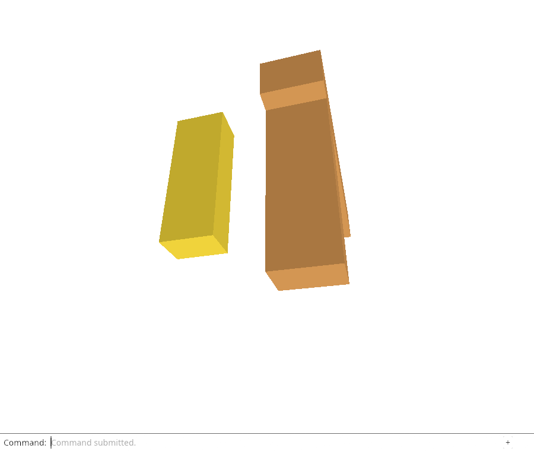
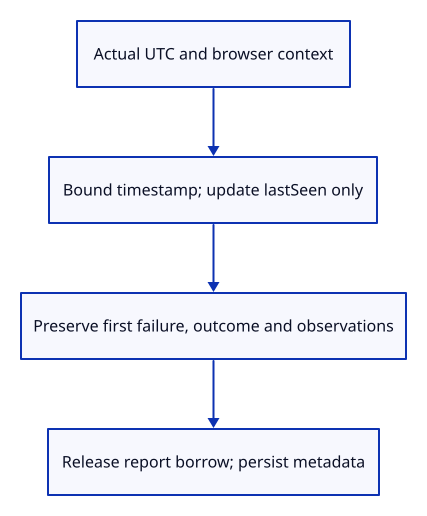

# 34g · Refresh heartbeat without rewriting failure evidence

**Typing: 17–33 minutes.** [Estimate](typing-load.md).

Refresh lastSeen without recording an event. A periodic heartbeat would otherwise fill the 24-event window and push out useful observations.

## Type

Continue from [Preserve unsupported telemetry while pruning](34fc-retention.md). [Save or recover your work](recovery.md).

### 1. `src/diagnostic.rs`

Advance heartbeat independently of observations, outcome and the first fatal timestamp; invalid timestamp text leaves the report unchanged.

<details>
<summary>Locate the existing block</summary>

```rust
    pub fn failure(&self) -> Option<&Event> { self.failure.as_ref() }
```

</details>

Replace that block with:

```rust
--8<-- "journey/code/34g-heartbeat-01.rs"
```

### 2. `src/heartbeat_tests.rs`

Verify all run outcomes, first-failure/event retention and atomic timestamp-text bounds without a browser clock dependency.

Create the file and type:

```rust
--8<-- "journey/code/34g-heartbeat-02.rs"
```

### 3. `src/lib.rs`

Include native heartbeat state proofs.

<details>
<summary>Locate the existing block</summary>

```rust
pub mod diagnostic;
```

</details>

Replace that block with:

```rust
--8<-- "journey/code/34g-heartbeat-03.rs"
```

### 4. `src/browser_report.rs`

Refresh actual browser context and UTC heartbeat, release its borrow, then persist metadata without invoking renderer or recording synthetic observations.

<details>
<summary>Locate the existing block</summary>

```rust
pub fn download() -> Result<(), JsValue> {
```

</details>

Replace that block with:

```rust
--8<-- "journey/code/34g-heartbeat-04.rs"
```

## Run and check

In your project:

```sh
cd workspace/journey
REGEN_PROTO=0 cargo build --lib --locked --target wasm32-unknown-unknown -j4
REGEN_PROTO=0 CARGO_BUILD_JOBS=4 trunk serve --port 8780
```

Open `http://127.0.0.1:8780/`. Keep an existing Trunk server running; saving rebuilds it.

In the debug console, call `window.wasmBindings.heartbeat()`. Download `Report`: lastSeen advances, while outcome, events and the first failure stay unchanged.

**Verified checkpoint in Chrome.**



[Verification scope](release.md).

Run the state checks on your computer from your project folder:

```sh
REGEN_PROTO=0 cargo test --lib --locked --target host-tuple -j4
```

<details>
<summary>Code explanation and diagram</summary>

`Report::heartbeat` validates timestamp text before updating that single field. Running, Ready, Closed and Failed keep their outcome, events and first fatal reason.

The browser wrapper supplies current UTC/context and persists after ending the report borrow. It receives no renderer or document. This lesson supplies the operation; the next owns its timer.

real UTC/context → bounded heartbeat update → release report borrow → bounded metadata persistence.



Why must a heartbeat not append a fatal event or rewrite the first failure time?

A heartbeat proves recent observation of a page, not a new failure. Rewriting failure time would recreate the stale-warning bug, while synthetic heartbeat events would rotate meaningful observations out of the recent window.

Study estimate, including typing and experiments: 1–2 hours.

</details>

<details>
<summary>Optional experiment</summary>

Implement heartbeat through record("fatal", ...), then predict which failure/outcome assertion fails. Implement it as a recent observation instead and explain why frequent beats would evict useful events.

</details>

<details>
<summary>Check and save your work</summary>

Restore experimental edits, then run from `session_viewer`:

```sh
npm --prefix ../session_tests run course -- check 34g-heartbeat
npm --prefix ../session_tests run course -- save 34g-heartbeat
```

Source comparison leaves your project untouched. [Save and recovery instructions](recovery.md).

</details>

<details>
<summary>Viewer coverage and verification</summary>

Production updates saved heartbeat on its periodic timer. The course now defines the metadata-only operation; owned periodic scheduling, lifecycle/error observers, detailed load telemetry and bounded recovery follow.

Headed Chrome invokes this real wrapper through a debug export, reads the corresponding localStorage value and checks unchanged drawing, selection, camera, history and geometry counters. After destroying an actual GPU device it advances the heartbeat again without new GPU work, then proves the first fatal timestamp/message and events are unchanged. It reloads the same test page to restore the healthy proof view.

Chrome updates and reads real stored heartbeat metadata, preserves scene/history/events and first failure, and proves heartbeat after actual GPU loss performs no GPU work. Periodic scheduling follows next.

[Full validation scope](release.md).

To reproduce the scripted acceptance of the reference checkpoint, run from `session_viewer` with the [course bundle server](release.md#reproduce) running on port 8781:

```sh
npm --prefix ../session_tests run course -- capture 34g-heartbeat
```

This uses the verified reference bundle; it does not check or change your typed project.

</details>
