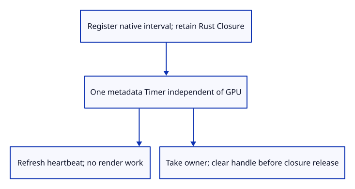
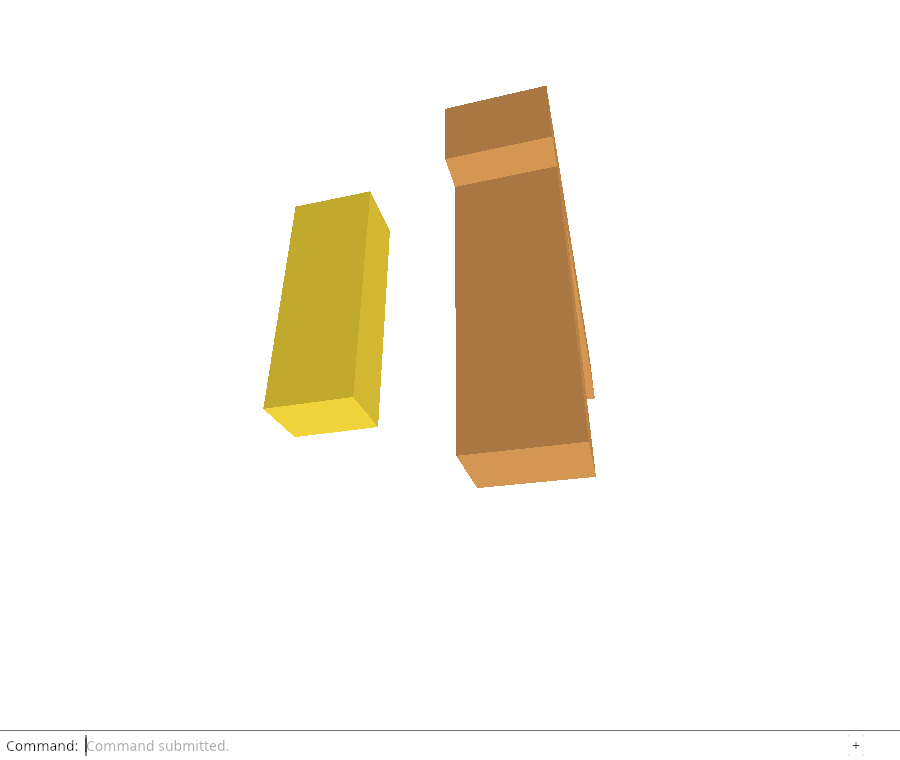

# 34ga · Own the periodic diagnostic heartbeat

**Combined study estimate: 1–2 hours.** Includes reading, typing, reasoning and experiments.

**Typing estimate: 16–32 minutes.** 41 added or changed lines; unchanged context is excluded. [How this is estimated](typing-load.md).

**Today:** Schedule a real 15-second metadata heartbeat independently of GPU lifetime and cancel its callback through an owner.

**Follow:** metadata startup → Timer owns native handle and Closure → heartbeat persists metadata → clear interval before callback release.

Own the browser interval and its Rust closure together. `Timer` stores the Window, native handle and Closure. Drop clears the interval before releasing the callback environment.

Keep one timer outside the GPU runtime and schedule a metadata heartbeat every 15000 milliseconds. Its callback captures no renderer or document, so diagnostics can continue after device loss.

Stop takes the owner out of the `RefCell` before dropping it. Replacement stops the old timer first; failed registration leaves no old timer running. Never dispose the timer from inside its active callback. Browser suspension/final-exit handling follows.



## Type the change

Continue from [Refresh heartbeat without rewriting failure evidence](34g-heartbeat.md). Save your own work first: `npm --prefix ../session_tests run course -- save before-34ga-timer` (from `session_viewer`).

### 1. `src/timer.rs`

Own the actual interval and callback together; clear its native timer before Rust releases the closure.

Create the file and type:

```rust
--8<-- "journey/code/34ga-timer-01.rs"
```

### 2. `src/lib.rs`

Keep browser interval ownership out of the native editor model.

Find this exact block:

```rust
pub mod report_storage;
```

Replace that block with:

```rust
--8<-- "journey/code/34ga-timer-02.rs"
```

### 3. `src/browser_report.rs`

Retain metadata scheduling independently of the GPU runtime lifetime.

Find this exact block:

```rust
    static PREVIOUS: RefCell<Option<Report>> = const { RefCell::new(None) };
```

Replace that block with:

```rust
--8<-- "journey/code/34ga-timer-03.rs"
```

### 4. `src/browser_report.rs`

Install periodic metadata refresh at run startup; report scheduler unavailability without rejecting drawing or current downloads.

Find this exact block:

```rust
    let _ = persist(); Ok(())
}

pub fn observe
```

Replace that block with:

```rust
--8<-- "journey/code/34ga-timer-04.rs"
```

### 5. `src/browser_report.rs`

Replace one owned interval at a time, cancel outside the slot borrow, and keep the callback metadata-only.

Find this exact block:

```rust
fn persist() -> bool {
```

Replace that block with:

```rust
--8<-- "journey/code/34ga-timer-05.rs"
```

## Run and look

From `session_viewer`, enter your project folder:

```sh
cd workspace/journey
REGEN_PROTO=0 cargo build --lib --locked --target wasm32-unknown-unknown -j4
REGEN_PROTO=0 CARGO_BUILD_JOBS=4 trunk serve --port 8780
```

Open `http://127.0.0.1:8780/`. If Trunk is already running in this project, leave it running; it rebuilds when you save.

Download `Diagnostic Report`, wait at least 15 seconds, then download it again. lastSeen should advance without adding an event. The timer updates metadata only.

**Verified checkpoint in Chrome.**



[What this screenshot checks](release.md).

Run the state checks from your project folder:

```sh
REGEN_PROTO=0 cargo test --lib --locked -j4
```

<details>
<summary>Optional experiment</summary>

Call start_periodic twice and inspect the cleared handles. Make registration throw and explain why the previous owner must not remain running. Never drop the owner from inside its own active callback.

</details>

## Explain the change

Why must clearing the interval happen before dropping its Rust Closure?

<details>
<summary>Compare your explanation</summary>

JavaScript holds the callback function while the interval is registered. Dropping the Rust environment first could leave a callback that invokes released state. The owner clears the native interval in Drop before field cleanup releases the closure.

</details>

## Keep your working result

Return to `session_viewer` in a second terminal. Restore experimental edits before comparing:

```sh
npm --prefix ../session_tests run course -- check 34ga-timer
npm --prefix ../session_tests run course -- save 34ga-timer
```

Check compares your typed source; run the focused check above for behavior. [Recover your work](recovery.md).

<details>
<summary>Where this fits in the finished viewer</summary>

Production periodically saves diagnostics. The course now has explicit callback ownership and real scheduled persistence independent of GPU loss. Automatic lifecycle/error observations, full load telemetry and bounded recovery follow.

</details>

<details>
<summary>Verification notes and browser acceptance</summary>

The test observes the real 15000-millisecond registration, then substitutes faster browser delivery to verify callbacks without a 15-second wait. During inherited acceptance it gates delivery, preserving the preceding checkpoints’ exact snapshot comparisons; custom acceptance enables real callback invocation afterward. This is semantic scheduling/ownership evidence, not a phone performance measurement. It proves lastSeen refresh with unchanged events/outcome, zero GPU calls inside each callback, continued metadata after real device destruction, first-failure preservation, exact cancellation and replacement, and ready startup when registration is denied.

Chrome observes actual 15-second interval registration and accelerates test delivery. It verifies owned callback replacement/cancellation, independent post-loss metadata, unchanged failure/events, zero callback GPU work and usable startup/downloads when scheduling fails.

[Full validation scope](release.md).

To reproduce the scripted acceptance of the reference checkpoint, run from `session_viewer` with the [course bundle server](release.md#reproduce) running on port 8781:

```sh
npm --prefix ../session_tests run course -- capture 34ga-timer
```

This uses the verified reference bundle; it does not check or change your typed project.

</details>
