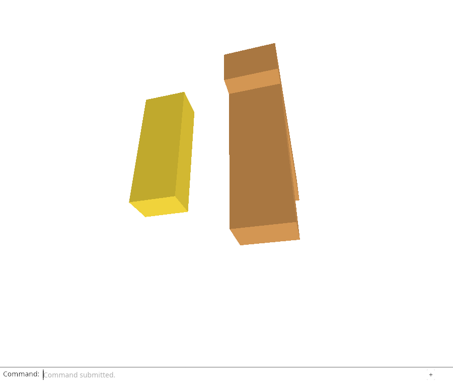
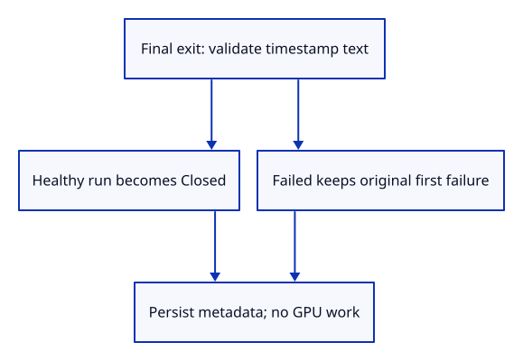

# 34gb · Mark a final healthy run closed

**Typing: 22–44 minutes.** [Estimate](typing-load.md).

Mark a healthy run Closed when it finally ends. Keep Failed and its original fatal reason. A cached page has not ended and must not call this operation.

`close` first validates its timestamp through heartbeat, then changes the healthy outcome. Invalid text leaves the whole value untouched. Guard the ready milestone too: a delayed success must not reopen a Closed report.

## Type

Continue from [Own the periodic diagnostic heartbeat](34ga-timer.md). [Save or recover your work](recovery.md).

### 1. `src/diagnostic.rs`

Mark a healthy final exit closed without erasing a failure or appending synthetic observations.

<details>
<summary>Locate the existing block</summary>

```rust
    pub fn failure(&self) -> Option<&Event> { self.failure.as_ref() }
```

</details>

Replace that block with:

```rust
--8<-- "journey/code/34gb-close-01.rs"
```

### 2. `src/close_report_tests.rs`

Prove healthy/failed final outcomes, repeatability and atomic refusal separately from browser suspension.

Create the file and type:

```rust
--8<-- "journey/code/34gb-close-02.rs"
```

### 3. `src/lib.rs`

Include native final-close policy proofs.

<details>
<summary>Locate the existing block</summary>

```rust
pub mod diagnostic;
```

</details>

Replace that block with:

```rust
--8<-- "journey/code/34gb-close-03.rs"
```

### 4. `src/browser_report.rs`

Refresh real context/time, release the report borrow and persist the final outcome without accessing GPU state.

<details>
<summary>Locate the existing block</summary>

```rust
pub fn download() -> Result<(), JsValue> {
```

</details>

Replace that block with:

```rust
--8<-- "journey/code/34gb-close-04.rs"
```

### 5. `src/diagnostic.rs`

A delayed ready milestone must not reopen a final closed run; cache suspension retains Ready without closing.

<details>
<summary>Locate the existing block</summary>

```rust
        } else if kind == "milestone" && message == "geometry on screen" && self.failure.is_none() {
```

</details>

Replace that block with:

```rust
--8<-- "journey/code/34gb-close-05.rs"
```

### 6. `src/browser_report.rs`

Let Chrome submit a real late milestone through the same metadata path; release builds gain no user control.

<details>
<summary>Locate the existing block</summary>

```rust
pub fn observe(kind: &str, message: &str) -> Result<(), JsValue> {
```

</details>

Replace that block with:

```rust
--8<-- "journey/code/34gb-close-06.rs"
```

## Run and check

In your project:

```sh
cd workspace/journey
REGEN_PROTO=0 cargo build --lib --locked --target wasm32-unknown-unknown -j4
REGEN_PROTO=0 CARGO_BUILD_JOBS=4 trunk serve --port 8780
```

Open `http://127.0.0.1:8780/`. Keep an existing Trunk server running; saving rebuilds it.

Run the close checks below. Closing a healthy report marks it Closed; closing a Failed report preserves its first fatal reason. A late ready milestone must not reopen Closed.

**Verified checkpoint in Chrome.**



[Verification scope](release.md).

Run the state checks on your computer from your project folder:

```sh
REGEN_PROTO=0 cargo test --lib --locked --target host-tuple -j4
```

<details>
<summary>Code explanation and diagram</summary>

The browser wrapper refreshes UTC/context and persists after ending its short metadata borrow. It does no GPU work. Automatic page-exit hooks come next; closing metadata does not cancel an outstanding GPU request.

real UTC/context → close healthy outcome or retain failure → release borrow → metadata-only persistence.



Why must a failed run remain failed when its page later closes?

Closing the page says the lifetime ended. It does not repair the error. Keeping Failed and its original fatal timestamp preserves useful evidence and prevents a later close from making the run look healthy.

Study estimate, including typing and experiments: 1–2 hours.

</details>

<details>
<summary>Optional experiment</summary>

Compare closing a Ready report and a Failed report. Explain why a persisted pagehide must not call this operation.

</details>

<details>
<summary>Check and save your work</summary>

Restore experimental edits, then run from `session_viewer`:

```sh
npm --prefix ../session_tests run course -- check 34gb-close
npm --prefix ../session_tests run course -- save 34gb-close
```

Source comparison leaves your project untouched. [Save and recovery instructions](recovery.md).

</details>

<details>
<summary>Viewer coverage and verification</summary>

Production distinguishes healthy final exits from interrupted or failed runs. The course now has the native policy and real metadata persistence; automatic lifecycle observations and owned cancellation follow. Pending GPU-startup cancellation is a separate remaining acceptance: preserving Closed does not cancel an adapter/device promise or stop a late renderer from installing.

Chrome checks Closed and the actual saved JSON on a ready viewer, a real late milestone that leaves Closed intact, unchanged drawing/placement/selection/camera/history/geometry counters, and unchanged first failure/events after real device destruction. It reloads the same test page to restore a healthy final proof view. Automatic suspension/resumption, interval cancellation and listener disposal follow.

Chrome verifies actual stored healthy Closed metadata, unchanged scene/history/counters, and original failure/event retention after closing a failed GPU lifetime.

[Full validation scope](release.md).

To reproduce the scripted acceptance of the reference checkpoint, run from `session_viewer` with the [course bundle server](release.md#reproduce) running on port 8781:

```sh
npm --prefix ../session_tests run course -- capture 34gb-close
```

This uses the verified reference bundle; it does not check or change your typed project.

</details>
