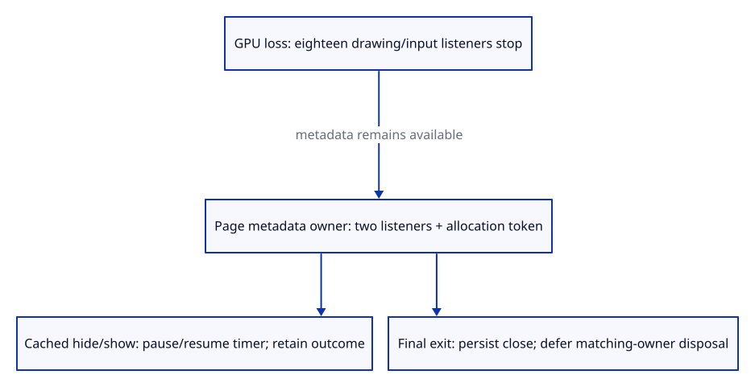

# 34gba · Own diagnostic page transitions

**Typing: 25–50 minutes.** [Estimate](typing-load.md).

Own diagnostic page events independently of the GPU. Two Window listeners and an `Rc` token keep metadata active after drawing/input cleanup. They retain no renderer or document.

## Type

Continue from [Mark a final healthy run closed](34gb-close.md). [Save or recover your work](recovery.md).

### 1. `src/report_lifecycle.rs`

Own two metadata callbacks independently of GPU; retain cached outcomes, defer final callback destruction, and guard cleanup by allocation identity.

Create the file and type:

```rust
--8<-- "journey/code/34gba-lifecycle-01.rs"
```

### 2. `src/lib.rs`

Keep page transition ownership in the browser layer.

<details>
<summary>Locate the existing block</summary>

```rust
mod timer;
```

</details>

Replace that block with:

```rust
--8<-- "journey/code/34gba-lifecycle-02.rs"
```

### 3. `src/browser_report.rs`

Install metadata lifecycle ownership before scheduling heartbeat; denied listener registration leaves drawing and current downloads available.

<details>
<summary>Locate the existing block</summary>

```rust
    if let Err(error) = start_periodic() { let _ = observe("diagnostic", &format!("Heartbeat unavailable: {error:?}")); }
```

</details>

Replace that block with:

```rust
--8<-- "journey/code/34gba-lifecycle-03.rs"
```

## Run and check

In your project:

```sh
cd workspace/journey
REGEN_PROTO=0 cargo build --lib --locked --target wasm32-unknown-unknown -j4
REGEN_PROTO=0 CARGO_BUILD_JOBS=4 trunk serve --port 8780
```

Open `http://127.0.0.1:8780/`. Keep an existing Trunk server running; saving rebuilds it.

In the debug console, run `window.dispatchEvent(new PageTransitionEvent("pagehide", {persisted: true}))`, then the same for `"pageshow"`. Download `Report`: the transitions are recorded and the healthy outcome stays Ready.

**Verified checkpoint in Chrome.**


[Verification scope](release.md).

Run the state checks on your computer from your project folder:

```sh
REGEN_PROTO=0 cargo test --lib --locked --target host-tuple -j4
```

<details>
<summary>Code explanation and diagram</summary>

On cached `pagehide`, record the transition and stop the heartbeat, retaining the outcome and listeners. On `pageshow`, record the return and resume one timer.

On final `pagehide`, close metadata immediately, then detach listeners on the next microtask. The active Rust callback must return before its Closure drops. Compare the captured token with the current owner so old cleanup cannot stop a replacement. Take the owner out of its `RefCell` before dropping it.

A partial registration failure drops its registered bindings and records unavailable lifecycle support; current drawing/downloads remain usable. Visibility/freeze events and cancellation of pending GPU startup are still subsequent work.

owned metadata listeners → cached pause or final close → deferred matching-owner disposal → cached pageshow resumes one timer.



Why does deferred final cleanup compare allocation identity before stopping metadata?

An earlier pagehide may have queued cleanup before a replacement installs its listeners and timer. The old allocation token must not match the replacement; otherwise the old task could stop the new diagnostic lifetime.

Study estimate, including typing and experiments: 1–2 hours.

</details>

<details>
<summary>Optional experiment</summary>

Dispatch persisted pagehide/pageshow and compare them with a final pagehide. Replace metadata ownership before queued cleanup and explain why the earlier token cannot stop it.

</details>

<details>
<summary>Check and save your work</summary>

Restore experimental edits, then run from `session_viewer`:

```sh
npm --prefix ../session_tests run course -- check 34gba-lifecycle
npm --prefix ../session_tests run course -- save 34gba-lifecycle
```

Source comparison leaves your project untouched. [Save and recovery instructions](recovery.md).

</details>

<details>
<summary>Viewer coverage and verification</summary>

The course now records actual page transitions independently of GPU loss and owns final cleanup. Visibility/freeze/error observations, full phase telemetry and bounded recovery remain next. Pending GPU startup must still be revoked before late renderer installation; this checkpoint verifies already-started and failed runtime transitions.

Chrome has focused lifecycle acceptance plus the common real command/camera/input checks. It separately observes two metadata bindings and eighteen drawing/input bindings; it does not modify the older checkpoints’ ownership assertions. Synthetic persisted transitions prove retention and resumed scheduling, not that Chrome actually caches this GPU page. Real device.destroy proves metadata continues after GPU disposal. Healthy and failed final exits stop scheduling, remove metadata bindings once and ignore late events. Replacement before deferred cleanup retains the new owner and timer. Denied registration leaves ready drawing and a usable current download. All earlier checkpoint evidence remains independently verified.

Chrome separately counts metadata/GPU bindings, proves cached pause/resume, healthy/failed final cleanup, real post-loss diagnostics, replacement identity guards and denied-registration current downloads.

[Full validation scope](release.md).

To reproduce the scripted acceptance of the reference checkpoint, run from `session_viewer` with the [course bundle server](release.md#reproduce) running on port 8781:

```sh
npm --prefix ../session_tests run course -- capture 34gba-lifecycle
```

This uses the verified reference bundle; it does not check or change your typed project.

</details>
