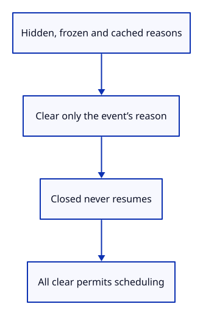

# 34gbb · Keep each heartbeat pause reason separate

**Typing: 22–43 minutes.** [Estimate](typing-load.md).

Give heartbeat scheduling three independent reasons to pause: hidden, frozen and cached. Clearing one reason must leave the others intact. Final closure permanently prevents resumption.

The policy is ordinary Rust, without browser or GPU ownership. Native checks exercise overlapping reasons and different release orders. Browser event delivery is connected in the next step.

## Type

Continue from [Own diagnostic page transitions](34gba-lifecycle.md). [Save or recover your work](recovery.md).

### 1. `src/suspension.rs`

Keep hidden, frozen and cached reasons independent; final closure permanently refuses scheduling.

Create the file and type:

```rust
--8<-- "journey/code/34gbb-suspension-01.rs"
```

### 2. `src/suspension_tests.rs`

Check overlapping reasons, initial hidden state, duplicate delivery and final closure that cannot resume.

Create the file and type:

```rust
--8<-- "journey/code/34gbb-suspension-02.rs"
```

### 3. `src/lib.rs`

Register the pure policy and its native checks.

<details>
<summary>Locate the existing block</summary>

```rust
pub mod diagnostic;
```

</details>

Replace that block with:

```rust
--8<-- "journey/code/34gbb-suspension-03.rs"
```

## Run and check

In your project:

```sh
cd workspace/journey
REGEN_PROTO=0 cargo build --lib --locked --target wasm32-unknown-unknown -j4
REGEN_PROTO=0 CARGO_BUILD_JOBS=4 trunk serve --port 8780
```

Open `http://127.0.0.1:8780/`. Keep an existing Trunk server running; saving rebuilds it.

Run the state checks. Every remaining pause reason prevents resumption, and clearing all reasons permits it. A closed policy stays closed.

**Verified checkpoint in Chrome.**


[Verification scope](release.md).

Run the state checks on your computer from your project folder:

```sh
REGEN_PROTO=0 cargo test --lib --locked --target host-tuple -j4
```

<details>
<summary>Code explanation and diagram</summary>


hidden + frozen + cached + final closure → one scheduling decision.



Why does becoming visible not always allow the heartbeat to resume?

Visibility clears only the hidden reason. A freeze or cached-page reason can still prohibit scheduling; final closure never resumes.

Study estimate, including typing and experiments: 0.75–1.25 hours.

</details>

<details>
<summary>Optional experiment</summary>

Change the first test to clear Frozen last. Predict which earlier clear remains paused, then run the checks.

</details>

<details>
<summary>Check and save your work</summary>

Restore experimental edits, then run from `session_viewer`:

```sh
npm --prefix ../session_tests run course -- check 34gbb-suspension
npm --prefix ../session_tests run course -- save 34gbb-suspension
```

Source comparison leaves your project untouched. [Save and recovery instructions](recovery.md).

</details>

<details>
<summary>Viewer coverage and verification</summary>

This prepares independent browser suspension reasons. The following step connects them to the real diagnostic timer; drawing and document ownership remain separate.

Native policy checks cover overlapping reasons in three release orders, initially hidden startup, duplicate events and final closure. Chrome independently retains the preceding page-transition route until this policy is connected.

This preparation step retains the preceding browser drawing and lifecycle behavior. Its new scheduling policy is tested natively.

[Full validation scope](release.md).

To reproduce the scripted acceptance of the reference checkpoint, run from `session_viewer` with the [course bundle server](release.md#reproduce) running on port 8781:

```sh
npm --prefix ../session_tests run course -- capture 34gbb-suspension
```

This uses the verified reference bundle; it does not check or change your typed project.

</details>
