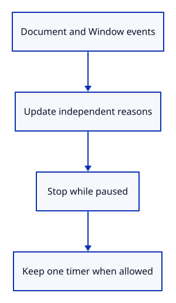

# 34gbba · Connect visibility and freezing to heartbeat scheduling

**Typing: 20–40 minutes.** [Estimate](typing-load.md).

Connect visibilitychange, freeze and resume on Document. Keep pagehide and pageshow on Window. Each event changes its own pause reason before synchronizing the heartbeat.

Read Document.hidden at startup and on return. Start one timer only when the policy permits it. Repeated resume events retain the existing timer. Final closure prevents restart before deferred listener cleanup.

## Type

Continue from [Keep each heartbeat pause reason separate](34gbb-suspension.md). [Save or recover your work](recovery.md).

### 1. `src/report_lifecycle.rs`

Use the scheduling policy in the existing metadata owner.

<details>
<summary>Locate the existing block</summary>

```rust
use crate::{browser_report as report, listeners::Listeners};
```

</details>

Replace that block with:

```rust
--8<-- "journey/code/34gbba-browser-01.rs"
```

### 2. `src/report_lifecycle.rs`

Store pause reasons beside the owned listeners and allocation token.

<details>
<summary>Locate the existing block</summary>

```rust
RefCell<Option<(Rc<()>, Listeners)>>
```

</details>

Replace that block with:

```rust
--8<-- "journey/code/34gbba-browser-02.rs"
```

### 3. `src/report_lifecycle.rs`

Keep replacement identity independent of scheduling state.

<details>
<summary>Locate the existing block</summary>

```rust
|(id, _)| Rc::ptr_eq(id, token)
```

</details>

Replace that block with:

```rust
--8<-- "journey/code/34gbba-browser-03.rs"
```

### 4. `src/report_lifecycle.rs`

Read or update scheduling state without retaining a borrow while the timer changes.

<details>
<summary>Locate the existing block</summary>

```rust
#[cfg_attr(debug_assertions, wasm_bindgen::prelude::wasm_bindgen(js_name = stop_report_lifecycle))]
```

</details>

Replace that block with:

```rust
--8<-- "journey/code/34gbba-browser-04.rs"
```

### 5. `src/report_lifecycle.rs`

Read the initial hidden state and retain Document for later visibility observations.

<details>
<summary>Locate the existing block</summary>

```rust
    let token = Rc::new(()); let guarded = Rc::clone(&token);
```

</details>

Replace that block with:

```rust
--8<-- "journey/code/34gbba-browser-05.rs"
```

### 6. `src/report_lifecycle.rs`

Pause cached scheduling; close the policy permanently before final cleanup is deferred.

<details>
<summary>Locate the existing block</summary>

```rust
                report::stop_periodic();
                if !cached {
```

</details>

Replace that block with:

```rust
--8<-- "journey/code/34gbba-browser-06.rs"
```

### 7. `src/report_lifecycle.rs`

On page return, clear only the cached reason and refresh actual visibility.

<details>
<summary>Locate the existing block</summary>

```rust
                if let Err(error) = report::start_periodic() {
                    let _ = report::observe("diagnostic", &format!("Heartbeat unavailable: {error:?}"));
                }
```

</details>

Replace that block with:

```rust
--8<-- "journey/code/34gbba-browser-07.rs"
```

### 8. `src/report_lifecycle.rs`

Observe Document visibility and freezing, then synchronize one timer after updating all affected reasons.

<details>
<summary>Locate the existing block</summary>

```rust
            _ => {}
        }
    });
```

</details>

Replace that block with:

```rust
--8<-- "journey/code/34gbba-browser-08.rs"
```

### 9. `src/report_lifecycle.rs`

Bind all three Document events; partial registration still cleans up through the listener owner.

<details>
<summary>Locate the existing block</summary>

```rust
    ACTIVE.with(|slot| slot.replace(Some((token, listeners)))); Ok(())
```

</details>

Replace that block with:

```rust
--8<-- "journey/code/34gbba-browser-09.rs"
```

### 10. `src/browser_report.rs`

Refuse suspended scheduling and retain an existing timer, so repeated resume events cannot restart or duplicate it.

<details>
<summary>Locate the existing block</summary>

```rust
pub fn start_periodic() -> Result<(), JsValue> {
    stop_periodic();
```

</details>

Replace that block with:

```rust
--8<-- "journey/code/34gbba-browser-10.rs"
```

## Run and check

In your project:

```sh
cd workspace/journey
REGEN_PROTO=0 cargo build --lib --locked --target wasm32-unknown-unknown -j4
REGEN_PROTO=0 CARGO_BUILD_JOBS=4 trunk serve --port 8780
```

Open `http://127.0.0.1:8780/`. Keep an existing Trunk server running; saving rebuilds it.

Switch away from the viewer tab, then return and type Diagnostic Report. Its lifecycle entries show hidden and visible, while the healthy outcome remains Ready.

**Verified checkpoint in Chrome.**


[Verification scope](release.md).

Run the state checks on your computer from your project folder:

```sh
REGEN_PROTO=0 cargo test --lib --locked --target host-tuple -j4
```

<details>
<summary>Code explanation and diagram</summary>


Document and Window events → independent pause reasons → stop or retain one heartbeat timer.



Why does timer synchronization happen after updating the event’s reasons?

The scheduling decision must include both the changed reason and current visibility. It must not resume between clearing cached state and discovering the document is still hidden.

Study estimate, including typing and experiments: 0.75–1.25 hours.

</details>

<details>
<summary>Optional experiment</summary>

In the debug console, dispatch Document freeze, cached Window pagehide, then Document resume. The cached reason still blocks scheduling until pageshow.

</details>

<details>
<summary>Check and save your work</summary>

Restore experimental edits, then run from `session_viewer`:

```sh
npm --prefix ../session_tests run course -- check 34gbba-browser
npm --prefix ../session_tests run course -- save 34gbba-browser
```

Source comparison leaves your project untouched. [Save and recovery instructions](recovery.md).

</details>

<details>
<summary>Viewer coverage and verification</summary>

Diagnostic metadata remains independent of drawing and survives device loss. This connects hidden/frozen/cached scheduling; pending GPU startup revocation, browser errors, full phases and bounded recovery follow. Scheduling requires a live lifecycle owner; denied bindings preserve manual report downloads without installing a heartbeat.

Chrome acceptance covers genuine visibility and freeze/resume separately from injected overlap orders. It checks initial hidden startup, duplicate resumption, timer-only metadata, first-failure preservation after actual device loss, final cleanup, refused late scheduling, replacement identity and partial binding failure. Native policy and common typed command/camera checks remain required.

Actual Chrome visibility/freezing, independent reason overlap, one timer, post-loss metadata and final cleanup are verified by this checkpoint.

[Full validation scope](release.md).

To reproduce the scripted acceptance of the reference checkpoint, run from `session_viewer` with the [course bundle server](release.md#reproduce) running on port 8781:

```sh
npm --prefix ../session_tests run course -- capture 34gbba-browser
```

This uses the verified reference bundle; it does not check or change your typed project.

</details>
