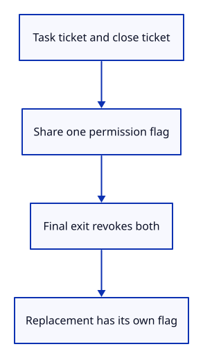

# 34gbc · Give pending startup a revocable ticket

**Typing: 14–27 minutes.** [Estimate](typing-load.md).

Give pending startup a shared permission flag. The task and close callback hold cloned tickets; revoking either ticket refuses every later result.

A replacement gets a separate allocation. This step checks the policy natively; the next step connects it to actual GPU requests.

## Type

Continue from [Connect visibility and freezing to heartbeat scheduling](34gbba-browser.md). [Save or recover your work](recovery.md).

### 1. `src/startup.rs`

Share startup permission between the waiting task and its close callback.

Create the file and type:

```rust
--8<-- "journey/code/34gbc-authority-01.rs"
```

### 2. `src/startup_tests.rs`

Check delayed tickets, repeated closure and an independent replacement owner.

Create the file and type:

```rust
--8<-- "journey/code/34gbc-authority-02.rs"
```

### 3. `src/lib.rs`

Register startup authority and its native checks.

<details>
<summary>Locate the existing block</summary>

```rust
pub mod suspension;
```

</details>

Replace that block with:

```rust
--8<-- "journey/code/34gbc-authority-03.rs"
```

## Run and check

In your project:

```sh
cd workspace/journey
REGEN_PROTO=0 cargo build --lib --locked --target wasm32-unknown-unknown -j4
REGEN_PROTO=0 CARGO_BUILD_JOBS=4 trunk serve --port 8780
```

Open `http://127.0.0.1:8780/`. Keep an existing Trunk server running; saving rebuilds it.

Run the state checks. Revocation reaches every waiting ticket, repeated closure stays revoked, and an independent replacement remains allowed.

**Verified checkpoint in Chrome.**


[Verification scope](release.md).

Run the state checks on your computer from your project folder:

```sh
REGEN_PROTO=0 cargo test --lib --locked --target host-tuple -j4
```

<details>
<summary>Code explanation and diagram</summary>


task ticket + close ticket → shared flag → delayed result refused after closure.



Why clone the ticket instead of copying its boolean value?

A copied boolean would keep its old value. Rc shares the Cell, so the waiting task sees the close callback’s revocation.

Study estimate, including typing and experiments: 0.5–1 hours.

</details>

<details>
<summary>Optional experiment</summary>

Revoke the device ticket instead of the owner in the first test. Predict whether the adapter ticket still permits startup, then run the checks.

</details>

<details>
<summary>Check and save your work</summary>

Restore experimental edits, then run from `session_viewer`:

```sh
npm --prefix ../session_tests run course -- check 34gbc-authority
npm --prefix ../session_tests run course -- save 34gbc-authority
```

Source comparison leaves your project untouched. [Save and recovery instructions](recovery.md).

</details>

<details>
<summary>Viewer coverage and verification</summary>

This prepares shared startup authority. The next checkpoint checks it after actual adapter and device awaits, independently of optional diagnostic scheduling.

Native tests cover shared revocation, repeated closure and independent allocations. Chrome retains the previous route until startup uses this authority.

The preceding browser behavior remains unchanged; the new shared startup authority is checked natively.

[Full validation scope](release.md).

To reproduce the scripted acceptance of the reference checkpoint, run from `session_viewer` with the [course bundle server](release.md#reproduce) running on port 8781:

```sh
npm --prefix ../session_tests run course -- capture 34gbc-authority
```

This uses the verified reference bundle; it does not check or change your typed project.

</details>
