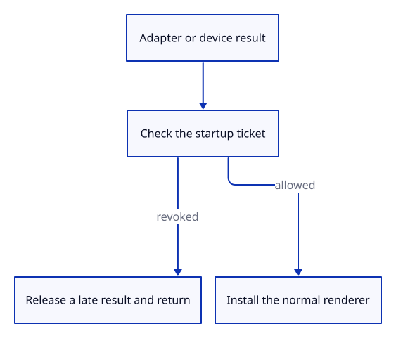

# 34gbca · Refuse GPU results after final page exit

**Typing: 15–30 minutes.** [Estimate](typing-load.md).

Keep one temporary pagehide listener while startup awaits the GPU. Final exit revokes its shared ticket; cached transitions retain permission.

## Type

Continue from [Give pending startup a revocable ticket](34gbc-authority.md). [Save or recover your work](recovery.md).

### 1. `src/browser_startup.rs`

Own one temporary page-exit binding across GPU awaits, independent of optional diagnostic listeners.

Create the file and type:

```rust
--8<-- "journey/code/34gbca-startup-01.rs"
```

### 2. `src/lib.rs`

Register the browser startup guard.

<details>
<summary>Locate the existing block</summary>

```rust
mod report_lifecycle;
```

</details>

Replace that block with:

```rust
--8<-- "journey/code/34gbca-startup-02.rs"
```

### 3. `src/browser.rs`

Keep the guard alive from startup until the runtime owns the drawing callbacks.

<details>
<summary>Locate the existing block</summary>

```rust
    crate::browser_report::start()?;
```

</details>

Replace that block with:

```rust
--8<-- "journey/code/34gbca-startup-03.rs"
```

### 4. `src/browser.rs`

After the adapter await, refuse a revoked result before requesting a device or interpreting an error.

<details>
<summary>Locate the existing block</summary>

```rust
        .await
        .map_err(|error| JsValue::from_str(&error.to_string()))?;
    let (device, queue) = adapter
```

</details>

Replace that block with:

```rust
--8<-- "journey/code/34gbca-startup-04.rs"
```

### 5. `src/browser.rs`

After the device await, destroy a late device and return quietly before configuring the surface or creating resources.

<details>
<summary>Locate the existing block</summary>

```rust
        .request_device(&wgpu::DeviceDescriptor::default())
        .await
        .map_err(|error| JsValue::from_str(&error.to_string()))?;
```

</details>

Replace that block with:

```rust
--8<-- "journey/code/34gbca-startup-05.rs"
```

## Run and check

In your project:

```sh
cd workspace/journey
REGEN_PROTO=0 cargo build --lib --locked --target wasm32-unknown-unknown -j4
REGEN_PROTO=0 CARGO_BUILD_JOBS=4 trunk serve --port 8780
```

Open `http://127.0.0.1:8780/`. Keep an existing Trunk server running; saving rebuilds it.

Reload and type `Diagnostic Report`. Startup reaches `ready` with a geometry-on-screen event.

**Verified checkpoint in Chrome.**


[Verification scope](release.md).

Run the state checks on your computer from your project folder:

```sh
REGEN_PROTO=0 cargo test --lib --locked --target host-tuple -j4
```

<details>
<summary>Code explanation and diagram</summary>

Check authority after each await, before interpreting errors or using the result. Destroy a device delivered after revocation. Returning successfully preserves the closed diagnostic report instead of recording a new fatal error. The listener is released when startup returns.

final exit → revoke ticket → adapter/device resolves → refuse renderer installation.



Why check permission before turning a rejected GPU request into an error?

The page may have closed while the request was pending. That obsolete rejection must not overwrite Closed with a new failure; an active startup still reports genuine errors.

Study estimate, including typing and experiments: 0.75–1.25 hours.

</details>

<details>
<summary>Optional experiment</summary>

In the debug build, compare the guard’s one temporary binding with the five metadata bindings. After Ready, only metadata and runtime bindings remain.

</details>

<details>
<summary>Check and save your work</summary>

Restore experimental edits, then run from `session_viewer`:

```sh
npm --prefix ../session_tests run course -- check 34gbca-startup
npm --prefix ../session_tests run course -- save 34gbca-startup
```

Source comparison leaves your project untouched. [Save and recovery instructions](recovery.md).

</details>

<details>
<summary>Viewer coverage and verification</summary>

Pending startup is now guarded at both GPU awaits, including rejected results and a late device. Cached transitions remain usable. Browser error observation, complete loading phases and bounded GPU recovery follow.

Fresh native, WebAssembly, Trunk, GPU and Chrome checks are required. The focused browser proof delays actual adapter/device results; injected page transitions exercise the branches without claiming browser cache eligibility.

Additional verification: Reload the viewer and type Diagnostic Report. Normal startup still reaches Ready. The checkpoint’s browser check holds real GPU results across cached and final page transitions.

Actual delayed GPU results are tested across final and cached page transitions; normal command, camera and lifecycle checks remain connected.

[Full validation scope](release.md).

To reproduce the scripted acceptance of the reference checkpoint, run from `session_viewer` with the [course bundle server](release.md#reproduce) running on port 8781:

```sh
npm --prefix ../session_tests run course -- capture 34gbca-startup
```

This uses the verified reference bundle; it does not check or change your typed project.

</details>
